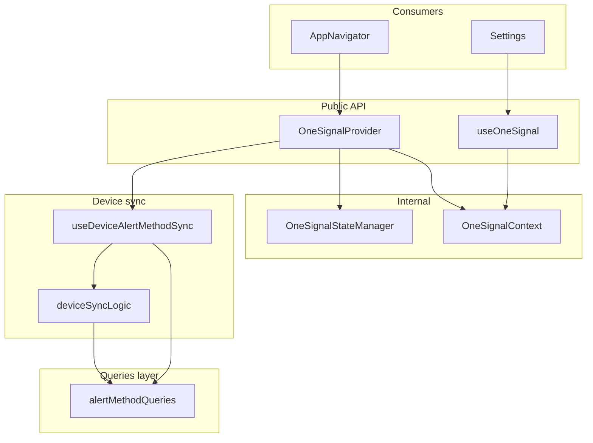

# OneSignal Device AlertMethod Refactor Plan

## Goals

- Handle all four scenarios from the spec using **getAlertMethods** to decide create vs update vs delete, without changing server code.
- Separate **queries/mutations** into a dedicated module for clarity and reuse.
- Preserve **type safety**, **small functions**, and **SOLID** structure.
- Correctly wire **AppNavigator** and **Settings** to the refactored hooks and types.

## Server Contract (Read-Only Reference)

From [apps/server/src/server/api/routers/alertMethod.ts](apps/server/src/server/api/routers/alertMethod.ts) and [apps/server/src/server/api/zodSchemas/alertMethod.schema.ts](apps/server/src/server/api/zodSchemas/alertMethod.schema.ts):

- **getAlertMethods**: returns `{ status, data: AlertMethod[] }` (userId, deletedAt: null).
- **createAlertMethod**: input `{ method, destination, deviceName?, deviceId? }`. For `method === 'device'`: server runs deviceVerification(destination), then may delete existing from other user and create for current user. Device is keyed by destination (OneSignal subscription ID) and deviceId.
- **updateAlertMethod**: input `{ params: { alertMethodId }, body: { isEnabled: boolean } }` only. **Destination cannot be updated.**
- **deleteAlertMethod**: input `{ alertMethodId }` (soft-delete).

Implication: for **reinstall (new OneSignal subscription ID)** we cannot “update” destination; we must **delete** the old device alert method and **create** a new one with the new destination.

## Scenario vs Action Matrix

| Scenario                        | Detection                                                                              | Action                                                                  |
| ------------------------------- | -------------------------------------------------------------------------------------- | ----------------------------------------------------------------------- |
| Fresh install                   | No device alert method for this deviceId                                               | **createAlertMethod**                                                   |
| Reinstall (new subscription ID) | Device alert method exists for deviceId but `destination !== current OneSignal userId` | **deleteAlertMethod**(oldId) then **createAlertMethod**(new)            |
| Permission revoked / regranted  | Same device + same destination; only enable/disable                                    | **updateAlertMethod**(alertMethodId, { isEnabled })                     |
| Multiple devices                | Different deviceId per device                                                          | **createAlertMethod** per device (existing logic already supports this) |

## Current State Summary

- **useOneSignal** ([apps/nativeapp/app/hooks/notification/useOneSignal.ts](apps/nativeapp/app/hooks/notification/useOneSignal.ts)): owns OneSignal init, state manager subscription, and **inline** tRPC (getAlertMethods refetch, createAlertMethod, updateAlertMethod). Sync logic **does not** handle reinstall (it only calls updateAlertMethod with `isEnabled: true` when destination changes; server does not update destination).
- **useOneSignalState** ([apps/nativeapp/app/hooks/notification/useOneSignalState.ts](apps/nativeapp/app/hooks/notification/useOneSignalState.ts)): **To be removed.** Subscribes to the same state manager and returns `DeviceState | null` for Settings. No unique logic — useOneSignal already subscribes and holds this state; we will expose it via React Context instead.
- **OneSignalDeviceSync** ([apps/nativeapp/app/services/OneSignal/OneSignalDeviceSync.ts](apps/nativeapp/app/services/OneSignal/OneSignalDeviceSync.ts)): **unused**; uses a raw tRPC client and a different API shape (e.g. `response?.json?.data`), so not aligned with React Query usage in the app.
- **Settings** ([apps/nativeapp/app/screens/Settings/Settings.tsx](apps/nativeapp/app/screens/Settings/Settings.tsx)): calls `useOneSignalState()` but **does not use** `oneSignalDeviceState`; `deviceNotification` uses OneSignal SDK directly (`OneSignal.User.pushSubscription.getIdAsync()`) and Redux/query data.
- **AppNavigator** ([apps/nativeapp/app/routes/AppNavigator.tsx](apps/nativeapp/app/routes/AppNavigator.tsx)): passes memoized `notificationHandlers` into `useOneSignal(onesignalAppId, notificationHandlers)`.

## Combined Architecture: Single Provider + Single Hook

**Idea:** OneSignalStateManager (holds state, talks to SDK) and OneSignalContext (distributes state in React) were two ways of “holding” the same state. Combine at the **API level**: one component that runs init and provides context, and one hook that reads it. State manager stays as an **internal** implementation detail of the Provider.

- **OneSignalProvider** (component): Accepts `appId` and optional `handlers`. Contains all init logic (state manager init, subscription, notification listeners, device sync). Subscribes to the state manager and keeps state in React state; provides `{ state, isInitialized, error }` via React Context. **Single place** that runs OneSignal and is the single subscriber to the state manager.
- **useOneSignal()** (hook): **Only** hook for consumers. Returns `useContext(OneSignalContext)` — i.e. `{ state, isInitialized, error }`. No separate “useOneSignalContext”; same hook for both the component that needs to pass appId/handlers (they pass it to the Provider) and for screens that only need state (they call useOneSignal()).

So: **one hook** (useOneSignal), **one component** (OneSignalProvider). Context is the React mechanism; state manager is the internal singleton the Provider uses. No duplicate “state holder” in the public API.

## File and Responsibility Plan

### 1. New: Alert method queries / API layer

- **Path**: `apps/nativeapp/app/api/alertMethod.ts` (or `apps/nativeapp/app/queries/alertMethod.ts`).
- **Role**: Single place for all alert-method tRPC usage used by OneSignal device sync. Keeps hooks free of raw tRPC and allows reuse and testing.
- **Contents**:
  - Export a **custom hook** (e.g. `useAlertMethodQueries()`) that returns:
    - `getAlertMethods` query (with `refetch` used for sync).
    - `createAlertMethod` mutation.
    - `updateAlertMethod` mutation.
    - `deleteAlertMethod` mutation.
  - Use **inferred types** from tRPC (or shared types from a shared package) for payloads and responses so that create/update/delete and getAlertMethods are type-safe.
  - Optionally export **types** for “device alert method” and “getAlertMethods response” for use in sync logic and Settings.

### 2. New: Device sync logic (pure + small functions)

- **Path**: `apps/nativeapp/app/services/OneSignal/deviceSyncLogic.ts` (or `deviceAlertMethodSync.ts`).
- **Role**: Pure functions that, given current device state and getAlertMethods result, **decide** create / update / delete. No tRPC or React; only data in, decision out (e.g. `{ action: 'create' | 'update' | 'deleteThenCreate' | 'no_change', alertMethodId?: string, payload?: ... }`). This follows SRP and makes sync easy to test.
- **Key function**: e.g. `computeDeviceSyncAction(params: { deviceId, deviceName, oneSignalUserId, alertMethods }): SyncAction`.
  - If no device alert method for this `deviceId` → **create**.
  - If device alert method for this `deviceId` but `destination !== oneSignalUserId` → **deleteThenCreate** (reinstall).
  - If same `deviceId` and same `destination` → **update** (e.g. set isEnabled from permission) or **no_change**.
- **Types**: Use a minimal “device alert method” shape (id, method, destination, deviceId, deviceName, isEnabled, …) aligned with getAlertMethods response; no dependency on full Prisma/backend types if not shared.

### 3. New: Hook that runs device sync (orchestration)

- **Path**: `apps/nativeapp/app/hooks/notification/useDeviceAlertMethodSync.ts`.
- **Role**: Uses `useAlertMethodQueries()` and `computeDeviceSyncAction`, plus device info (e.g. from existing `getDeviceInfo()`). Exposes a single **sync function**: `performDeviceSync(deviceState: DeviceState, fireAlertUserId: string)`.
  - Calls refetch getAlertMethods.
  - Calls `computeDeviceSyncAction(deviceId, deviceName, deviceState.userId, alertMethods)`.
  - Depending on action: call createMutation, updateMutation, or deleteMutation + createMutation (for reinstall).
  - Handles errors and logging (e.g. existing ONESIGNAL_LOG_PREFIXES); keep callbacks minimal so the hook stays thin.
- **Single Responsibility**: orchestration only; no OneSignal init or state manager.

### 4. OneSignalProvider + useOneSignal (combined; replace current useOneSignal and useOneSignalContext)

- **Remove**: [apps/nativeapp/app/hooks/notification/useOneSignalState.ts](apps/nativeapp/app/hooks/notification/useOneSignalState.ts) (no logic to migrate).
- **New / refactor**: Single module that exports **OneSignalProvider** and **useOneSignal** (e.g. `apps/nativeapp/app/contexts/OneSignalContext.tsx` or `app/providers/OneSignalProvider.tsx` plus a small hook file, or keep under `hooks/notification/` with a provider component).
  - **OneSignalProvider** (component): Props: `appId: string`, `handlers?: NotificationHandlers`, `children`. Contains all logic currently in useOneSignal: get state manager, init (appId + userDetails from Redux), subscribe to state manager and hold `[state, setState]` in React state, set up notification listeners (foregroundWillDisplay, click) with handlersRef, call `useDeviceAlertMethodSync().performDeviceSync` on init and on permission_changed, permission-check interval. Renders `OneSignalContext.Provider value={{ state, isInitialized, error }}`. So the **Provider is the only subscriber** to the state manager and the only place that runs init/sync — no separate “useOneSignal that does init” in AppNavigator.
  - **useOneSignal()** (hook): Only `return useContext(OneSignalContext)`. Returns `{ state: DeviceState | null, isInitialized: boolean, error: Error | null }`. Default value when outside provider: `{ state: null, isInitialized: false, error: null }`. So **one hook** for all consumers (Settings, any future screen); no useOneSignalContext name.
- **OneSignalStateManager**: Keep as internal singleton (no export in public API or export only for tests). Provider uses it; no other component subscribes to it. So “Context & StateManager combined” = one public surface (Provider + useOneSignal), state manager is implementation detail inside the Provider.

### 6. OneSignalDeviceSync.ts

- **Path**: [apps/nativeapp/app/services/OneSignal/OneSignalDeviceSync.ts](apps/nativeapp/app/services/OneSignal/OneSignalDeviceSync.ts).
- **Decision**: **Remove** this class (or deprecate and stop exporting) so the app has one sync path: `deviceSyncLogic` + `useDeviceAlertMethodSync` + queries. This avoids duplicate logic and the old tRPC client shape. Update [apps/nativeapp/app/services/OneSignal/index.ts](apps/nativeapp/app/services/OneSignal/index.ts) to drop the OneSignalDeviceSync export.

### 7. Types

- **Path**: [apps/nativeapp/app/services/OneSignal/types.ts](apps/nativeapp/app/services/OneSignal/types.ts).
- **Changes**:
  - Add a **SyncAction** (or similar) type used by `deviceSyncLogic`.
  - Ensure **DeviceState** and **NotificationHandlers** stay aligned with [design.md](.kiro/specs/onesignal-integration-improvement/design.md) and [design.md](.kiro/specs/onesignal-initialization-fix/design.md). Tighten **NotificationHandlers** (e.g. `onOpened` parameter type from OneSignal SDK) if needed for type safety.
  - If the queries layer defines “device alert method” from tRPC, either re-export that type here or import it in deviceSyncLogic so there is a single source of truth.

### 8. AppNavigator

- **Path**: [apps/nativeapp/app/routes/AppNavigator.tsx](apps/nativeapp/app/routes/AppNavigator.tsx).
- **Changes**:
  - **Remove** direct `useOneSignal(onesignalAppId, notificationHandlers)` call. Wrap the navigator (or the subtree that includes Settings) with **OneSignalProvider**: `<OneSignalProvider appId={onesignalAppId} handlers={notificationHandlers}>…</OneSignalProvider>`. Keep the memoized `notificationHandlers` (lines 29–43) and pass them into the Provider. So AppNavigator no longer calls a hook for OneSignal — it only renders the Provider; Settings and others use `useOneSignal()` to read state.
  - Optionally type the handlers with the shared `NotificationHandlers` type (already imported) and use SDK types for the notification/opened payloads so there are no `any` in the handler signatures where possible.

### 9. Settings

- **Path**: [apps/nativeapp/app/screens/Settings/Settings.tsx](apps/nativeapp/app/screens/Settings/Settings.tsx).
- **Changes**:
  - **Remove** `useOneSignalState` import and usage. **Use** `useOneSignal()` (the single consumer hook) instead: `const { state, isInitialized, error } = useOneSignal();`.
  - In `deviceNotification`: use `state?.userId` for “current device” matching instead of calling `OneSignal.User.pushSubscription.getIdAsync()` directly. Guard: if `state` is null, treat as “no current device” (e.g. set deviceAlertPreferences from non-device list or empty) and do not call the OneSignal SDK.
  - Keep `trpc.alertMethod.getAlertMethods.useQuery` and existing Settings-specific mutations (update, delete, etc.). No need to move those into the new “queries” file unless you want Settings to use `useAlertMethodQueries()` too; that can be a follow-up.
  - Ensure `formattedAlertPreferences` and `deviceNotification` still receive the same data shape (from getAlertMethods) so UI and “current device” ordering remain correct.

## Implementation Order (Suggested)

1. Add **types** (SyncAction, device alert method shape) in types or in the new queries module.
2. Add **alert method queries** module and `useAlertMethodQueries()`.
3. Add **deviceSyncLogic** with `computeDeviceSyncAction` (and any small helpers).
4. Add **useDeviceAlertMethodSync** and wire it to queries + deviceSyncLogic + getDeviceInfo.
5. **OneSignalProvider + useOneSignal**: Create OneSignalContext (createContext with default `{ state: null, isInitialized: false, error: null }`). Implement **OneSignalProvider** that takes appId + handlers, runs all current useOneSignal logic (state manager init, subscription, notification listeners, performDeviceSync via useDeviceAlertMethodSync, permission interval), and provides `{ state, isInitialized, error }`. Implement **useOneSignal()** as `useContext(OneSignalContext)`. Remove or refactor the old useOneSignal.ts so it no longer exists as a “do init” hook — its logic lives inside OneSignalProvider.
6. **Remove or stop exporting** OneSignalDeviceSync; update OneSignal service index.
7. **Remove useOneSignalState**: delete the hook file.
8. **AppNavigator**: replace `useOneSignal(…)` with `<OneSignalProvider appId={…} handlers={…}>…</OneSignalProvider>`; keep memoized handlers.
9. **Settings**: replace `useOneSignalState()` with `useOneSignal()`; in `deviceNotification` use `state?.userId` and null guards.
10. **Lint and type-check**; run app and test all four scenarios.

## Testing Checklist (Manual)

- Fresh install: no alert methods → create device alert method.
- Reinstall: new subscription ID (e.g. reinstall app) → old device record deleted, new one created; getAlertMethods shows one device with new destination.
- Permission revoked then regranted: updateAlertMethod(isEnabled) used where applicable; UI in Settings reflects state.
- Multiple devices: second device gets its own createAlertMethod; getAlertMethods shows both.
- Settings: device list and “current device” ordering still correct; no direct OneSignal calls before init.

## Files Touched (Summary)

| Action               | Path                                                                                                                                                                                                                          |
| -------------------- | ----------------------------------------------------------------------------------------------------------------------------------------------------------------------------------------------------------------------------- |
| New                  | `app/api/alertMethod.ts` or `app/queries/alertMethod.ts`                                                                                                                                                                      |
| New                  | `app/services/OneSignal/deviceSyncLogic.ts`                                                                                                                                                                                   |
| New                  | `app/hooks/notification/useDeviceAlertMethodSync.ts`                                                                                                                                                                          |
| New                  | `app/contexts/OneSignalContext.tsx` (OneSignalProvider + useOneSignal + context; or under providers/)                                                                                                                         |
| Refactor / replace   | `app/hooks/notification/useOneSignal.ts` — logic moves into OneSignalProvider; file may export only `useOneSignal` (context consumer) and re-export Provider, or Provider lives in contexts/ and useOneSignal stays in hooks/ |
| Delete               | `app/hooks/notification/useOneSignalState.ts`                                                                                                                                                                                 |
| Remove / stop export | `app/services/OneSignal/OneSignalDeviceSync.ts`, update `index.ts`                                                                                                                                                            |
| Update types         | `app/services/OneSignal/types.ts`                                                                                                                                                                                             |
| Update               | `app/routes/AppNavigator.tsx` (render OneSignalProvider instead of calling useOneSignal; typing)                                                                                                                              |
| Update               | `app/screens/Settings/Settings.tsx` (useOneSignal() + state?.userId in deviceNotification)                                                                                                                                    |

No server-side or schema changes.

---

## Hurdles & Logical Complications

1. **Provider needs Redux (userDetails).** Current useOneSignal uses `useAppSelector(state => state.loginSlice.userDetails)` to get FireAlert userId for init and sync. OneSignalProvider must run inside the Redux tree, and it will use the same selector inside the Provider. No change from today.
2. **Handlers stability.** If the parent of OneSignalProvider re-renders and passes new `handlers` every time, we must avoid re-initializing OneSignal. Keep using a ref (handlersRef) inside the Provider and only use it when attaching listeners; do not use handlers in the init dependency array so that changing handlers does not re-run init.
3. **useDeviceAlertMethodSync inside Provider.** The Provider is a component, so it can call hooks. It will call `useDeviceAlertMethodSync()` and then call `performDeviceSync` when state is ready and on permission_changed. Same as current useOneSignal. No issue.
4. **Context default when outside Provider.** If useOneSignal() is called outside OneSignalProvider (e.g. in a screen that’s not under the app stack), it should return a safe default: `{ state: null, isInitialized: false, error: null }`. Create the context with this default so consumers don’t crash.
5. **Single subscription.** Only OneSignalProvider subscribes to the state manager. So we don’t “combine” the state manager and context into one class (context is a React primitive; state manager is a singleton). We combine at the API level: one component (Provider) that uses the state manager and fills the context. No duplicate subscriptions.
6. **Where to put Provider.** OneSignalProvider should wrap the part of the tree that has access to Redux (userDetails) and that includes Settings. So in AppNavigator, wrap the navigator (or the logged-in stack) with `<OneSignalProvider appId={…} handlers={…}>`. Do not wrap the whole app above Redux Provider if userDetails would be unavailable there.
7. **Export surface.** Public API: `OneSignalProvider`, `useOneSignal`. Optionally export `OneSignalContext` for testing or advanced use. State manager (`getOneSignalStateManager`) can remain exported for tests or stay internal to the OneSignal module.
