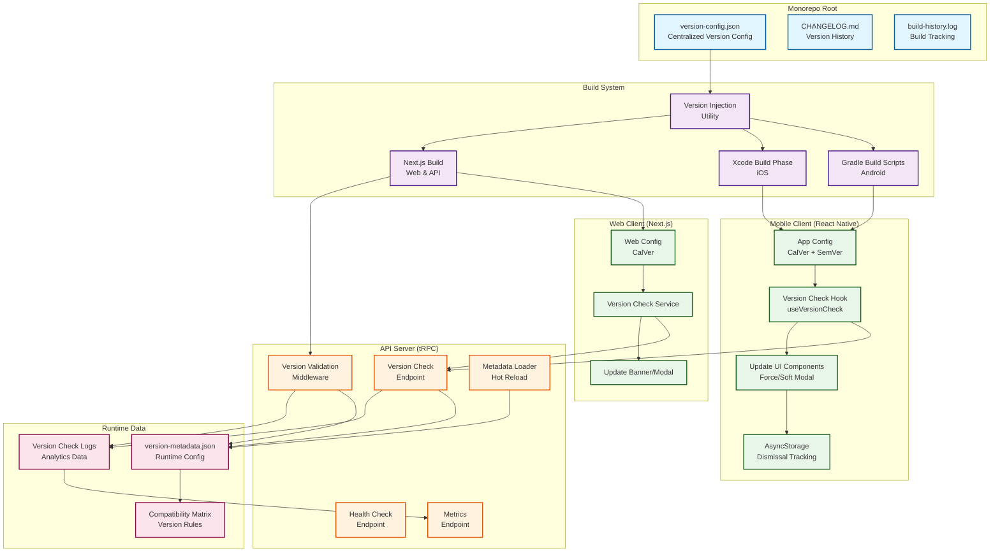

# Design Document: API Versioning System

## Overview

The API Versioning System provides comprehensive version management for the FireAlert monorepo, coordinating versioning across the React Native mobile app (iOS and Android), Next.js web client, and tRPC API server. The system implements a dual versioning strategy: Calendar Versioning (CalVer) for internal development coordination and Semantic Versioning (SemVer) for public app store releases.

### Key Design Goals

1. **Unified Version Management**: Centralized version configuration that coordinates releases across all platform components
2. **Backward Compatibility**: Graceful handling of version mismatches with configurable enforcement policies
3. **Developer Experience**: Automated version injection during builds with minimal manual intervention
4. **User Safety**: Force update mechanism for critical security fixes and breaking changes
5. **Operational Visibility**: Comprehensive monitoring and analytics for version distribution

### Design Principles

- **Single Source of Truth**: All version information originates from a centralized configuration file
- **Build-Time Injection**: Versions are injected during build process, not hardcoded in source
- **Runtime Validation**: Version compatibility is enforced at runtime via tRPC middleware
- **Progressive Enforcement**: Grace period support for smooth rollout without disrupting existing users
- **Platform Awareness**: Platform-specific handling for iOS, Android, and Web differences

## Architecture

### System Components



### Component Responsibilities

#### Version Configuration (`version-config.json`)

- **Location**: Monorepo root
- **Purpose**: Single source of truth for all version information
- **Contents**: Current CalVer, SemVer, build numbers, version mappings
- **Access**: Read by build scripts and version injection utilities

#### Version Metadata (`version-metadata.json`)

- **Location**: `apps/server/config/version-metadata.json`
- **Purpose**: Runtime configuration for version enforcement
- **Contents**: Minimum/recommended versions, compatibility matrix, update messages, grace period settings
- **Access**: Loaded by API server, supports hot reload

#### Version Injection Utility

- **Location**: `scripts/version-inject.ts`
- **Purpose**: Inject version information into platform-specific build artifacts
- **Responsibilities**:
  - Read version-config.json
  - Update Android build.gradle (versionCode, versionName)
  - Update iOS Info.plist variables (MARKETING_VERSION, CURRENT_PROJECT_VERSION)
  - Generate version constants for React Native and Next.js
  - Log build to build-history.log

#### tRPC Version Middleware

- **Location**: `apps/server/src/server/api/middleware/versionMiddleware.ts`
- **Purpose**: Enforce version compatibility on API requests
- **Responsibilities**:
  - Extract client version from request headers
  - Validate against compatibility matrix
  - Return version mismatch errors for incompatible clients
  - Log version check events
  - Support bypass for development and specific endpoints

#### Version Check Endpoint

- **Location**: `apps/server/src/server/api/routers/version.ts`
- **Purpose**: Provide version compatibility information to clients
- **Responsibilities**:
  - Accept client version and platform information
  - Compare against minimum and recommended versions
  - Return force update, soft update, or success responses
  - Include compatibility matrix in success responses
  - Track version check requests for analytics

#### Mobile Version Check Hook

- **Location**: `apps/nativeapp/app/hooks/version/useVersionCheck.ts`
- **Purpose**: Manage version checking lifecycle in React Native
- **Responsibilities**:
  - Perform version check on app startup
  - Schedule periodic checks every 24 hours
  - Trigger appropriate UI based on response (force/soft update)
  - Track dismissal state in AsyncStorage
  - Support development bypass mode

#### Update UI Components

- **Mobile Force Update Modal**: `apps/nativeapp/app/components/version/ForceUpdateModal.tsx`
- **Mobile Soft Update Banner**: `apps/nativeapp/app/components/version/SoftUpdateBanner.tsx`
- **Web Update Modal**: `apps/server/src/Components/version/UpdateModal.tsx`
- **Web Update Banner**: `apps/server/src/Components/version/UpdateBanner.tsx`

### Data Flow

#### Build-Time Flow

1. Developer updates `version-config.json` with new CalVer/SemVer
2. Build script runs `version-inject.ts`
3. Version injector reads configuration
4. Android: Updates `versionCode` and `versionName` in `build.gradle`
5. iOS: Updates `MARKETING_VERSION` and `CURRENT_PROJECT_VERSION` in project settings
6. React Native: Generates `app/constants/version.ts` with version constants
7. Next.js: Generates `src/config/version.ts` with version constants
8. Build proceeds with injected versions
9. Build history logged with timestamp and version mapping

#### Runtime Version Check Flow

1. Client app starts (mobile or web)
2. Version check hook/service reads local version from config
3. Client sends version check request to `/api/version/check` with:
   - Client CalVer version
   - Platform (ios/android/web)
   - Build number
4. Server version endpoint receives request
5. Server loads version-metadata.json
6. Server compares client version against:
   - Minimum supported version for platform
   - Recommended version for platform
7. Server determines response type:
   - **Force Update**: Client version < minimum supported
   - **Soft Update**: Minimum ≤ client version < recommended
   - **Success**: Client version ≥ recommended
8. Server returns response with:
   - Update type (force/soft/none)
   - Update message (platform-specific)
   - Compatibility matrix (if success)
   - Server version information
9. Client receives response
10. Client triggers appropriate UI:
    - Force update: Show blocking modal with app store link
    - Soft update: Show dismissible banner (once per session)
    - Success: Continue normal operation
11. Version check logged for analytics

#### API Request Flow with Middleware

1. Client makes tRPC API request
2. Request includes `X-Client-Version` header with CalVer
3. Version middleware intercepts request
4. Middleware extracts version from header
5. Middleware checks if endpoint requires validation
6. If validation required:
   - Load compatibility matrix
   - Validate client version against API version
   - If incompatible: Return version mismatch error
   - If compatible: Continue to next middleware
7. If validation not required or bypassed: Continue to next middleware
8. Version check result logged for monitoring

## Components and Interfaces

### Configuration File Structures

#### version-config.json

```typescript
interface VersionConfig {
  calver: string; // YYYY-MM-DD format
  semver: string; // MAJOR.MINOR.PATCH format
  buildNumbers: {
    android: number; // Android versionCode
    ios: number; // iOS CURRENT_PROJECT_VERSION
  };
  versionMappings: {
    [calver: string]: {
      semver: string;
      releaseDate: string;
      releaseNotes: string;
    };
  };
}
```

Example:

```json
{
  "calver": "2026-02-18",
  "semver": "1.9.0",
  "buildNumbers": {
    "android": 24,
    "ios": 24
  },
  "versionMappings": {
    "2026-02-18": {
      "semver": "1.9.0",
      "releaseDate": "2026-02-18T00:00:00Z",
      "releaseNotes": "Added API versioning system with force update support"
    },
    "2026-01-15": {
      "semver": "1.8.0",
      "releaseDate": "2026-01-15T00:00:00Z",
      "releaseNotes": "Enhanced notification system"
    }
  }
}
```

#### version-metadata.json

```typescript
interface VersionMetadata {
  apiVersion: string; // Current API CalVer version
  minimumVersions: {
    ios: string; // Minimum supported iOS client CalVer
    android: string; // Minimum supported Android client CalVer
    web: string; // Minimum supported web client CalVer
  };
  recommendedVersions: {
    ios: string; // Recommended iOS client CalVer
    android: string; // Recommended Android client CalVer
    web: string; // Recommended web client CalVer
  };
  compatibilityMatrix: CompatibilityRule[];
  forceUpdateMessages: {
    ios: string;
    android: string;
    web: string;
  };
  softUpdateMessages: {
    ios: string;
    android: string;
    web: string;
  };
  gracePeriod: {
    enabled: boolean;
    endDate: string; // ISO 8601 date
  };
  bypassEndpoints: string[]; // Endpoints that skip version validation
}

interface CompatibilityRule {
  clientVersionPattern: string; // Supports wildcards: "2026-01-*", "2026-*"
  minApiVersion: string;
  maxApiVersion: string;
  platforms: ("ios" | "android" | "web")[];
}
```

Example:

```json
{
  "apiVersion": "2026-02-18",
  "minimumVersions": {
    "ios": "2026-01-01",
    "android": "2026-01-01",
    "web": "2026-01-15"
  },
  "recommendedVersions": {
    "ios": "2026-02-18",
    "android": "2026-02-18",
    "web": "2026-02-18"
  },
  "compatibilityMatrix": [
    {
      "clientVersionPattern": "2026-02-*",
      "minApiVersion": "2026-02-01",
      "maxApiVersion": "2026-12-31",
      "platforms": ["ios", "android", "web"]
    },
    {
      "clientVersionPattern": "2026-01-*",
      "minApiVersion": "2026-01-01",
      "maxApiVersion": "2026-02-28",
      "platforms": ["ios", "android", "web"]
    }
  ],
  "forceUpdateMessages": {
    "ios": "A critical update is required. Please update FireAlert from the App Store to continue.",
    "android": "A critical update is required. Please update FireAlert from the Play Store to continue.",
    "web": "A critical update is required. The page will refresh automatically."
  },
  "softUpdateMessages": {
    "ios": "A new version of FireAlert is available. Update now for the latest features and improvements.",
    "android": "A new version of FireAlert is available. Update now for the latest features and improvements.",
    "web": "A new version is available. Refresh to get the latest updates."
  },
  "gracePeriod": {
    "enabled": false,
    "endDate": "2026-03-01T00:00:00Z"
  },
  "bypassEndpoints": ["version.check", "version.info", "health"]
}
```

### API Interfaces

#### Version Check Request/Response

```typescript
// Request
interface VersionCheckRequest {
  clientVersion: string; // CalVer format
  platform: "ios" | "android" | "web";
  buildNumber?: number;
  appVersion?: string; // SemVer for mobile
}

// Response
type VersionCheckResponse =
  | ForceUpdateResponse
  | SoftUpdateResponse
  | SuccessResponse;

interface ForceUpdateResponse {
  status: "force_update";
  message: string;
  minimumVersion: string;
  currentVersion: string;
  downloadUrl?: string; // App store URL for mobile
  serverVersion: string;
}

interface SoftUpdateResponse {
  status: "soft_update";
  message: string;
  recommendedVersion: string;
  currentVersion: string;
  downloadUrl?: string;
  serverVersion: string;
  features?: string[]; // New features in recommended version
}

interface SuccessResponse {
  status: "success";
  currentVersion: string;
  serverVersion: string;
  compatibilityMatrix: CompatibilityRule[];
  nextCheckIn?: number; // Seconds until next check
}
```

#### Version Middleware Context

```typescript
interface VersionContext {
  clientVersion?: string;
  platform?: "ios" | "android" | "web";
  isCompatible: boolean;
  bypassEnabled: boolean;
  gracePeriodActive: boolean;
}

// Extended tRPC context
interface TRPCContext {
  // ... existing context fields
  version: VersionContext;
}
```

### React Native Integration

#### Version Constants Generation

File: `apps/nativeapp/app/constants/version.ts` (generated at build time)

```typescript
export const VERSION_CONFIG = {
  CALVER: "2026-02-18",
  SEMVER: "1.9.0",
  BUILD_NUMBER: 24,
  PLATFORM: Platform.OS,
} as const;

export const getVersionString = (): string => {
  return `${VERSION_CONFIG.SEMVER} (${VERSION_CONFIG.BUILD_NUMBER})`;
};

export const getFullVersionInfo = () => ({
  calver: VERSION_CONFIG.CALVER,
  semver: VERSION_CONFIG.SEMVER,
  buildNumber: VERSION_CONFIG.BUILD_NUMBER,
  platform: VERSION_CONFIG.PLATFORM,
});
```

#### Version Check Hook

File: `apps/nativeapp/app/hooks/version/useVersionCheck.ts`

```typescript
interface UseVersionCheckOptions {
  enabled?: boolean;
  onForceUpdate?: () => void;
  onSoftUpdate?: () => void;
}

interface VersionCheckState {
  isChecking: boolean;
  lastCheck: Date | null;
  updateRequired: "force" | "soft" | "none";
  updateMessage: string | null;
  downloadUrl: string | null;
}

export const useVersionCheck = (options: UseVersionCheckOptions = {}) => {
  const [state, setState] = useState<VersionCheckState>({
    isChecking: false,
    lastCheck: null,
    updateRequired: "none",
    updateMessage: null,
    downloadUrl: null,
  });

  const checkVersion = async () => {
    // Implementation details in code
  };

  const dismissSoftUpdate = async () => {
    // Store dismissal in AsyncStorage with session key
  };

  useEffect(() => {
    // Check on mount
    checkVersion();

    // Schedule periodic checks every 24 hours
    const interval = setInterval(checkVersion, 24 * 60 * 60 * 1000);

    return () => clearInterval(interval);
  }, []);

  return {
    ...state,
    checkVersion,
    dismissSoftUpdate,
  };
};
```

### Next.js Integration

#### Version Constants Generation

File: `apps/server/src/config/version.ts` (generated at build time)

```typescript
export const VERSION_CONFIG = {
  CALVER: "2026-02-18",
  API_VERSION: "2026-02-18",
} as const;

export const getServerVersion = () => VERSION_CONFIG.CALVER;
```

#### Version Middleware Implementation

File: `apps/server/src/server/api/middleware/versionMiddleware.ts`

```typescript
import { TRPCError } from "@trpc/server";
import { middleware } from "../trpc";
import { loadVersionMetadata } from "../../../utils/version/metadataLoader";
import { validateVersion } from "../../../utils/version/validator";
import { logger } from "../../logger";

export const versionMiddleware = middleware(async ({ ctx, next, path }) => {
  const metadata = await loadVersionMetadata();

  // Check if endpoint bypasses version validation
  if (metadata.bypassEndpoints.includes(path)) {
    return next({
      ctx: {
        ...ctx,
        version: {
          bypassEnabled: true,
          isCompatible: true,
          gracePeriodActive: metadata.gracePeriod.enabled,
        },
      },
    });
  }

  // Extract version from headers
  const clientVersion = ctx.req.headers["x-client-version"] as
    | string
    | undefined;
  const platform = ctx.req.headers["x-client-platform"] as
    | "ios"
    | "android"
    | "web"
    | undefined;

  // Handle missing version during grace period
  if (!clientVersion) {
    if (metadata.gracePeriod.enabled) {
      logger(
        "Version check bypassed during grace period (no client version)",
        "warn"
      );
      return next({
        ctx: {
          ...ctx,
          version: {
            bypassEnabled: false,
            isCompatible: true,
            gracePeriodActive: true,
          },
        },
      });
    }

    throw new TRPCError({
      code: "BAD_REQUEST",
      message: "Client version header is required",
    });
  }

  // Validate version compatibility
  const validation = validateVersion(clientVersion, platform, metadata);

  if (!validation.isCompatible) {
    logger(
      `Version mismatch: client=${clientVersion}, api=${metadata.apiVersion}`,
      "warn"
    );

    throw new TRPCError({
      code: "PRECONDITION_FAILED",
      message: "Client version is not compatible with API version",
      cause: {
        clientVersion,
        apiVersion: metadata.apiVersion,
        minimumVersion: platform
          ? metadata.minimumVersions[platform]
          : undefined,
      },
    });
  }

  return next({
    ctx: {
      ...ctx,
      version: {
        clientVersion,
        platform,
        bypassEnabled: false,
        isCompatible: true,
        gracePeriodActive: metadata.gracePeriod.enabled,
      },
    },
  });
});
```

#### Version Router

File: `apps/server/src/server/api/routers/version.ts`

```typescript
import { z } from "zod";
import { createTRPCRouter, publicProcedure } from "../trpc";
import { loadVersionMetadata } from "../../../utils/version/metadataLoader";
import { VERSION_CONFIG } from "../../../config/version";
import { compareVersions } from "../../../utils/version/comparator";
import { logVersionCheck } from "../../../utils/version/analytics";

const versionCheckSchema = z.object({
  clientVersion: z.string().regex(/^\d{4}-\d{2}-\d{2}$/),
  platform: z.enum(["ios", "android", "web"]),
  buildNumber: z.number().optional(),
  appVersion: z.string().optional(),
});

export const versionRouter = createTRPCRouter({
  check: publicProcedure
    .input(versionCheckSchema)
    .mutation(async ({ input }) => {
      const metadata = await loadVersionMetadata();
      const { clientVersion, platform, buildNumber, appVersion } = input;

      // Log version check for analytics
      await logVersionCheck({
        clientVersion,
        platform,
        buildNumber,
        appVersion,
        timestamp: new Date(),
      });

      const minimumVersion = metadata.minimumVersions[platform];
      const recommendedVersion = metadata.recommendedVersions[platform];

      // Check if force update required
      if (compareVersions(clientVersion, minimumVersion) < 0) {
        return {
          status: "force_update" as const,
          message: metadata.forceUpdateMessages[platform],
          minimumVersion,
          currentVersion: clientVersion,
          downloadUrl: getDownloadUrl(platform),
          serverVersion: VERSION_CONFIG.CALVER,
        };
      }

      // Check if soft update recommended
      if (compareVersions(clientVersion, recommendedVersion) < 0) {
        return {
          status: "soft_update" as const,
          message: metadata.softUpdateMessages[platform],
          recommendedVersion,
          currentVersion: clientVersion,
          downloadUrl: getDownloadUrl(platform),
          serverVersion: VERSION_CONFIG.CALVER,
          features: getNewFeatures(clientVersion, recommendedVersion),
        };
      }

      // Client is up to date
      return {
        status: "success" as const,
        currentVersion: clientVersion,
        serverVersion: VERSION_CONFIG.CALVER,
        compatibilityMatrix: metadata.compatibilityMatrix,
        nextCheckIn: 24 * 60 * 60, // 24 hours in seconds
      };
    }),

  info: publicProcedure.query(() => {
    return {
      calver: VERSION_CONFIG.CALVER,
      apiVersion: VERSION_CONFIG.API_VERSION,
    };
  }),

  changelog: publicProcedure
    .input(
      z.object({
        since: z.string().optional(),
        limit: z.number().default(10),
      })
    )
    .query(async ({ input }) => {
      // Load and return changelog entries
      // Implementation in code
    }),
});

function getDownloadUrl(
  platform: "ios" | "android" | "web"
): string | undefined {
  const urls = {
    ios: "https://apps.apple.com/app/firealert/id[APP_ID]",
    android: "https://play.google.com/store/apps/details?id=eco.pp.firealert",
    web: undefined,
  };
  return urls[platform];
}

function getNewFeatures(
  currentVersion: string,
  targetVersion: string
): string[] {
  // Load version mappings and extract features between versions
  // Implementation in code
  return [];
}
```

## Data Models

### Version Comparison Logic

CalVer versions follow YYYY-MM-DD format and can be compared lexicographically:

```typescript
/**
 * Compare two CalVer version strings
 * @returns -1 if v1 < v2, 0 if v1 === v2, 1 if v1 > v2
 */
export function compareVersions(v1: string, v2: string): number {
  if (v1 === v2) return 0;
  return v1 < v2 ? -1 : 1;
}

/**
 * Check if version matches a pattern (supports wildcards)
 * @example matchesPattern("2026-02-18", "2026-02-*") // true
 * @example matchesPattern("2026-02-18", "2026-*") // true
 */
export function matchesPattern(version: string, pattern: string): boolean {
  if (pattern === "*") return true;

  const regex = new RegExp("^" + pattern.replace(/\*/g, ".*") + "$");

  return regex.test(version);
}

/**
 * Validate CalVer format
 */
export function isValidCalVer(version: string): boolean {
  const regex = /^\d{4}-\d{2}-\d{2}$/;
  if (!regex.test(version)) return false;

  // Validate it's a real date
  const date = new Date(version);
  return !isNaN(date.getTime());
}

/**
 * Validate SemVer format
 */
export function isValidSemVer(version: string): boolean {
  const regex = /^\d+\.\d+\.\d+$/;
  return regex.test(version);
}
```

### Compatibility Matrix Evaluation

```typescript
interface CompatibilityEvaluation {
  isCompatible: boolean;
  matchedRule?: CompatibilityRule;
  reason?: string;
}

export function evaluateCompatibility(
  clientVersion: string,
  apiVersion: string,
  platform: "ios" | "android" | "web",
  matrix: CompatibilityRule[]
): CompatibilityEvaluation {
  // Find matching rule for client version and platform
  const matchedRule = matrix.find(
    (rule) =>
      rule.platforms.includes(platform) &&
      matchesPattern(clientVersion, rule.clientVersionPattern)
  );

  if (!matchedRule) {
    // No explicit rule found, apply default policy
    // Default: allow if client version is not too old (within 3 months)
    const threeMonthsAgo = getDateMonthsAgo(3);
    const isCompatible = compareVersions(clientVersion, threeMonthsAgo) >= 0;

    return {
      isCompatible,
      reason: isCompatible
        ? "No explicit rule, default policy allows recent versions"
        : "No explicit rule, default policy blocks old versions",
    };
  }

  // Check if API version is within the allowed range
  const isCompatible =
    compareVersions(apiVersion, matchedRule.minApiVersion) >= 0 &&
    compareVersions(apiVersion, matchedRule.maxApiVersion) <= 0;

  return {
    isCompatible,
    matchedRule,
    reason: isCompatible
      ? `API version ${apiVersion} is within allowed range [${matchedRule.minApiVersion}, ${matchedRule.maxApiVersion}]`
      : `API version ${apiVersion} is outside allowed range [${matchedRule.minApiVersion}, ${matchedRule.maxApiVersion}]`,
  };
}

function getDateMonthsAgo(months: number): string {
  const date = new Date();
  date.setMonth(date.getMonth() - months);
  return date.toISOString().split("T")[0];
}
```

### Version Metadata Schema Validation

```typescript
import { z } from "zod";

const calverSchema = z.string().regex(/^\d{4}-\d{2}-\d{2}$/);
const semverSchema = z.string().regex(/^\d+\.\d+\.\d+$/);

const compatibilityRuleSchema = z.object({
  clientVersionPattern: z.string(),
  minApiVersion: calverSchema,
  maxApiVersion: calverSchema,
  platforms: z.array(z.enum(["ios", "android", "web"])),
});

export const versionMetadataSchema = z.object({
  apiVersion: calverSchema,
  minimumVersions: z.object({
    ios: calverSchema,
    android: calverSchema,
    web: calverSchema,
  }),
  recommendedVersions: z.object({
    ios: calverSchema,
    android: calverSchema,
    web: calverSchema,
  }),
  compatibilityMatrix: z.array(compatibilityRuleSchema),
  forceUpdateMessages: z.object({
    ios: z.string(),
    android: z.string(),
    web: z.string(),
  }),
  softUpdateMessages: z.object({
    ios: z.string(),
    android: z.string(),
    web: z.string(),
  }),
  gracePeriod: z.object({
    enabled: z.boolean(),
    endDate: z.string().datetime(),
  }),
  bypassEndpoints: z.array(z.string()),
});

export type VersionMetadata = z.infer<typeof versionMetadataSchema>;

export function validateMetadata(data: unknown): VersionMetadata {
  return versionMetadataSchema.parse(data);
}
```

### Analytics Data Model

```typescript
interface VersionCheckLog {
  id: string;
  timestamp: Date;
  clientVersion: string;
  platform: "ios" | "android" | "web";
  buildNumber?: number;
  appVersion?: string;
  result: "force_update" | "soft_update" | "success";
  userId?: string;
}

interface VersionDistribution {
  platform: "ios" | "android" | "web";
  version: string;
  count: number;
  percentage: number;
  lastSeen: Date;
}

interface UpdateMetrics {
  forceUpdateRate: number; // Percentage of users requiring force update
  softUpdateRate: number; // Percentage of users with soft update available
  adoptionRate: number; // Percentage of users on latest version
  averageUpdateTime: number; // Average time to update (in days)
}
```

## Correctness Properties

_A property is a characteristic or behavior that should hold true across all valid executions of a system—essentially, a formal statement about what the system should do. Properties serve as the bridge between human-readable specifications and machine-verifiable correctness guarantees._

### Property Reflection

After analyzing all acceptance criteria, I identified the following consolidations to eliminate redundancy:

- **Version Format Validation**: Criteria 1.1 and 1.5 both test CalVer format validation - combined into Property 1
- **Metadata Structure**: Criteria 8.2, 8.3, 8.4, 8.5 all test metadata structure - combined into Property 8
- **Version Check Response Logic**: Criteria 4.3, 4.4, 4.5 all test version comparison logic - combined into Property 3
- **Header Inclusion**: Criteria 3.2 and 7.4 both test that responses include version information - combined into Property 2
- **Compatibility Matrix Structure**: Criteria 10.1 and 10.2 both test matrix structure - combined into Property 9

### Property 1: CalVer Format Validation

_For any_ string input, the version validator should correctly identify whether it matches the YYYY-MM-DD format and represents a valid calendar date.

**Validates: Requirements 1.1, 1.5**

### Property 2: API Response Version Headers

_For any_ API request that passes through the version middleware, the response should include the API server's CalVer version in the response headers.

**Validates: Requirements 3.2, 7.4**

### Property 3: Version Check Response Correctness

_For any_ client version, platform, and version metadata configuration, the version check endpoint should return the correct response type (force update, soft update, or success) based on the comparison rules: force update if client < minimum, soft update if minimum ≤ client < recommended, success if client ≥ recommended.

**Validates: Requirements 4.2, 4.3, 4.4, 4.5**

### Property 4: SemVer Format Validation

_For any_ string input, the version validator should correctly identify whether it matches the MAJOR.MINOR.PATCH semantic versioning format.

**Validates: Requirements 2.1**

### Property 5: CalVer-SemVer Mapping Integrity

_For any_ CalVer version present in the version metadata, there should exist a corresponding SemVer version mapping in the configuration.

**Validates: Requirements 2.2**

### Property 6: Platform Build Number Separation

_For any_ version configuration, the build numbers for Android and iOS should be maintained as separate, independent sequences.

**Validates: Requirements 2.7**

### Property 7: Version Middleware Validation Logic

_For any_ API request with a client version header, the version middleware should extract the version, validate it against the compatibility matrix, and either allow the request (if compatible) or return a version mismatch error (if incompatible).

**Validates: Requirements 7.1, 7.2, 7.3**

### Property 8: Version Metadata Structure Completeness

_For any_ valid version metadata configuration, it must include all required fields: minimum versions for all platforms (iOS, Android, Web), recommended versions for all platforms, compatibility matrix, force update messages for all platforms, soft update messages for all platforms, grace period configuration, and bypass endpoints list.

**Validates: Requirements 8.2, 8.3, 8.4, 8.5**

### Property 9: Compatibility Matrix Bounds

_For any_ compatibility rule in the matrix, it must define both a minimum API version and a maximum API version, creating a valid version range where minimum ≤ maximum.

**Validates: Requirements 10.1, 10.2**

### Property 10: Compatibility Evaluation with Bounds

_For any_ client version, API version, and compatibility matrix, the compatibility evaluation should correctly determine compatibility by checking if the API version falls within the min/max bounds of the matching rule.

**Validates: Requirements 10.3**

### Property 11: Wildcard Pattern Matching

_For any_ version string and wildcard pattern (e.g., "2026-02-_", "2026-_"), the pattern matcher should correctly identify whether the version matches the pattern.

**Validates: Requirements 10.4**

### Property 12: Version Check Logging

_For any_ version check request received by the server, the system should log the client version, platform, and check result for analytics purposes.

**Validates: Requirements 13.1**

### Property 13: Metadata Schema Validation

_For any_ JSON input, the metadata validator should correctly identify whether it conforms to the version metadata schema, rejecting invalid structures and accepting valid ones.

**Validates: Requirements 8.7**

### Property 14: Version Comparison Correctness

_For any_ two CalVer version strings in YYYY-MM-DD format, the comparison function should correctly determine their ordering (less than, equal to, or greater than).

**Validates: Requirements 4.2**

## Error Handling

### Version Validation Errors

**Missing Version Header**

- **Scenario**: Client makes API request without `X-Client-Version` header
- **Grace Period Active**: Log warning, allow request to proceed
- **Grace Period Inactive**: Return `BAD_REQUEST` error with message "Client version header is required"
- **Logging**: Log all missing version events for monitoring

**Invalid Version Format**

- **Scenario**: Client sends malformed version string (not YYYY-MM-DD)
- **Response**: Return `BAD_REQUEST` error with message "Invalid version format. Expected YYYY-MM-DD"
- **Logging**: Log format validation failures

**Incompatible Version**

- **Scenario**: Client version fails compatibility check
- **Response**: Return `PRECONDITION_FAILED` error with:
  - Client version
  - API version
  - Minimum supported version for platform
  - Message: "Client version is not compatible with API version"
- **Logging**: Log version mismatch with full context

### Configuration Errors

**Invalid Metadata File**

- **Scenario**: version-metadata.json fails schema validation
- **Response**: Server startup fails with detailed validation errors
- **Fallback**: Use last known good configuration if available
- **Alerting**: Send alert to monitoring system

**Missing Configuration File**

- **Scenario**: version-metadata.json not found
- **Response**: Server startup fails with error "Version metadata configuration not found"
- **Fallback**: Use embedded default configuration for development
- **Alerting**: Send critical alert

**Metadata Reload Failure**

- **Scenario**: Hot reload of metadata fails due to invalid JSON
- **Response**: Keep using current in-memory configuration
- **Logging**: Log reload failure with error details
- **Alerting**: Send warning alert

### Build System Errors

**Version Injection Failure**

- **Scenario**: version-inject.ts fails to update build files
- **Response**: Build process fails with detailed error
- **Validation**: Pre-build validation checks version-config.json exists and is valid
- **Rollback**: No automatic rollback; developer must fix configuration

**Missing Release Notes**

- **Scenario**: Build attempted without release notes for current version
- **Response**: Build fails with error "Release notes required for version X"
- **Override**: Environment variable `SKIP_RELEASE_NOTES_CHECK=true` for development
- **Validation**: Enforced only for production builds

### Client-Side Errors

**Version Check Network Failure**

- **Scenario**: Client cannot reach version check endpoint
- **Response**: Log error, retry with exponential backoff (max 3 attempts)
- **Fallback**: Allow app to continue with cached version check result
- **User Experience**: Show warning banner if checks consistently fail

**Force Update Modal Dismissed (iOS)**

- **Scenario**: User attempts to dismiss force update modal (should be impossible)
- **Response**: Modal remains blocking, log attempt
- **Implementation**: Modal has no dismiss button, back button disabled

**App Store Link Failure**

- **Scenario**: App store link doesn't open
- **Response**: Show error message with manual instructions
- **Fallback**: Provide app store search instructions
- **Logging**: Log link failure for investigation

### Monitoring and Alerting

**High Incompatible Version Rate**

- **Trigger**: >10% of requests have incompatible versions
- **Alert**: Send warning to operations team
- **Action**: Review if minimum version threshold is too aggressive

**Grace Period Expiration**

- **Trigger**: Grace period end date reached
- **Alert**: Send notification 7 days before, 1 day before, and at expiration
- **Action**: Ensure all clients have been updated

**Version Distribution Anomaly**

- **Trigger**: Sudden spike in old version usage
- **Alert**: Send warning to operations team
- **Action**: Investigate potential rollback or deployment issue

## Testing Strategy

### Overview

The API versioning system requires comprehensive testing across multiple layers: unit tests for core logic, integration tests for API endpoints, and property-based tests for universal correctness guarantees. The testing strategy employs a dual approach combining traditional unit tests for specific scenarios with property-based tests for exhaustive validation.

### Property-Based Testing

Property-based testing will be implemented using **fast-check** for TypeScript/JavaScript, which is well-suited for the Node.js and React Native environments in the FireAlert monorepo.

**Configuration**:

- Minimum 100 iterations per property test
- Each property test references its design document property via comment tag
- Tag format: `// Feature: api-versioning-system, Property {number}: {property_text}`

**Property Test Implementation**:

#### Property 1: CalVer Format Validation

```typescript
// Feature: api-versioning-system, Property 1: CalVer format validation
it("should correctly validate CalVer format for any string input", () => {
  fc.assert(
    fc.property(fc.string(), (input) => {
      const result = isValidCalVer(input);
      const matchesFormat = /^\d{4}-\d{2}-\d{2}$/.test(input);

      if (!matchesFormat) {
        expect(result).toBe(false);
      } else {
        // If format matches, check if it's a valid date
        const date = new Date(input);
        expect(result).toBe(!isNaN(date.getTime()));
      }
    }),
    { numRuns: 100 }
  );
});
```

#### Property 2: API Response Version Headers

```typescript
// Feature: api-versioning-system, Property 2: API response version headers
it("should include API version in response headers for any API request", () => {
  fc.assert(
    fc.property(
      fc.record({
        clientVersion: calverArbitrary(),
        platform: fc.constantFrom("ios", "android", "web"),
      }),
      async (input) => {
        const response = await makeApiRequest("/api/test", input);
        expect(response.headers["x-api-version"]).toBeDefined();
        expect(isValidCalVer(response.headers["x-api-version"])).toBe(true);
      }
    ),
    { numRuns: 100 }
  );
});
```

#### Property 3: Version Check Response Correctness

```typescript
// Feature: api-versioning-system, Property 3: Version check response correctness
it("should return correct response type based on version comparison", () => {
  fc.assert(
    fc.property(
      fc.record({
        clientVersion: calverArbitrary(),
        minimumVersion: calverArbitrary(),
        recommendedVersion: calverArbitrary(),
        platform: fc.constantFrom("ios", "android", "web"),
      }),
      async (input) => {
        // Ensure minimum <= recommended
        const [min, rec] = [
          input.minimumVersion,
          input.recommendedVersion,
        ].sort();

        const metadata = createTestMetadata({
          minimumVersions: { [input.platform]: min },
          recommendedVersions: { [input.platform]: rec },
        });

        const response = await versionCheck(
          {
            clientVersion: input.clientVersion,
            platform: input.platform,
          },
          metadata
        );

        if (compareVersions(input.clientVersion, min) < 0) {
          expect(response.status).toBe("force_update");
        } else if (compareVersions(input.clientVersion, rec) < 0) {
          expect(response.status).toBe("soft_update");
        } else {
          expect(response.status).toBe("success");
        }
      }
    ),
    { numRuns: 100 }
  );
});
```

#### Property 4: SemVer Format Validation

```typescript
// Feature: api-versioning-system, Property 4: SemVer format validation
it("should correctly validate SemVer format for any string input", () => {
  fc.assert(
    fc.property(fc.string(), (input) => {
      const result = isValidSemVer(input);
      const matchesFormat = /^\d+\.\d+\.\d+$/.test(input);
      expect(result).toBe(matchesFormat);
    }),
    { numRuns: 100 }
  );
});
```

#### Property 5: CalVer-SemVer Mapping Integrity

```typescript
// Feature: api-versioning-system, Property 5: CalVer-SemVer mapping integrity
it("should have SemVer mapping for any CalVer in metadata", () => {
  fc.assert(
    fc.property(versionConfigArbitrary(), (config) => {
      for (const calver of Object.keys(config.versionMappings)) {
        expect(config.versionMappings[calver].semver).toBeDefined();
        expect(isValidSemVer(config.versionMappings[calver].semver)).toBe(true);
      }
    }),
    { numRuns: 100 }
  );
});
```

#### Property 7: Version Middleware Validation Logic

```typescript
// Feature: api-versioning-system, Property 7: Version middleware validation logic
it("should correctly validate or reject requests based on compatibility", () => {
  fc.assert(
    fc.property(
      fc.record({
        clientVersion: calverArbitrary(),
        apiVersion: calverArbitrary(),
        isCompatible: fc.boolean(),
      }),
      async (input) => {
        const metadata = createTestMetadata({
          apiVersion: input.apiVersion,
          compatibilityMatrix: input.isCompatible
            ? [createCompatibleRule(input.clientVersion, input.apiVersion)]
            : [createIncompatibleRule(input.clientVersion, input.apiVersion)],
        });

        const request = createMockRequest({
          headers: { "x-client-version": input.clientVersion },
        });

        if (input.isCompatible) {
          await expect(
            versionMiddleware(request, metadata)
          ).resolves.not.toThrow();
        } else {
          await expect(versionMiddleware(request, metadata)).rejects.toThrow(
            "version mismatch"
          );
        }
      }
    ),
    { numRuns: 100 }
  );
});
```

#### Property 10: Compatibility Evaluation with Bounds

```typescript
// Feature: api-versioning-system, Property 10: Compatibility evaluation with bounds
it("should correctly evaluate compatibility using min/max bounds", () => {
  fc.assert(
    fc.property(
      fc.record({
        clientVersion: calverArbitrary(),
        apiVersion: calverArbitrary(),
        minApiVersion: calverArbitrary(),
        maxApiVersion: calverArbitrary(),
      }),
      (input) => {
        // Ensure min <= max
        const [min, max] = [input.minApiVersion, input.maxApiVersion].sort();

        const rule: CompatibilityRule = {
          clientVersionPattern: input.clientVersion,
          minApiVersion: min,
          maxApiVersion: max,
          platforms: ["ios", "android", "web"],
        };

        const result = evaluateCompatibility(
          input.clientVersion,
          input.apiVersion,
          "ios",
          [rule]
        );

        const expectedCompatible =
          compareVersions(input.apiVersion, min) >= 0 &&
          compareVersions(input.apiVersion, max) <= 0;

        expect(result.isCompatible).toBe(expectedCompatible);
      }
    ),
    { numRuns: 100 }
  );
});
```

#### Property 11: Wildcard Pattern Matching

```typescript
// Feature: api-versioning-system, Property 11: Wildcard pattern matching
it("should correctly match versions against wildcard patterns", () => {
  fc.assert(
    fc.property(calverArbitrary(), (version) => {
      // Test various wildcard patterns
      const [year, month, day] = version.split("-");

      expect(matchesPattern(version, "*")).toBe(true);
      expect(matchesPattern(version, version)).toBe(true);
      expect(matchesPattern(version, `${year}-${month}-*`)).toBe(true);
      expect(matchesPattern(version, `${year}-*`)).toBe(true);
      expect(matchesPattern(version, `${year}-${month}-${day}`)).toBe(true);

      // Should not match different patterns
      expect(matchesPattern(version, "9999-99-*")).toBe(false);
    }),
    { numRuns: 100 }
  );
});
```

#### Property 13: Metadata Schema Validation

```typescript
// Feature: api-versioning-system, Property 13: Metadata schema validation
it("should correctly validate metadata schema for any JSON input", () => {
  fc.assert(
    fc.property(fc.anything(), (input) => {
      try {
        const result = validateMetadata(input);
        // If validation succeeds, verify structure
        expect(result.apiVersion).toBeDefined();
        expect(result.minimumVersions).toBeDefined();
        expect(result.compatibilityMatrix).toBeInstanceOf(Array);
      } catch (error) {
        // If validation fails, input should be invalid
        expect(error).toBeInstanceOf(z.ZodError);
      }
    }),
    { numRuns: 100 }
  );
});
```

#### Property 14: Version Comparison Correctness

```typescript
// Feature: api-versioning-system, Property 14: Version comparison correctness
it("should correctly compare any two CalVer versions", () => {
  fc.assert(
    fc.property(calverArbitrary(), calverArbitrary(), (v1, v2) => {
      const result = compareVersions(v1, v2);

      if (v1 === v2) {
        expect(result).toBe(0);
      } else if (v1 < v2) {
        expect(result).toBe(-1);
      } else {
        expect(result).toBe(1);
      }

      // Verify transitivity
      const v3 = calverArbitrary().generate(fc.random());
      if (compareVersions(v1, v2) < 0 && compareVersions(v2, v3) < 0) {
        expect(compareVersions(v1, v3)).toBe(-1);
      }
    }),
    { numRuns: 100 }
  );
});
```

### Unit Testing

Unit tests complement property tests by validating specific scenarios, edge cases, and integration points.

#### Version Injection Tests

**File**: `scripts/__tests__/version-inject.test.ts`

```typescript
describe("Version Injection", () => {
  it("should inject CalVer and SemVer into Android build.gradle", async () => {
    const config = {
      calver: "2026-02-18",
      semver: "1.9.0",
      buildNumbers: { android: 24, ios: 24 },
    };

    await injectVersions(config);

    const gradleContent = await fs.readFile(
      "apps/nativeapp/android/app/build.gradle",
      "utf-8"
    );
    expect(gradleContent).toContain("versionCode 24");
    expect(gradleContent).toContain('versionName "1.9.0"');
  });

  it("should generate version constants for React Native", async () => {
    const config = {
      calver: "2026-02-18",
      semver: "1.9.0",
      buildNumbers: { android: 24, ios: 24 },
    };

    await injectVersions(config);

    const versionFile = await import("apps/nativeapp/app/constants/version");
    expect(versionFile.VERSION_CONFIG.CALVER).toBe("2026-02-18");
    expect(versionFile.VERSION_CONFIG.SEMVER).toBe("1.9.0");
  });

  it("should fail build if release notes are missing", async () => {
    const config = {
      calver: "2026-02-18",
      semver: "1.9.0",
      buildNumbers: { android: 24, ios: 24 },
      versionMappings: {},
    };

    await expect(injectVersions(config)).rejects.toThrow(
      "Release notes required"
    );
  });
});
```

#### Version Check Endpoint Tests

**File**: `apps/server/src/server/api/routers/__tests__/version.test.ts`

```typescript
describe("Version Check Endpoint", () => {
  it("should return force update for outdated client", async () => {
    const response = await caller.version.check({
      clientVersion: "2025-01-01",
      platform: "ios",
    });

    expect(response.status).toBe("force_update");
    expect(response.minimumVersion).toBeDefined();
    expect(response.downloadUrl).toContain("apps.apple.com");
  });

  it("should return soft update for recent but not latest client", async () => {
    const response = await caller.version.check({
      clientVersion: "2026-01-15",
      platform: "android",
    });

    expect(response.status).toBe("soft_update");
    expect(response.recommendedVersion).toBeDefined();
  });

  it("should return success for up-to-date client", async () => {
    const response = await caller.version.check({
      clientVersion: "2026-02-18",
      platform: "web",
    });

    expect(response.status).toBe("success");
    expect(response.compatibilityMatrix).toBeDefined();
  });

  it("should handle missing platform gracefully", async () => {
    await expect(
      caller.version.check({
        clientVersion: "2026-02-18",
        platform: "invalid" as any,
      })
    ).rejects.toThrow();
  });
});
```

#### Mobile Version Check Hook Tests

**File**: `apps/nativeapp/app/hooks/version/__tests__/useVersionCheck.test.ts`

```typescript
describe("useVersionCheck Hook", () => {
  it("should perform version check on mount", async () => {
    const { result, waitForNextUpdate } = renderHook(() => useVersionCheck());

    expect(result.current.isChecking).toBe(true);
    await waitForNextUpdate();
    expect(result.current.isChecking).toBe(false);
    expect(result.current.lastCheck).toBeInstanceOf(Date);
  });

  it("should show force update modal when required", async () => {
    mockVersionCheckResponse({ status: "force_update" });

    const onForceUpdate = jest.fn();
    const { result, waitForNextUpdate } = renderHook(() =>
      useVersionCheck({ onForceUpdate })
    );

    await waitForNextUpdate();
    expect(result.current.updateRequired).toBe("force");
    expect(onForceUpdate).toHaveBeenCalled();
  });

  it("should track soft update dismissal in AsyncStorage", async () => {
    mockVersionCheckResponse({ status: "soft_update" });

    const { result, waitForNextUpdate } = renderHook(() => useVersionCheck());
    await waitForNextUpdate();

    await result.current.dismissSoftUpdate();

    const dismissed = await AsyncStorage.getItem("soft_update_dismissed");
    expect(dismissed).toBeTruthy();
  });

  it("should schedule periodic checks every 24 hours", async () => {
    jest.useFakeTimers();

    const { result } = renderHook(() => useVersionCheck());
    const checkSpy = jest.spyOn(result.current, "checkVersion");

    jest.advanceTimersByTime(24 * 60 * 60 * 1000);
    expect(checkSpy).toHaveBeenCalled();

    jest.useRealTimers();
  });
});
```

#### Middleware Tests

**File**: `apps/server/src/server/api/middleware/__tests__/versionMiddleware.test.ts`

```typescript
describe("Version Middleware", () => {
  it("should allow requests with compatible versions", async () => {
    const ctx = createMockContext({
      headers: { "x-client-version": "2026-02-18" },
    });

    await expect(
      versionMiddleware({ ctx, next: jest.fn() })
    ).resolves.not.toThrow();
  });

  it("should reject requests with incompatible versions", async () => {
    const ctx = createMockContext({
      headers: { "x-client-version": "2020-01-01" },
    });

    await expect(versionMiddleware({ ctx, next: jest.fn() })).rejects.toThrow(
      "PRECONDITION_FAILED"
    );
  });

  it("should bypass validation for whitelisted endpoints", async () => {
    const ctx = createMockContext({
      headers: {},
      path: "version.check",
    });

    await expect(
      versionMiddleware({ ctx, next: jest.fn() })
    ).resolves.not.toThrow();
  });

  it("should allow requests without version during grace period", async () => {
    setGracePeriod(true);

    const ctx = createMockContext({
      headers: {},
    });

    await expect(
      versionMiddleware({ ctx, next: jest.fn() })
    ).resolves.not.toThrow();
  });
});
```

### Integration Testing

Integration tests validate end-to-end flows across multiple components.

#### Build-to-Runtime Flow Test

```typescript
describe("Build to Runtime Integration", () => {
  it("should inject version at build time and validate at runtime", async () => {
    // 1. Update version config
    await updateVersionConfig({
      calver: "2026-03-01",
      semver: "2.0.0",
    });

    // 2. Run build injection
    await runBuildInjection();

    // 3. Start server
    const server = await startTestServer();

    // 4. Verify server reports correct version
    const response = await fetch(`${server.url}/api/version/info`);
    const data = await response.json();
    expect(data.calver).toBe("2026-03-01");

    // 5. Verify client can check version
    const checkResponse = await fetch(`${server.url}/api/version/check`, {
      method: "POST",
      body: JSON.stringify({
        clientVersion: "2026-03-01",
        platform: "web",
      }),
    });
    expect(checkResponse.status).toBe(200);
  });
});
```

### Test Utilities and Arbitraries

```typescript
// Custom fast-check arbitraries for version testing
export const calverArbitrary = () =>
  fc
    .tuple(
      fc.integer({ min: 2020, max: 2030 }),
      fc.integer({ min: 1, max: 12 }),
      fc.integer({ min: 1, max: 28 })
    )
    .map(
      ([year, month, day]) =>
        `${year}-${String(month).padStart(2, "0")}-${String(day).padStart(
          2,
          "0"
        )}`
    );

export const semverArbitrary = () =>
  fc
    .tuple(fc.nat(20), fc.nat(20), fc.nat(100))
    .map(([major, minor, patch]) => `${major}.${minor}.${patch}`);

export const versionConfigArbitrary = () =>
  fc.record({
    calver: calverArbitrary(),
    semver: semverArbitrary(),
    buildNumbers: fc.record({
      android: fc.integer({ min: 1, max: 1000 }),
      ios: fc.integer({ min: 1, max: 1000 }),
    }),
    versionMappings: fc.dictionary(
      calverArbitrary(),
      fc.record({
        semver: semverArbitrary(),
        releaseDate: fc.date().map((d) => d.toISOString()),
        releaseNotes: fc.string(),
      })
    ),
  });
```

### Testing Checklist

**Before Deployment**:

- [ ] All property tests pass with 100+ iterations
- [ ] Unit test coverage >80% for version utilities
- [ ] Integration tests pass for build injection
- [ ] Manual testing on iOS device with force update
- [ ] Manual testing on Android device with soft update
- [ ] Web client update flow tested in browser
- [ ] Grace period behavior validated
- [ ] Metadata hot reload tested
- [ ] Version mismatch errors logged correctly
- [ ] Analytics endpoints return valid data

**Post-Deployment Monitoring**:

- [ ] Version distribution metrics collected
- [ ] No spike in version mismatch errors
- [ ] Force update completion rate tracked
- [ ] Soft update adoption rate tracked
- [ ] Grace period expiration alerts configured

## Implementation Notes

### Build System Integration

#### Gradle Integration (Android)

The version injection script will modify `apps/nativeapp/android/app/build.gradle` to update `versionCode` and `versionName`:

```groovy
android {
    defaultConfig {
        versionCode 24  // Auto-updated by version-inject.ts
        versionName "1.9.0"  // Auto-updated by version-inject.ts
    }
}
```

**Implementation approach**:

- Use regex replacement to update version values
- Preserve existing file formatting
- Validate changes before writing
- Create backup before modification

#### Xcode Integration (iOS)

The version injection script will update Xcode project settings via `xcodeproj` manipulation or direct Info.plist variable updates:

```xml
<key>CFBundleShortVersionString</key>
<string>$(MARKETING_VERSION)</string>
<key>CFBundleVersion</key>
<string>$(CURRENT_PROJECT_VERSION)</string>
```

Project settings will define:

- `MARKETING_VERSION = 1.9.0`
- `CURRENT_PROJECT_VERSION = 24`

**Implementation approach**:

- Use `xcode` npm package for project file manipulation
- Update build settings for all configurations (Debug, Release)
- Validate changes don't break project structure

#### Next.js Integration

Version constants will be generated as TypeScript files that are imported by the server:

```typescript
// Generated file: apps/server/src/config/version.ts
export const VERSION_CONFIG = {
  CALVER: "2026-02-18",
  API_VERSION: "2026-02-18",
} as const;
```

**Implementation approach**:

- Generate TypeScript file with proper typing
- Include in build process before Next.js compilation
- Add to `.gitignore` to prevent manual edits

### Deployment Strategy

#### Phase 1: Infrastructure Setup (Week 1)

1. Create version-config.json at monorepo root
2. Create version-metadata.json in server config
3. Implement version injection script
4. Add version constants generation
5. Update build scripts to run version injection

#### Phase 2: Server Implementation (Week 2)

1. Implement version middleware
2. Create version router with check endpoint
3. Add version headers to all API responses
4. Implement metadata loader with hot reload
5. Add version logging and analytics

#### Phase 3: Client Implementation (Week 3)

1. Implement useVersionCheck hook for React Native
2. Create force update modal component
3. Create soft update banner component
4. Add version display to settings screen
5. Implement web client version check

#### Phase 4: Grace Period Rollout (Week 4)

1. Enable grace period in metadata
2. Deploy to production with non-blocking checks
3. Monitor version distribution
4. Collect analytics on client versions
5. Adjust minimum version thresholds based on data

#### Phase 5: Enforcement (Week 5)

1. Disable grace period
2. Enable version enforcement
3. Monitor for version mismatch errors
4. Send force update notifications
5. Track update completion rates

### Backward Compatibility Considerations

**Existing Clients Without Version Headers**:

- Grace period allows requests without version headers
- Log all requests missing version information
- Gradually reduce grace period as adoption increases
- Eventually require version headers for all requests

**Version Metadata Changes**:

- Metadata schema is versioned
- Server supports multiple metadata schema versions
- Gradual migration path for schema changes
- Backward-compatible additions preferred

**API Changes**:

- Breaking API changes require MAJOR version bump
- Compatibility matrix defines supported version ranges
- Clients receive advance notice via soft update
- Minimum 30-day notice before force update for breaking changes

### Performance Considerations

**Version Check Frequency**:

- Initial check on app startup (cached for session)
- Periodic checks every 24 hours
- Exponential backoff on network failures
- Cached results used when offline

**Middleware Performance**:

- Version validation adds <1ms to request latency
- Metadata cached in memory (reloaded on file change)
- Compatibility matrix evaluation is O(n) where n = number of rules
- Bypass list checked first for fast path

**Build Time Impact**:

- Version injection adds ~2-5 seconds to build time
- Parallel execution for Android and iOS updates
- Cached results when version unchanged
- No impact on incremental builds

### Security Considerations

**Version Spoofing**:

- Version headers are informational, not security boundaries
- Authentication still required for protected endpoints
- Version checks complement, not replace, authentication
- Monitoring alerts on suspicious version patterns

**Configuration Security**:

- version-metadata.json is server-side only
- No sensitive data in version configuration
- Metadata changes logged for audit trail
- Access controls on configuration files

**Force Update Abuse**:

- Rate limiting on version check endpoint
- Monitoring for excessive force update triggers
- Manual review required for force update deployment
- Rollback capability for incorrect force updates

### Monitoring and Observability

**Key Metrics**:

- Version distribution by platform
- Force update completion rate
- Soft update adoption rate
- Version mismatch error rate
- Average time to update
- Grace period request rate

**Dashboards**:

- Real-time version distribution chart
- Update funnel visualization
- Error rate by version
- Platform-specific adoption trends

**Alerts**:

- High version mismatch error rate (>5%)
- Force update completion rate low (<80% after 7 days)
- Grace period expiration approaching
- Metadata reload failures
- Unsupported version usage spike

### Future Enhancements

**Potential Improvements**:

1. **A/B Testing**: Gradual rollout of force updates to percentage of users
2. **In-App Updates**: Android in-app update API integration
3. **Update Scheduling**: Allow users to schedule updates for convenient time
4. **Differential Updates**: Smaller update packages for minor versions
5. **Version Rollback**: Automatic rollback on high error rates
6. **Multi-Region Rollout**: Staged deployment by geographic region
7. **Custom Update Messages**: Per-version customizable update messaging
8. **Update Analytics**: Detailed funnel analysis of update flow
