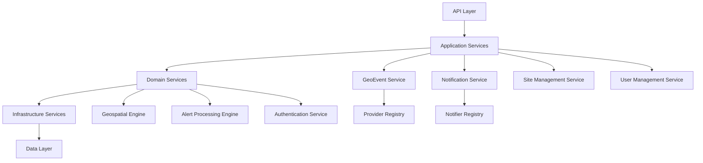

# Design Document

## Overview

This document outlines the design for a comprehensive analysis and improvement of the FireAlert codebase. The FireAlert system is a sophisticated geolocation-based alert platform that monitors environmental events (primarily fires) and notifies users through multiple channels. The system consists of a Next.js web application, React Native mobile app, and a robust backend service architecture.

The analysis will focus on identifying architectural improvements, establishing best practices, improving code quality, and creating comprehensive documentation to support future development.

## Architecture

### Current System Architecture

The FireAlert system follows a monorepo structure with clear separation between components:

```
FireAlert/
├── apps/
│   ├── server/          # Next.js web application with tRPC API
│   └── nativeapp/       # React Native mobile application
├── packages/            # Shared packages and configurations
└── docs/               # Documentation (to be enhanced)
```

#### Key Architectural Components

1. **Web Application (Next.js + tRPC)**

   - API layer using tRPC for type-safe client-server communication
   - Authentication via Auth0
   - Database access through Prisma ORM
   - Service-oriented architecture for business logic

2. **Mobile Application (React Native)**

   - Cross-platform mobile app for iOS and Android
   - Shared API client with web application via tRPC
   - Location services and push notifications
   - Offline-capable data synchronization

3. **Database Layer (PostgreSQL + PostGIS)**

   - Geospatial data storage and querying
   - Complex relationships between users, sites, alerts, and notifications
   - Migration-based schema management

4. **Service Architecture**
   - GeoEvent Providers for data ingestion
   - Notification services for multi-channel alerts
   - Site alert processing and matching

### Proposed Architecture Improvements

#### 1. Enhanced Service Layer Architecture



#### 2. Improved Error Handling and Logging

- Centralized error handling with proper error types
- Structured logging with correlation IDs
- Monitoring and alerting integration
- Graceful degradation strategies

#### 3. Enhanced Type Safety

- Strict TypeScript configuration
- Comprehensive type definitions for all data models
- Runtime type validation using Zod schemas
- Type-safe database queries and API contracts

## Components and Interfaces

### 1. Analysis Engine

The core component responsible for conducting the codebase analysis:

```typescript
interface AnalysisEngine {
  analyzeArchitecture(): ArchitectureAnalysis;
  analyzeCodeQuality(): CodeQualityReport;
  analyzeSecurity(): SecurityReport;
  analyzePerformance(): PerformanceReport;
  analyzeDatabaseLayer(): DatabaseAnalysisReport;
  generateRecommendations(): ImprovementPlan;
}

interface ArchitectureAnalysis {
  patterns: ArchitecturalPattern[];
  dependencies: DependencyGraph;
  coupling: CouplingMetrics;
  cohesion: CohesionMetrics;
  violations: ArchitecturalViolation[];
  monorepoStructure: MonorepoEvaluation;
  serviceLayerAssessment: ServiceLayerAnalysis;
  apiLayerAssessment: APILayerAnalysis;
}

interface CodeQualityReport {
  typeScriptIssues: TypeSafetyIssue[];
  codeSmells: CodeSmell[];
  duplications: CodeDuplication[];
  complexity: ComplexityMetrics;
  testCoverage: CoverageReport;
  dependencyAnalysis: DependencyReport;
  codeOrganization: OrganizationReport;
}

interface SecurityReport {
  authenticationAssessment: AuthSecurityAnalysis;
  apiSecurityIssues: APISecurityIssue[];
  environmentConfigIssues: ConfigSecurityIssue[];
  dataValidationGaps: ValidationGap[];
  vulnerabilities: SecurityVulnerability[];
}

interface PerformanceReport {
  databaseQueryIssues: QueryPerformanceIssue[];
  nPlusOneQueries: NPlusOneQuery[];
  apiBottlenecks: APIBottleneck[];
  optimizationOpportunities: OptimizationOpportunity[];
}

interface DatabaseAnalysisReport {
  schemaDesign: SchemaDesignAnalysis;
  queryOptimization: QueryOptimizationReport;
  migrationStrategy: MigrationAnalysis;
  geospatialPerformance: GeospatialAnalysis;
  dataRelationships: RelationshipAnalysis;
}
```

### 2. Documentation Generator

Automated documentation generation for improved developer experience:

```typescript
interface DocumentationGenerator {
  generateArchitectureGuide(): ArchitectureGuide;
  generateAPIDocumentation(): APIDocumentation;
  generateServiceGuides(): ServiceGuide[];
  generateDeveloperGuides(): DeveloperGuide[];
  generateSetupGuide(): SetupGuide;
  generateCodingStandards(): CodingStandardsGuide;
  generateWorkflowGuide(): WorkflowGuide;
}

interface ArchitectureGuide {
  overview: string;
  components: ComponentDescription[];
  dataFlow: DataFlowDiagram;
  deploymentGuide: DeploymentInstructions;
  monorepoStructure: MonorepoDocumentation;
  serviceArchitecture: ServiceArchitectureDoc;
}

interface APIDocumentation {
  tRPCRouters: RouterDocumentation[];
  endpoints: EndpointDocumentation[];
  authenticationGuide: AuthenticationDoc;
  usageExamples: APIUsageExample[];
  errorHandling: ErrorHandlingDoc;
}

interface ServiceGuide {
  serviceName: string;
  purpose: string;
  interfaces: InterfaceDocumentation[];
  dependencies: ServiceDependency[];
  usageExamples: ServiceUsageExample[];
  extensionGuide: ExtensionGuide;
}

interface SetupGuide {
  prerequisites: Prerequisite[];
  installationSteps: InstallationStep[];
  environmentConfiguration: EnvironmentSetup;
  troubleshooting: TroubleshootingGuide;
  developmentWorkflow: WorkflowInstructions;
}
```

### 3. Improvement Planner

Strategic planning component for prioritizing and implementing improvements:

```typescript
interface ImprovementPlanner {
  prioritizeIssues(issues: Issue[]): PrioritizedIssue[];
  createRefactoringPlan(analysis: AnalysisResult): RefactoringPlan;
  estimateEffort(improvements: Improvement[]): EffortEstimate;
  generateMigrationStrategy(changes: Change[]): MigrationStrategy;
  createServiceArchitecturePlan(
    serviceAnalysis: ServiceLayerAnalysis
  ): ServiceImprovementPlan;
  generatePerformanceOptimizationPlan(
    performanceReport: PerformanceReport
  ): PerformanceImprovementPlan;
  createSecurityImprovementPlan(
    securityReport: SecurityReport
  ): SecurityImprovementPlan;
}

interface ServiceImprovementPlan {
  geoEventProviderImprovements: ProviderImprovement[];
  notificationServiceImprovements: NotifierImprovement[];
  dataAccessImprovements: DataAccessImprovement[];
  businessLogicImprovements: BusinessLogicImprovement[];
  dependencyDecouplingPlan: DecouplingPlan[];
}

interface PerformanceImprovementPlan {
  databaseOptimizations: DatabaseOptimization[];
  queryImprovements: QueryImprovement[];
  apiOptimizations: APIOptimization[];
  mobileOptimizations: MobileOptimization[];
  geospatialOptimizations: GeospatialOptimization[];
}

interface SecurityImprovementPlan {
  authenticationImprovements: AuthImprovement[];
  apiSecurityEnhancements: APISecurityEnhancement[];
  configurationSecurityFixes: ConfigSecurityFix[];
  validationImprovements: ValidationImprovement[];
}
```

## Data Models

### Analysis Data Models

```typescript
interface AnalysisResult {
  id: string;
  timestamp: Date;
  codebaseVersion: string;
  architecture: ArchitectureAnalysis;
  codeQuality: CodeQualityReport;
  security: SecurityReport;
  performance: PerformanceReport;
  databaseAnalysis: DatabaseAnalysisReport;
  recommendations: Recommendation[];
}

interface Recommendation {
  id: string;
  category:
    | "architecture"
    | "security"
    | "performance"
    | "maintainability"
    | "database";
  priority: "critical" | "high" | "medium" | "low";
  title: string;
  description: string;
  impact: string;
  effort: "low" | "medium" | "high";
  implementation: ImplementationGuide;
  requirements: string[]; // References to specific requirements
}

interface ImplementationGuide {
  steps: string[];
  codeExamples: CodeExample[];
  testingStrategy: string;
  rollbackPlan: string;
  affectedFiles: string[];
  dependencies: string[];
}

// Service Architecture Models
interface ServiceLayerAnalysis {
  currentPatterns: ServicePattern[];
  couplingIssues: CouplingIssue[];
  separationOfConcerns: SeparationAnalysis;
  dependencyInjectionOpportunities: DIOpportunity[];
  businessLogicLocation: BusinessLogicAnalysis;
}

interface GeoEventProviderAnalysis {
  currentImplementation: ProviderImplementation;
  extensibilityIssues: ExtensibilityIssue[];
  typeDefinitionGaps: TypeDefinitionGap[];
  errorHandlingPatterns: ErrorHandlingPattern[];
}

interface NotificationServiceAnalysis {
  notifierArchitecture: NotifierArchitecture;
  registryImplementation: RegistryImplementation;
  channelSupport: ChannelSupport[];
  failureHandling: FailureHandlingAnalysis;
}

// Database Analysis Models
interface SchemaDesignAnalysis {
  normalizationLevel: NormalizationLevel;
  relationshipDesign: RelationshipDesign;
  indexingStrategy: IndexingStrategy;
  constraintUsage: ConstraintUsage;
}

interface GeospatialAnalysis {
  postGISUsage: PostGISUsage;
  spatialIndexing: SpatialIndexing;
  queryPerformance: SpatialQueryPerformance;
  geometryOptimization: GeometryOptimization;
}
```

### Current System Data Models (Analysis)

The existing Prisma schema reveals several areas for improvement:

1. **User Management**: Well-structured with role-based access control
2. **Geospatial Data**: Proper use of PostGIS for spatial operations
3. **Alert System**: Complex but well-designed notification pipeline
4. **Extensibility**: Good foundation for adding new providers and notifiers

## Database and Data Layer Analysis

### PostGIS and Geospatial Performance

The database analysis will focus on optimizing the geospatial capabilities and overall data layer performance:

#### Schema Design and Relationships

- **Data Model Evaluation**: Assess current Prisma schema design and normalization
- **Relationship Optimization**: Review foreign key constraints and referential integrity
- **Index Strategy**: Evaluate current indexing approach for both spatial and non-spatial queries
- **Migration Strategy**: Assess migration patterns and versioning approach

#### Geospatial Query Optimization

- **PostGIS Usage Patterns**: Analyze spatial query efficiency and optimization opportunities
- **Spatial Indexing**: Review GiST and SP-GiST index usage for geometry columns
- **Query Performance**: Identify N+1 queries and complex spatial operations
- **Geometry Optimization**: Assess geometry simplification and caching strategies

#### Data Access Patterns

- **Repository Pattern Implementation**: Evaluate current data access abstraction
- **Query Optimization**: Identify opportunities for query batching and caching
- **Connection Pooling**: Assess database connection management and pooling strategies
- **Transaction Management**: Review transaction boundaries and consistency patterns

## Error Handling

### Current Error Handling Analysis

The system uses tRPC's built-in error handling with some custom middleware. Areas for improvement:

1. **Inconsistent Error Types**: Mix of generic errors and specific business errors
2. **Limited Error Context**: Insufficient contextual information for debugging
3. **No Centralized Logging**: Scattered logging throughout the application

### Proposed Error Handling Strategy

```typescript
// Centralized error types
abstract class AppError extends Error {
  abstract readonly code: string;
  abstract readonly statusCode: number;
  abstract readonly isOperational: boolean;
}

class ValidationError extends AppError {
  readonly code = "VALIDATION_ERROR";
  readonly statusCode = 400;
  readonly isOperational = true;
}

class GeoEventProcessingError extends AppError {
  readonly code = "GEO_EVENT_PROCESSING_ERROR";
  readonly statusCode = 500;
  readonly isOperational = true;
}

// Error handling middleware
const errorHandler = (error: Error, context: Context) => {
  if (error instanceof AppError) {
    logger.warn("Operational error", { error, context });
    return formatErrorResponse(error);
  }

  logger.error("Unexpected error", { error, context });
  return formatGenericErrorResponse();
};
```

## Security and Performance Analysis

### Security Assessment Framework

The security analysis will comprehensively evaluate the application's security posture across multiple dimensions:

#### Authentication and Authorization

- **Auth0 Integration Review**: Assess current Auth0 implementation and security patterns
- **Session Management**: Evaluate session handling and token management
- **Role-Based Access Control**: Review RBAC implementation and permission checking
- **API Security**: Assess endpoint protection and authorization middleware

#### Data Protection and Validation

- **Input Validation**: Evaluate Zod schema usage and validation completeness
- **Data Sanitization**: Assess input sanitization and XSS prevention
- **SQL Injection Prevention**: Review Prisma usage and raw query security
- **Environment Configuration**: Audit secrets management and configuration security

#### API Security Measures

- **Rate Limiting**: Assess current rate limiting implementation
- **CORS Configuration**: Review cross-origin resource sharing settings
- **Request Validation**: Evaluate tRPC input validation and error handling
- **Security Headers**: Assess security header implementation

### Performance Analysis Framework

The performance analysis will identify bottlenecks and optimization opportunities across the entire stack:

#### Database Performance

- **Query Optimization**: Identify slow queries and N+1 query problems
- **Index Utilization**: Assess index usage and optimization opportunities
- **Connection Management**: Evaluate connection pooling and database load
- **Geospatial Query Performance**: Analyze PostGIS query efficiency

#### API Performance

- **Response Time Analysis**: Identify slow API endpoints and bottlenecks
- **Caching Strategy**: Evaluate current caching implementation and opportunities
- **Data Transfer Optimization**: Assess payload sizes and data transfer efficiency
- **Concurrent Request Handling**: Review request processing and resource utilization

## Code Quality Focus

Rather than extensive testing infrastructure, we'll focus on improving code quality through:

1. **Type Safety** - Eliminate runtime errors through better TypeScript usage
2. **Error Handling** - Consistent error patterns for better debugging
3. **Code Organization** - Clear separation of concerns and readable structure
4. **Documentation** - Practical guides for developers working with the code

## Implementation Approach

This analysis and refactoring will be conducted as an interactive process where we identify issues and implement improvements immediately. The focus is on high-impact changes that improve code maintainability, architecture clarity, and developer experience.

### Core Focus Areas

1. **Service Architecture Cleanup** - Improve separation of concerns and dependency injection
2. **Type Safety Enhancement** - Strengthen TypeScript usage and eliminate any types
3. **Error Handling Standardization** - Implement consistent error patterns
4. **Documentation Creation** - Generate practical developer guides
5. **Code Organization** - Improve file structure and naming conventions
6. **Database Layer Optimization** - Improve PostGIS usage and query performance
7. **Security Hardening** - Strengthen authentication, validation, and security measures
8. **Performance Optimization** - Address bottlenecks across web and database layers

### Immediate Improvements (High Impact, Low Risk)

1. **Service Layer Refactoring**

   - Extract business logic from tRPC routers
   - Implement proper dependency injection
   - Create clear service interfaces
   - Improve GeoEvent provider architecture
   - Enhance notification service patterns

2. **Type Safety Improvements**

   - Eliminate `any` types
   - Add proper type definitions for external APIs
   - Strengthen Prisma type usage
   - Improve Zod schema definitions

3. **Error Handling Standardization**

   - Create custom error classes
   - Implement consistent error responses
   - Add proper error logging
   - Improve validation error handling

4. **Developer Documentation**

   - Architecture overview with monorepo structure
   - Service documentation for all major components
   - API usage guides with tRPC examples
   - Setup and development workflow
   - Coding standards and best practices

5. **Database Optimization**

   - Query performance analysis
   - PostGIS usage optimization
   - Index strategy improvements
   - Migration pattern standardization

6. **Security Enhancements**
   - Auth0 integration review
   - Input validation improvements
   - Environment configuration security
   - API security measures

## Success Criteria

### Code Quality Improvements

- Elimination of `any` types in critical code paths
- Consistent error handling patterns across services
- Clear separation between API layer and business logic
- Improved code organization and file structure
- Enhanced TypeScript usage with strict type checking
- Standardized dependency management and organization

### Architecture Improvements

- Well-defined service layer with proper separation of concerns
- Improved GeoEvent provider and notification service architecture
- Better dependency injection and decoupling strategies

- Enhanced database query patterns and PostGIS optimization

### Security Enhancements

- Strengthened Auth0 integration and security patterns
- Comprehensive input validation and sanitization
- Secure environment configuration and secrets management
- Improved API security measures and rate limiting

### Performance Optimizations

- Eliminated N+1 queries and database performance bottlenecks
- Optimized geospatial queries and PostGIS usage

- Enhanced API response times and caching strategies

### Documentation Deliverables

- Comprehensive architecture overview with monorepo structure
- Service layer documentation for all major components
- Complete API usage guides with tRPC examples
- Developer setup and workflow guide
- Coding standards and best practices documentation

- Database optimization and migration guides

### Developer Experience Improvements

- Clear service interfaces and dependency injection
- Consistent coding patterns across the web platform
- Better error messages and debugging information
- Comprehensive developer documentation
- Improved development workflow and setup processes

## Risk Assessment and Mitigation

### High-Risk Areas

1. **Geospatial Data Processing**: Complex PostGIS operations and spatial queries
2. **Real-time Notifications**: Critical for user safety and fire alert delivery
3. **Authentication and Authorization**: Security-sensitive Auth0 integration

4. **Database Migration**: Schema changes affecting geospatial data
5. **Service Layer Refactoring**: Risk of breaking existing API contracts
6. **Type Safety Changes**: Potential runtime errors during TypeScript improvements

### Mitigation Strategies

1. **Geospatial Operations**: Comprehensive testing of PostGIS queries and spatial calculations
2. **Notification System**: Redundant notification channels and delivery monitoring
3. **Security**: Security audit, penetration testing, and gradual Auth0 improvements

4. **Database Changes**: Careful migration planning with rollback strategies
5. **Service Refactoring**: Incremental changes with comprehensive API testing
6. **Type Safety**: Gradual TypeScript improvements with runtime validation
7. **Code Organization**: Phased refactoring with clear rollback points

## Conclusion

This comprehensive design provides a detailed framework for analyzing and improving the FireAlert server codebase across all critical dimensions: architecture, code quality, security, performance, and database optimization. The systematic approach ensures that all aspects of the server system are evaluated and improved while maintaining operational stability.

The design addresses the core requirement categories through:

- **Comprehensive Analysis**: Multi-dimensional evaluation covering architecture, code quality, security, performance, and database layers
- **Structured Improvement Planning**: Prioritized recommendations with clear implementation guidance
- **Risk-Aware Implementation**: Careful mitigation strategies for high-risk areas
- **Developer-Centric Approach**: Focus on documentation, developer experience, and maintainability
- **Server Focus**: Concentrated analysis on the Next.js server application and its architecture

The phased approach ensures minimal disruption to ongoing development while systematically addressing technical debt, security vulnerabilities, performance bottlenecks, and architectural inconsistencies. The emphasis on comprehensive documentation and developer experience improvements will establish a solid foundation for future feature development and team scalability.

This design serves as a roadmap for transforming the FireAlert codebase into a more maintainable, secure, performant, and developer-friendly system that can effectively support the critical mission of forest fire detection and alerting.
