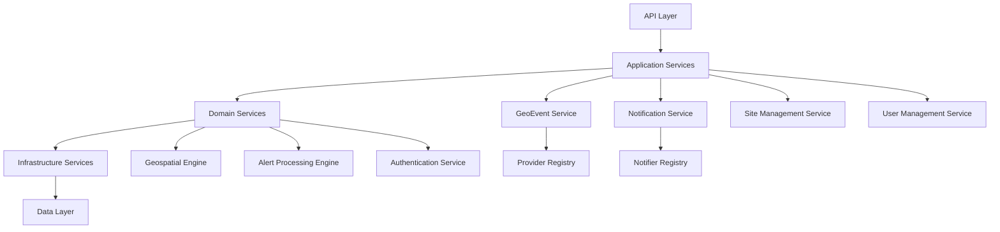

# Design Document

## Overview

This document outlines the design for a comprehensive analysis and improvement of the FireAlert codebase. The FireAlert system is a sophisticated geolocation-based alert platform that monitors environmental events (primarily fires) and notifies users through multiple channels. The system consists of a Next.js web application, React Native mobile app, and a robust backend service architecture.

The analysis will focus on identifying architectural improvements, establishing best practices, improving code quality, and creating comprehensive documentation to support future development.

## Architecture

### Current System Architecture

The FireAlert system follows a monorepo structure with clear separation between components:

```
FireAlert/
├── apps/
│   ├── server/          # Next.js web application with tRPC API
│   └── nativeapp/       # React Native mobile application
├── packages/            # Shared packages and configurations
└── docs/               # Documentation (to be enhanced)
```

#### Key Architectural Components

1. **Web Application (Next.js + tRPC)**
   - API layer using tRPC for type-safe client-server communication
   - Authentication via Auth0
   - Database access through Prisma ORM
   - Service-oriented architecture for business logic

2. **Mobile Application (React Native)**
   - Cross-platform mobile app for iOS and Android
   - Shared API client with web application via tRPC
   - Location services and push notifications
   - Offline-capable data synchronization

3. **Database Layer (PostgreSQL + PostGIS)**
   - Geospatial data storage and querying
   - Complex relationships between users, sites, alerts, and notifications
   - Migration-based schema management

4. **Service Architecture**
   - GeoEvent Providers for data ingestion
   - Notification services for multi-channel alerts
   - Site alert processing and matching

### Proposed Architecture Improvements

#### 1. Enhanced Service Layer Architecture



#### 2. Improved Error Handling and Logging

- Centralized error handling with proper error types
- Structured logging with correlation IDs
- Monitoring and alerting integration
- Graceful degradation strategies

#### 3. Enhanced Type Safety

- Strict TypeScript configuration
- Comprehensive type definitions for all data models
- Runtime type validation using Zod schemas
- Type-safe database queries and API contracts

## Components and Interfaces

### 1. Analysis Engine

The core component responsible for conducting the codebase analysis:

```typescript
interface AnalysisEngine {
  analyzeArchitecture(): ArchitectureAnalysis;
  analyzeCodeQuality(): CodeQualityReport;
  analyzeSecurity(): SecurityReport;
  analyzePerformance(): PerformanceReport;
  generateRecommendations(): ImprovementPlan;
}

interface ArchitectureAnalysis {
  patterns: ArchitecturalPattern[];
  dependencies: DependencyGraph;
  coupling: CouplingMetrics;
  cohesion: CohesionMetrics;
  violations: ArchitecturalViolation[];
}

interface CodeQualityReport {
  typeScriptIssues: TypeSafetyIssue[];
  codeSmells: CodeSmell[];
  duplications: CodeDuplication[];
  complexity: ComplexityMetrics;
  testCoverage: CoverageReport;
}
```

### 2. Documentation Generator

Automated documentation generation for improved developer experience:

```typescript
interface DocumentationGenerator {
  generateArchitectureGuide(): ArchitectureGuide;
  generateAPIDocumentation(): APIDocumentation;
  generateServiceGuides(): ServiceGuide[];
  generateDeveloperGuides(): DeveloperGuide[];
}

interface ArchitectureGuide {
  overview: string;
  components: ComponentDescription[];
  dataFlow: DataFlowDiagram;
  deploymentGuide: DeploymentInstructions;
}
```

### 3. Improvement Planner

Strategic planning component for prioritizing and implementing improvements:

```typescript
interface ImprovementPlanner {
  prioritizeIssues(issues: Issue[]): PrioritizedIssue[];
  createRefactoringPlan(analysis: AnalysisResult): RefactoringPlan;
  estimateEffort(improvements: Improvement[]): EffortEstimate;
  generateMigrationStrategy(changes: Change[]): MigrationStrategy;
}
```

## Data Models

### Analysis Data Models

```typescript
interface AnalysisResult {
  id: string;
  timestamp: Date;
  codebaseVersion: string;
  architecture: ArchitectureAnalysis;
  codeQuality: CodeQualityReport;
  security: SecurityReport;
  performance: PerformanceReport;
  recommendations: Recommendation[];
}

interface Recommendation {
  id: string;
  category: 'architecture' | 'security' | 'performance' | 'maintainability';
  priority: 'critical' | 'high' | 'medium' | 'low';
  title: string;
  description: string;
  impact: string;
  effort: 'low' | 'medium' | 'high';
  implementation: ImplementationGuide;
}

interface ImplementationGuide {
  steps: string[];
  codeExamples: CodeExample[];
  testingStrategy: string;
  rollbackPlan: string;
}
```

### Current System Data Models (Analysis)

The existing Prisma schema reveals several areas for improvement:

1. **User Management**: Well-structured with role-based access control
2. **Geospatial Data**: Proper use of PostGIS for spatial operations
3. **Alert System**: Complex but well-designed notification pipeline
4. **Extensibility**: Good foundation for adding new providers and notifiers

## Error Handling

### Current Error Handling Analysis

The system uses tRPC's built-in error handling with some custom middleware. Areas for improvement:

1. **Inconsistent Error Types**: Mix of generic errors and specific business errors
2. **Limited Error Context**: Insufficient contextual information for debugging
3. **No Centralized Logging**: Scattered logging throughout the application

### Proposed Error Handling Strategy

```typescript
// Centralized error types
abstract class AppError extends Error {
  abstract readonly code: string;
  abstract readonly statusCode: number;
  abstract readonly isOperational: boolean;
}

class ValidationError extends AppError {
  readonly code = 'VALIDATION_ERROR';
  readonly statusCode = 400;
  readonly isOperational = true;
}

class GeoEventProcessingError extends AppError {
  readonly code = 'GEO_EVENT_PROCESSING_ERROR';
  readonly statusCode = 500;
  readonly isOperational = true;
}

// Error handling middleware
const errorHandler = (error: Error, context: Context) => {
  if (error instanceof AppError) {
    logger.warn('Operational error', { error, context });
    return formatErrorResponse(error);
  }
  
  logger.error('Unexpected error', { error, context });
  return formatGenericErrorResponse();
};
```

## Code Quality Focus

Rather than extensive testing infrastructure, we'll focus on improving code quality through:

1. **Type Safety** - Eliminate runtime errors through better TypeScript usage
2. **Error Handling** - Consistent error patterns for better debugging
3. **Code Organization** - Clear separation of concerns and readable structure
4. **Documentation** - Practical guides for developers working with the code

## Implementation Approach

This analysis and refactoring will be conducted as an interactive process where we identify issues and implement improvements immediately. The focus is on high-impact changes that improve code maintainability, architecture clarity, and developer experience.

### Core Focus Areas

1. **Service Architecture Cleanup** - Improve separation of concerns and dependency injection
2. **Type Safety Enhancement** - Strengthen TypeScript usage and eliminate any types
3. **Error Handling Standardization** - Implement consistent error patterns
4. **Documentation Creation** - Generate practical developer guides
5. **Code Organization** - Improve file structure and naming conventions

### Immediate Improvements (High Impact, Low Risk)

1. **Service Layer Refactoring**
   - Extract business logic from tRPC routers
   - Implement proper dependency injection
   - Create clear service interfaces

2. **Type Safety Improvements**
   - Eliminate `any` types
   - Add proper type definitions for external APIs
   - Strengthen Prisma type usage

3. **Error Handling Standardization**
   - Create custom error classes
   - Implement consistent error responses
   - Add proper error logging

4. **Developer Documentation**
   - Architecture overview
   - Service documentation
   - API usage guides
   - Setup and development workflow

## Success Criteria

### Code Quality Improvements
- Elimination of `any` types in critical code paths
- Consistent error handling patterns across services
- Clear separation between API layer and business logic
- Improved code organization and file structure

### Documentation Deliverables
- Architecture overview document
- Service layer documentation
- API usage guides
- Developer setup and workflow guide

### Developer Experience Improvements
- Clear service interfaces and dependency injection
- Consistent coding patterns across the codebase
- Better error messages and debugging information
- Comprehensive developer documentation

## Risk Assessment and Mitigation

### High-Risk Areas
1. **Geospatial Data Processing**: Complex PostGIS operations
2. **Real-time Notifications**: Critical for user safety
3. **Authentication and Authorization**: Security-sensitive
4. **Mobile App Performance**: User experience critical

### Mitigation Strategies
1. Comprehensive testing of geospatial operations
2. Redundant notification channels and monitoring
3. Security audit and penetration testing
4. Performance monitoring and optimization

## Conclusion

This design provides a comprehensive framework for analyzing and improving the FireAlert codebase. The phased approach ensures minimal disruption to ongoing development while systematically addressing technical debt and establishing a solid foundation for future features.

The focus on automation, documentation, and developer experience will significantly improve the long-term maintainability and extensibility of the system.