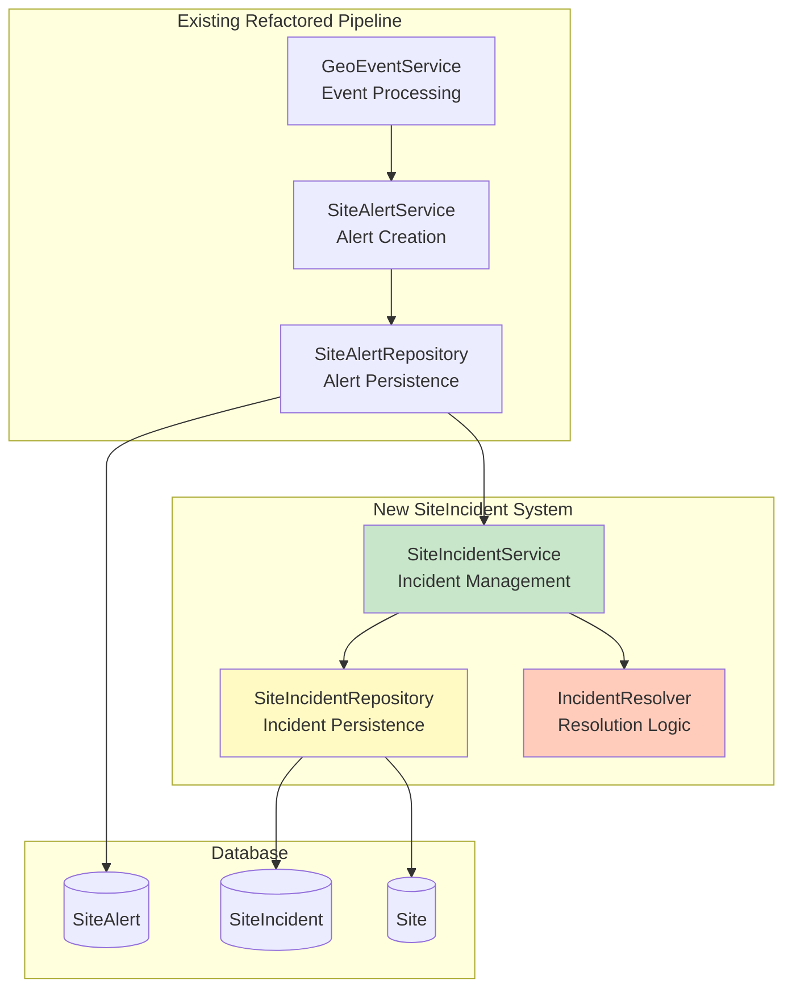

# Design Document: Fire Incident CRON

## Overview

The Fire Incident CRON feature extends the existing geo-event-fetcher CRON job to implement a SiteIncident system that groups related fire alerts and manages notification lifecycle. This design builds upon the refactored service layer architecture to provide better fire tracking and reduce notification fatigue through intelligent incident grouping.

The system transforms the current approach from individual SiteAlert notifications with simple cooldowns to incident-based notifications that track fire events from start to resolution, providing users with better insights into fire duration and scope.

## Architecture

### High-Level Integration

The SiteIncident system integrates into the existing refactored geo-event-fetcher pipeline at the SiteAlert creation stage. The integration follows the established service layer patterns with dependency injection and clean separation of concerns.



### Service Layer Architecture

Following the established patterns from the geo-event-fetcher refactoring, the SiteIncident system implements:

1. **SiteIncidentService**: Business logic for incident lifecycle management
2. **SiteIncidentRepository**: Data access layer for incident operations
3. **IncidentResolver**: Specialized service for incident resolution logic
4. **Integration Points**: Clean interfaces with existing SiteAlertService

### Data Model Integration

The SiteIncident system leverages the existing database schema with the SiteIncident table already defined. The integration adds the incident association logic to the SiteAlert creation workflow.

## Components and Interfaces

### SiteIncidentService

**Purpose**: Orchestrates incident lifecycle management and SiteAlert association

**Key Methods**:

- `processNewSiteAlert(siteAlert: SiteAlert): Promise<SiteIncident>`
- `resolveInactiveIncidents(): Promise<number>`
- `associateAlertWithIncident(alert: SiteAlert, incident: SiteIncident): Promise<void>`

**Dependencies**:

- `SiteIncidentRepository` - Data access
- `IncidentResolver` - Resolution logic
- `PerformanceMetrics` - Performance tracking

### SiteIncidentRepository

**Purpose**: Data access layer for SiteIncident operations with PostGIS spatial queries

**Key Methods**:

- `findActiveBySiteId(siteId: string): Promise<SiteIncident | null>`
- `createIncident(data: CreateIncidentData): Promise<SiteIncident>`
- `updateIncident(id: string, data: UpdateIncidentData): Promise<SiteIncident>`
- `findInactiveIncidents(inactiveHours: number): Promise<SiteIncident[]>`
- `resolveIncidentsBatch(incidents: SiteIncident[]): Promise<number>`

**Spatial Operations**:

- Geometry union calculations for incident detection areas
- Efficient spatial queries using PostGIS indexes

### IncidentResolver

**Purpose**: Specialized logic for determining incident resolution and geometry calculations

**Key Methods**:

- `shouldResolveIncident(incident: SiteIncident): boolean`
- `calculateIncidentGeometry(alerts: SiteAlert[]): Geometry`
- `batchResolveIncidents(incidents: SiteIncident[]): Promise<ResolveResult>`

### Integration Interfaces

**SiteAlertService Integration**:

```typescript
interface SiteIncidentIntegration {
  processNewAlert(alert: SiteAlert): Promise<SiteIncident>;
  resolveInactiveIncidents(): Promise<number>;
}
```

**Transaction Management**:

```typescript
interface TransactionContext {
  siteAlert: SiteAlert;
  siteIncident: SiteIncident;
  rollback(): Promise<void>;
}
```

## Data Models

### SiteIncident Entity

The SiteIncident table (already existing in schema) represents a grouped fire event:

```typescript
interface SiteIncident {
  id: string; // Primary key (cuid)
  siteId: string; // Foreign key to Site
  startSiteAlertId: string; // First alert in incident
  endSiteAlertId?: string; // Final alert (when resolved)
  latestSiteAlertId: string; // Most recent alert
  startedAt: DateTime; // Incident start time
  endedAt?: DateTime; // Incident end time (when resolved)
  isActive: boolean; // Active status (default: true)
  isProcessed: boolean; // Processing status (default: false)
  startNotificationId?: string; // Start notification reference
  endNotificationId?: string; // End notification reference
  reviewStatus: string; // Review status (default: "to_review")
  createdAt: DateTime; // Creation timestamp
  updatedAt: DateTime; // Last update timestamp
}
```

### SiteAlert Enhancement

The existing SiteAlert table includes `siteIncidentId` for incident association:

```typescript
interface SiteAlert {
  // ... existing fields
  siteIncidentId?: string; // Foreign key to SiteIncident
}
```

### Service Data Transfer Objects

```typescript
interface CreateIncidentData {
  siteId: string;
  startSiteAlertId: string;
  latestSiteAlertId: string;
  startedAt: DateTime;
}

interface UpdateIncidentData {
  latestSiteAlertId?: string;
  endSiteAlertId?: string;
  endedAt?: DateTime;
  isActive?: boolean;
  isProcessed?: boolean;
}

interface ResolveResult {
  resolvedCount: number;
  errors: Error[];
  metrics: PerformanceMetrics;
}
```

## Correctness Properties

_A property is a characteristic or behavior that should hold true across all valid executions of a system-essentially, a formal statement about what the system should do. Properties serve as the bridge between human-readable specifications and machine-verifiable correctness guarantees._

### Property 1: Default Values on Creation

_For any_ new SiteIncident created by the system, the default values should be isActive = true and isProcessed = false
**Validates: Requirements 1.3**

### Property 2: Active Incident Check

_For any_ new SiteAlert created, the Fire_Incident_Service should check for active SiteIncidents for the same Site
**Validates: Requirements 2.1**

### Property 3: New Incident Creation

_For any_ SiteAlert where no active SiteIncident exists for the site, the Fire_Incident_Service should create a new SiteIncident with the SiteAlert as the first alert
**Validates: Requirements 2.2**

### Property 4: Existing Incident Association

_For any_ SiteAlert where an active SiteIncident exists for the site, the Fire_Incident_Service should associate the SiteAlert with the existing SiteIncident
**Validates: Requirements 2.3**

### Property 5: New Incident Field Population

_For any_ new SiteIncident created, the system should set firstSiteAlertId, firstEventId, startedAt, and siteId fields correctly
**Validates: Requirements 2.4**

### Property 6: Latest Alert Tracking

_For any_ SiteAlert associated with an existing SiteIncident, the system should update the latestSiteAlertId field to track the most recent alert
**Validates: Requirements 2.5**

### Property 7: Activity Time Window

_For any_ SiteIncident, it should be considered active when new SiteAlerts are associated within 6 hours of the last alert
**Validates: Requirements 3.1**

### Property 8: Automatic Resolution

_For any_ SiteIncident with no new SiteAlerts for 6+ hours, the system should mark it as inactive (isActive = false)
**Validates: Requirements 3.2**

### Property 9: Resolution Timestamp

_For any_ SiteIncident being marked as inactive, the system should set the endedAt timestamp
**Validates: Requirements 3.3**

### Property 10: Geometry Union Calculation

_For any_ resolved SiteIncident, the detectionGeometry should include the union of all associated SiteAlert geometries
**Validates: Requirements 3.4**

### Property 11: Service Integration

_For any_ SiteAlert created by the geo-event-fetcher, the system should call Fire_Incident_Service for incident processing
**Validates: Requirements 4.1**

### Property 12: Transaction Integrity

_For any_ SiteAlert creation, the Fire_Incident_Service should execute within the same database transaction
**Validates: Requirements 4.2**

### Property 13: Transaction Rollback

_For any_ SiteIncident creation failure, the system should rollback the entire SiteAlert transaction
**Validates: Requirements 4.3**

### Property 14: Activity Logging

_For any_ SiteIncident creation or association, the system should log the activity with sufficient detail
**Validates: Requirements 4.4**

### Property 15: Start Notification Status

_For any_ new SiteIncident created, the system should set notificationStatus to 'START'
**Validates: Requirements 5.1**

### Property 16: End Notification Status

_For any_ SiteIncident becoming inactive, the system should set notificationStatus to 'END'
**Validates: Requirements 5.2**

### Property 17: Start Notification Tracking

_For any_ start notification created for a SiteIncident, the system should track the startedNotificationId
**Validates: Requirements 5.3**

### Property 18: End Notification Tracking

_For any_ end notification created for a SiteIncident, the system should track the endedNotificationId
**Validates: Requirements 5.4**

### Property 19: Duplicate Notification Prevention

_For any_ SiteIncident phase (start or end), the system should prevent duplicate notifications from being created
**Validates: Requirements 5.5**

### Property 20: Inactive Incident Identification

_For any_ query for inactive incidents, the system should correctly identify SiteIncidents that have been inactive for 6+ hours
**Validates: Requirements 8.1**

### Property 21: Resolution Field Updates

_For any_ incident being resolved, the system should mark isActive = false and set endedAt timestamp correctly
**Validates: Requirements 8.2**

### Property 22: Resolution Processing Flag

_For any_ resolved incident, the system should mark isProcessed = false to trigger end notifications
**Validates: Requirements 8.3**

### Property 23: Resolution Geometry Update

_For any_ incident being resolved, the system should update detectionGeometry with the union of all associated SiteAlert geometries
**Validates: Requirements 8.4**

### Property 24: CRON Integration

_For any_ geo-event-fetcher CRON execution, the system should handle incident resolution within the same execution
**Validates: Requirements 8.5**

### Property 25: Error Handling

_For any_ database operation error, the system should implement proper error handling without corrupting data
**Validates: Requirements 9.2**

### Property 26: Input Validation

_For any_ input data provided to SiteIncident operations, the system should validate the data before processing
**Validates: Requirements 9.3**

### Property 27: Error Logging

_For any_ error that occurs, the system should log it with sufficient context for debugging
**Validates: Requirements 9.4**

### Property 28: Partial Failure Handling

_For any_ partial failure scenario, the system should handle it gracefully without corrupting existing data
**Validates: Requirements 9.5**

### Property 29: Performance Constraint

_For any_ SiteIncident operation, the system should execute within 100ms per SiteAlert to maintain CRON performance
**Validates: Requirements 10.1**

### Property 30: Query Efficiency

_For any_ database query in SiteIncident operations, the system should use efficient queries with proper indexing
**Validates: Requirements 10.2**

### Property 31: Batch Resolution

_For any_ incident resolution operation, the system should batch multiple incidents when possible for efficiency
**Validates: Requirements 10.3**

### Property 32: Database Round Trip Optimization

_For any_ SiteIncident processing, the system should minimize database round trips through efficient query design
**Validates: Requirements 10.4**

### Property 33: Performance Metrics Collection

_For any_ SiteIncident operation, the system should include performance metrics in the operation results
**Validates: Requirements 10.5**

## Error Handling

### Transaction Management

The SiteIncident system integrates with the existing transaction management in SiteAlertRepository:

1. **Atomic Operations**: SiteAlert creation and SiteIncident association occur in the same transaction
2. **Rollback Strategy**: If incident processing fails, the entire SiteAlert transaction rolls back
3. **Partial Failure Recovery**: Individual incident failures don't affect other incidents in batch operations

### Error Categories

1. **Database Errors**: Connection failures, constraint violations, timeout errors
2. **Business Logic Errors**: Invalid state transitions, missing required data
3. **Integration Errors**: Service communication failures, dependency unavailability
4. **Performance Errors**: Operations exceeding time constraints

### Error Recovery Strategies

```typescript
interface ErrorRecovery {
  retryableErrors: ErrorType[];
  maxRetries: number;
  backoffStrategy: BackoffStrategy;
  fallbackBehavior: FallbackBehavior;
}
```

## Testing Strategy

### Dual Testing Approach

The SiteIncident system follows the established testing patterns from the geo-event-fetcher refactoring:

**Unit Tests**: Verify specific examples, edge cases, and error conditions

- Service method behavior with mocked dependencies
- Repository query logic with test database
- Error handling scenarios
- Edge cases (empty data, invalid inputs)

**Property-Based Tests**: Verify universal properties across all inputs

- Incident lifecycle properties (creation, association, resolution)
- Transaction integrity properties
- Performance constraint properties
- Data consistency properties

### Property-Based Testing Configuration

- **Framework**: Use existing property-based testing library from geo-event-fetcher
- **Iterations**: Minimum 100 iterations per property test
- **Test Tags**: Format: **Feature: fire-incident-cron, Property {number}: {property_text}**
- **Data Generation**: Smart generators for SiteAlert, SiteIncident, and Site data

### Integration Testing

- **Database Integration**: Test with real PostgreSQL + PostGIS for spatial operations
- **Transaction Testing**: Verify rollback behavior under various failure conditions
- **Performance Testing**: Validate 100ms constraint under realistic data volumes
- **CRON Integration**: Test full pipeline with SiteIncident processing enabled

### Test Data Management

```typescript
interface TestDataGenerator {
  generateSite(): Site;
  generateSiteAlert(siteId: string): SiteAlert;
  generateActiveIncident(siteId: string): SiteIncident;
  generateInactiveIncident(siteId: string, hoursInactive: number): SiteIncident;
}
```

The testing strategy ensures comprehensive coverage while maintaining the performance and reliability standards established by the existing geo-event-fetcher system.
