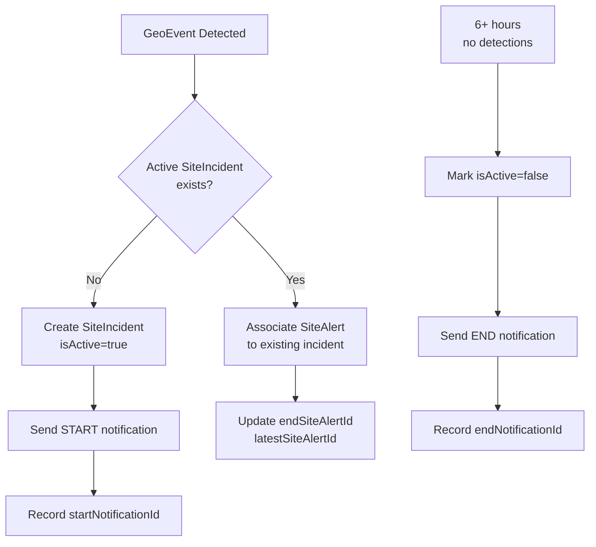

# Design Document: Fire Incident Tracking

## Overview

The Fire Incident Tracking feature introduces a `SiteIncident` entity that groups multiple fire detections (`SiteAlert` records) occurring within a configurable activity period. This design addresses notification fatigue by sending alerts at incident boundaries (start and end) rather than for each individual detection, while maintaining a complete audit trail for analysis and investigation.

### Problem Statement

- Current system sends notifications for each individual fire detection with a 2-hour cooldown
- Results in either missed insights about fire progression or excessive notifications for long-running fires
- No grouping mechanism to understand fire incident lifecycle

### Solution Overview

- Create `SiteIncident` entity to group related `SiteAlert` records
- Track incident lifecycle: creation (start), active monitoring, closure (end)
- Send notifications only at incident boundaries
- Maintain complete audit trail with metadata for historical analysis

## Architecture

### High-Level Flow



### System Boundaries

**In Scope:**

- SiteIncident entity creation and lifecycle management
- Association of SiteAlerts with incidents
- Notification boundary tracking (start/end)
- Audit trail and metadata storage
- Review status tracking for investigation

**Out of Scope (Future Work):**

- CRON job automation for incident transitions
- Automated notification sending via CRON
- Real-time incident status updates

## Components and Interfaces

### Database Schema

#### SiteIncident Entity

```typescript
interface SiteIncident {
  id: string; // Primary key
  siteId: string; // Foreign key to Site

  // Lifecycle tracking
  startSiteAlertId: string; // First alert that triggered incident
  latestSiteAlertId: string; // Most recent alert associated (updated while isActive)
  endSiteAlertId?: string; // Last alert before closure (set only when isActive=false)

  // Timestamps
  startedAt: DateTime; // When incident was created
  endedAt?: DateTime; // When incident was closed

  // State management
  isActive: boolean; // Whether incident is ongoing
  isProcessed: boolean; // Whether notifications have been sent

  // Notification tracking
  startNotificationId?: string; // Foreign key to Notification (START)
  endNotificationId?: string; // Foreign key to Notification (END)

  // Audit trail
  reviewStatus: "to_review" | "in_review" | "reviewed";

  // Metadata
  createdAt: DateTime;
  updatedAt: DateTime;
}
```

#### Relationships

```
SiteIncident
├── Site (many-to-one)
├── SiteAlert (one-to-many) - all alerts in this incident
├── Notification (one-to-many) - start and end notifications
└── GeoEvent (implicit via SiteAlert)

SiteAlert
├── SiteIncident (many-to-one) - optional, null for legacy alerts
└── [existing relationships]
```

### Service Layer

#### SiteIncidentService

Handles core business logic for incident management:

```typescript
interface SiteIncidentService {
  // Incident creation and association
  createOrUpdateIncident(
    siteId: string,
    siteAlert: SiteAlert,
    geoEvent: GeoEvent
  ): Promise<SiteIncident>;

  // Incident closure
  closeInactiveIncidents(
    inactivityThresholdHours: number
  ): Promise<SiteIncident[]>;

  // Query operations
  getActiveIncidentForSite(siteId: string): Promise<SiteIncident | null>;
  getIncidentsByDateRange(
    siteId: string,
    startDate: DateTime,
    endDate: DateTime
  ): Promise<SiteIncident[]>;

  // Metadata updates
  updateReviewStatus(
    incidentId: string,
    status: "to_review" | "in_review" | "reviewed"
  ): Promise<SiteIncident>;
}
```

#### NotificationBoundaryService

Manages notification creation at incident boundaries:

```typescript
interface NotificationBoundaryService {
  // Start notification
  createStartNotification(
    incident: SiteIncident,
    siteAlert: SiteAlert
  ): Promise<Notification>;

  // End notification
  createEndNotification(incident: SiteIncident): Promise<Notification>;

  // Notification tracking
  recordNotificationSent(
    incidentId: string,
    notificationType: "START" | "END",
    notificationId: string
  ): Promise<void>;
}
```

### API Layer

#### tRPC Procedures

```typescript
// Query procedures
router.getIncident(incidentId: string): SiteIncident
router.getActiveIncidents(siteId: string): SiteIncident[]
router.getIncidentHistory(siteId: string, dateRange): SiteIncident[]

// Mutation procedures
router.updateIncidentReviewStatus(
  incidentId: string,
  status: ReviewStatus
): SiteIncident

// Admin procedures (future)
router.closeIncident(incidentId: string): SiteIncident
router.reopenIncident(incidentId: string): SiteIncident
```

## Data Models

### Prisma Schema Addition

The following model will be added to `apps/server/prisma/schema.prisma`:

```prisma
model SiteIncident {
  id                String          @id @default(cuid())
  siteId            String

  // Lifecycle tracking
  startSiteAlertId  String
  endSiteAlertId    String?
  latestSiteAlertId  String

  // Timestamps
  startedAt         DateTime        @default(now())
  endedAt           DateTime?

  // State management
  isActive          Boolean         @default(true)
  isProcessed       Boolean         @default(false)

  // Notification tracking
  startNotificationId  String?
  endNotificationId    String?

  // Audit trail
  reviewStatus      String          @default("to_review") // "to_review" | "in_review" | "reviewed"

  // Metadata
  createdAt         DateTime        @default(now())
  updatedAt         DateTime        @updatedAt

  // Relations
  site              Site            @relation(fields: [siteId], references: [id], onDelete: Cascade)
  startSiteAlert    SiteAlert       @relation("startAlert", fields: [startSiteAlertId], references: [id])
  latestSiteAlert   SiteAlert       @relation("latestAlert", fields: [latestSiteAlertId], references: [id])
  endSiteAlert      SiteAlert?      @relation("endAlert", fields: [endSiteAlertId], references: [id])
  siteAlerts        SiteAlert[]     @relation("incidentAlerts")

  @@index([siteId])
  @@index([isActive, isProcessed])
  @@index([startedAt])
}
```

**Schema Changes to Existing Models:**

```prisma
// Add to SiteAlert model:
siteIncidentId    String?
siteIncident      SiteIncident?   @relation("incidentAlerts", fields: [siteIncidentId], references: [id], onDelete: SetNull)

// Add to Site model:
incidents         SiteIncident[]
```

**Cascade Behavior:**

- When a Site is deleted, all associated SiteIncidents are deleted (cascade)
- When a SiteAlert is deleted, SiteIncident references are set to null (SetNull) to preserve incident history
- SiteIncident deletion does not cascade to SiteAlerts (preserves audit trail)

### SiteIncident State Machine

```
┌─────────────────────────────────────────────────────────┐
│                    CREATED                              │
│  isActive=true, isProcessed=false                       │
│  startNotificationId=null, endNotificationId=null       │
└────────────────────┬────────────────────────────────────┘
                     │
                     ▼
┌─────────────────────────────────────────────────────────┐
│                    ACTIVE                               │
│  isActive=true, isProcessed=true                        │
│  startNotificationId=set, endNotificationId=null        │
│  (Receives new SiteAlerts, updates endSiteAlertId)      │
└────────────────────┬────────────────────────────────────┘
                     │
        (6+ hours no detections)
                     │
                     ▼
┌─────────────────────────────────────────────────────────┐
│                    CLOSING                              │
│  isActive=false, isProcessed=false                      │
│  endedAt=set, endSiteAlertId=set                        │
└────────────────────┬────────────────────────────────────┘
                     │
                     ▼
┌─────────────────────────────────────────────────────────┐
│                    CLOSED                               │
│  isActive=false, isProcessed=true                       │
│  endNotificationId=set                                  │
│  (No new SiteAlerts can be associated)                  │
└─────────────────────────────────────────────────────────┘
```

### Notification Integration

The existing `Notification` model will be used to track incident boundary notifications. The `metadata` JSON field will store incident-specific information:

```typescript
interface IncidentNotificationMetadata {
  type: "INCIDENT_START" | "INCIDENT_END";
  incidentId: string;
  siteId: string;
  siteName: string;
  detectionCount?: number; // For END notifications, count of alerts in incident
  durationMinutes?: number; // For END notifications, incident duration
}
```

**Notification Creation Flow:**

1. When SiteIncident is created with `isActive=true`, a START notification is created
2. When SiteIncident transitions to `isActive=false`, an END notification is created
3. Both notifications reference the SiteIncident via metadata, not directly via foreign key
4. Notifications are associated with the first SiteAlert (startSiteAlertId) for tracking purposes

## Correctness Properties

A property is a characteristic or behavior that should hold true across all valid executions of a system—essentially, a formal statement about what the system should do. Properties serve as the bridge between human-readable specifications and machine-verifiable correctness guarantees.

### Property 1: Incident Creation Invariant

_For any_ Site with no active SiteIncident, when a new GeoEvent is detected within that Site's geometry, the system SHALL create exactly one new SiteIncident with isActive=true and record the startSiteAlertId.

**Validates: Requirements 1.1, 2.1**

### Property 2: Single Active Incident Per Site

_For any_ Site, there SHALL be at most one SiteIncident with isActive=true at any given time.

**Validates: Requirements 1.1, 1.2**

### Property 3: Alert Association Consistency

_For any_ SiteAlert associated with a SiteIncident, the SiteAlert's siteIncidentId SHALL match the SiteIncident's id, and the SiteAlert's geometry SHALL intersect with the Site's geometry.

**Validates: Requirements 1.2, 5.2**

### Property 4: Closed Incident Immutability

_For any_ SiteIncident with isActive=false, no new SiteAlerts SHALL be associated with it, and all metadata (startedAt, endedAt) SHALL remain unchanged.

**Validates: Requirements 1.4, 3.4**

### Property 5: Notification Boundary Tracking

_For any_ SiteIncident, if startNotificationId is set, then startedAt and startSiteAlertId SHALL be set. If endNotificationId is set, then endedAt and endSiteAlertId SHALL be set.

**Validates: Requirements 2.2, 2.4**

### Property 6: Inactivity Threshold Enforcement

_For any_ SiteIncident with isActive=true, if the time elapsed since the latest associated SiteAlert exceeds the configured inactivity threshold, the system SHALL transition the incident to isActive=false.

**Validates: Requirements 1.3**

### Property 7: Audit Trail Completeness

_For any_ SiteIncident, all subsequent SiteAlerts SHALL have their endSiteAlertId and latestSiteAlertId recorded.

**Validates: Requirements 3.1, 3.2, 3.4**

### Property 8: Review Status Validity

_For any_ SiteIncident, the reviewStatus field SHALL only contain values from the set: {to_review, in_review, reviewed}.

**Validates: Requirements 3.3**

### Property 9: Referential Integrity

_For any_ SiteIncident, the siteId SHALL reference an existing Site, and all foreign keys (startSiteAlertId, latestSiteAlertId, endSiteAlertId, startNotificationId, endNotificationId) SHALL either be null or reference existing records.

**Validates: Requirements 5.1, 5.2**

### Property 10: Incident Lifecycle Ordering

_For any_ SiteIncident, startedAt SHALL be less than or equal to endedAt (if endedAt is set), and both SHALL be valid timestamps.

**Validates: Requirements 2.1, 2.3**

### Property 11: Notification Status Validity (Phase 2)

_For any_ Notification created for a SiteIncident, the notificationStatus field SHALL only contain values from the set: {START_SCHEDULED, START_SENT, END_SCHEDULED, END_SENT}.

**Validates: Requirements 5.1, 5.4, 5.5, 5.6**

### Property 12: Notification Method Distribution (Phase 2)

_For any_ SiteIncident with verified and enabled alert methods, the system SHALL create notifications for each method, and the notification method counter SHALL accurately track available methods.

**Validates: Requirements 5.2, 5.3**

### Property 13: Notification Delivery Consistency (Phase 2)

_For any_ Notification with notificationStatus=START_SENT or END_SENT, the notification SHALL have isDelivered=true and sentAt SHALL be set to a valid timestamp.

**Validates: Requirements 6.1, 6.2, 6.5**

### Property 14: Notification Message Differentiation (Phase 2)

_For any_ START notification and END notification for the same SiteIncident, the constructed messages SHALL differ and END notifications SHALL include incident summary information (duration, detection count).

**Validates: Requirements 6.3, 6.2**

### Property 15: Failed Notification Handling (Phase 2)

_For any_ Notification that fails to send, the notification SHALL be marked as skipped, and the failure count for the corresponding alert method SHALL be incremented.

**Validates: Requirements 6.4**

## Configuration

### Environment Variables

```bash
# Inactivity threshold for closing incidents (in hours)
INCIDENT_INACTIVITY_HOURS=6

# Feature flag for incident notifications (future CRON automation)
ENABLE_INCIDENT_NOTIFICATIONS=true
```

**Default Values:**

- `INCIDENT_INACTIVITY_HOURS`: 6 hours (if not set)
- `ENABLE_INCIDENT_NOTIFICATIONS`: true (if not set)

## Error Handling

### Validation Errors

- **Invalid Site Reference**: Attempting to create incident for non-existent Site
- **Invalid Review Status**: Attempting to set reviewStatus to unsupported value (must be one of: "to_review", "in_review", "reviewed")
- **Invalid Timestamp**: endedAt before startedAt
- **Invalid Inactivity Threshold**: Configured threshold is negative or zero

### Business Logic Errors

- **Duplicate Active Incident**: Attempting to create incident when one already exists for Site
- **Closed Incident Modification**: Attempting to associate SiteAlert with closed incident
- **Missing Required Fields**: Creating incident without startSiteAlertId or startedAt
- **Referential Integrity**: SiteAlert does not belong to the specified Site

### Recovery Strategies

- Return descriptive error messages with field-level validation details
- Log all errors for audit trail with incident ID and timestamp
- Prevent partial state updates (transactional consistency via Prisma)
- Provide rollback capability for failed operations
- Gracefully handle missing environment variables with sensible defaults

## Implementation Scope

### Phase 1: Core SiteIncident Entity (Requirements 1-4)

This phase focuses on the core SiteIncident entity and business logic:

- SiteIncident creation and lifecycle management
- Association of SiteAlerts with incidents
- Notification boundary tracking (start/end)
- Audit trail and metadata storage
- Review status tracking for investigation
- Query operations for incident retrieval
- tRPC API endpoints for incident management

### Phase 2: SiteIncident Notification Services (Requirements 5-7)

This phase implements notification creation and sending for incident boundaries:

- **CreateIncidentNotifications Service**: Creates START and END notifications for SiteIncidents
  - Processes unprocessed SiteIncidents with `isProcessed=false`
  - Creates notifications for each verified and enabled alert method
  - Tracks notification method counts for balanced distribution
  - Sets `notificationStatus` to START_SCHEDULED or END_SCHEDULED
  - Supports batch processing with chunking
- **SendIncidentNotifications Service**: Sends incident boundary notifications
  - Processes notifications with `notificationStatus` in SCHEDULED state
  - Delivers through configured alert methods (SMS, WhatsApp, Email, Device, Webhook)
  - Constructs differentiated messages for START vs END events
  - Updates `notificationStatus` to START_SENT or END_SENT on success
  - Marks failed notifications as skipped
- **Mock APIs**: Testing endpoints for notification services
  - Mock endpoint to create incident notifications (filters by SiteIncident ID, Site ID, notification type)
  - Mock endpoint to send incident notifications
  - Returns detailed response data (notification counts, success/failure stats, processed incident IDs)
  - Maintains data integrity and transactional consistency

### Future Work: CRON Automation (Requirement 8)

**Out of Scope (Planned for later):**

- Automated CRON job execution for incident transitions
- Automated notification sending via CRON
- Real-time incident status updates
- Scheduled inactivity checks

These will be implemented after the geo-event-fetcher CRON refactoring is complete (see Requirement 8 in requirements.md).

## Notification Services Architecture (Phase 2)

### CreateIncidentNotifications Service

Handles creation of incident boundary notifications following the pattern of `CreateNotifications.ts`:

```typescript
interface CreateIncidentNotificationsService {
  // Main execution
  createNotifications(): Promise<number>; // Returns count of notifications created

  // Helper functions
  processUnprocessedIncidents(chunkSize: number): Promise<SiteIncident[]>;

  createNotificationQueue(
    incidents: SiteIncident[]
  ): Promise<NotificationQueueItem[]>;

  filterByNotificationStatus(
    incidents: SiteIncident[],
    status: "START_SCHEDULED" | "END_SCHEDULED"
  ): Promise<SiteIncident[]>;
}

interface NotificationQueueItem {
  incidentId: string;
  siteId: string;
  notificationType: "START_SCHEDULED" | "END_SCHEDULED";
  alertMethod: string;
  destination: string;
}
```

**Processing Flow:**

1. Query unprocessed SiteIncidents (isProcessed=false)
2. Group by siteId for efficient processing
3. Initialize notification method counter per site
4. Create notification queue with all verified/enabled alert methods
5. Batch create notifications in Prisma transaction
6. Update SiteIncident.isProcessed=true

### SendIncidentNotifications Service

Handles sending of incident boundary notifications following the pattern of `SendNotifications.ts`:

```typescript
interface SendIncidentNotificationsService {
  // Main execution
  sendNotifications(options?: AdditionalOptions): Promise<number>; // Returns count sent

  // Helper functions
  getScheduledNotifications(batchSize: number): Promise<Notification[]>;

  constructMessage(
    notification: Notification,
    incident: SiteIncident,
    alertMethod: string
  ): Promise<string>;

  updateNotificationStatus(
    notificationId: string,
    status: "START_SENT" | "END_SENT"
  ): Promise<void>;
}
```

**Processing Flow:**

1. Query notifications with `notificationStatus` in SCHEDULED state
2. Process in batches to manage database load
3. For each notification:
   - Construct appropriate message (START vs END)
   - Deliver through configured alert method
   - Update status to SENT on success
   - Mark as skipped on failure
4. Increment failure count for failed alert methods
5. Continue until no more scheduled notifications

### Notification Status State Machine

```
START Notification Lifecycle:
┌──────────────────────────┐
│  START_SCHEDULED         │
│  (Created, awaiting send)│
└────────────┬─────────────┘
             │
             ▼
┌──────────────────────────┐
│  START_SENT              │
│  (Successfully sent)     │
└──────────────────────────┘

END Notification Lifecycle:
┌──────────────────────────┐
│  END_SCHEDULED           │
│  (Created, awaiting send)│
└────────────┬─────────────┘
             │
             ▼
┌──────────────────────────┐
│  END_SENT                │
│  (Successfully sent)     │
└──────────────────────────┘

Failed notifications are marked as skipped and not retried.
```

## Testing Strategy

### Unit Testing

Unit tests verify specific examples and edge cases:

- Incident creation with valid/invalid inputs
- State transitions (active → closing → closed)
- Review status updates
- Referential integrity checks
- Timestamp validation
- Boundary conditions (empty incidents, null fields)

### Property-Based Testing

Property-based tests verify universal properties across all inputs using a PBT framework (Vitest with fast-check for TypeScript):

- **Framework**: Vitest with fast-check
- **Minimum Iterations**: 100 per property test
- **Test Annotation Format**: `**Feature: fire-incident, Property {number}: {property_text}**`
- **One Test Per Property**: Each correctness property has exactly one corresponding PBT test

#### Property Test Configuration

Each property-based test SHALL:

1. Generate random but valid inputs (Sites, SiteAlerts, GeoEvents)
2. Execute the operation under test
3. Verify the property holds for all generated inputs
4. Include explicit reference to the correctness property in comments

Example structure:

```typescript
// **Feature: fire-incident, Property 1: Incident Creation Invariant**
// **Validates: Requirements 1.1, 2.1**
test("property: incident creation invariant", () => {
  fc.assert(
    fc.property(arbitrarySite(), arbitraryGeoEvent(), (site, geoEvent) => {
      // Test implementation
    }),
    { numRuns: 100 }
  );
});
```

### Integration Testing

Integration tests verify interactions between components:

- SiteIncident creation with SiteAlert association
- Closed incidents prevent new associations
- Query operations return correct related data
- Referential integrity across related entities

### Test Coverage Goals

- Core business logic: 100% coverage
- Error paths: 100% coverage
- State transitions: 100% coverage
- Edge cases: Covered by property-based tests
