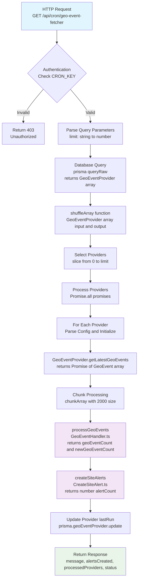
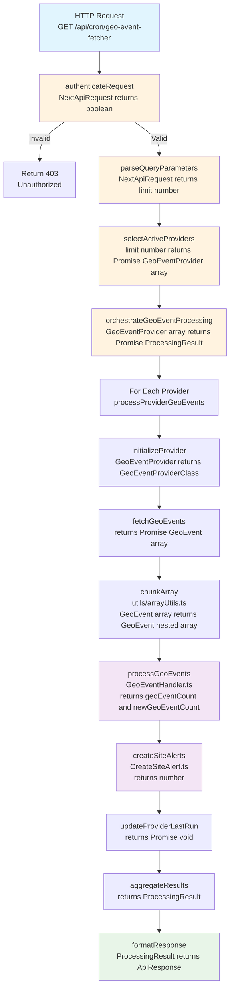

# Design Document

## Overview

This document outlines the refactoring design for the geo-event-fetcher CRON job. The refactoring aims to improve code quality, maintainability, and testability while preserving all existing functionality and maintaining backward compatibility.

## Current Process Flow

The following diagram shows the current implementation flow with file references and function signatures:



### Current Implementation Issues

**File: `apps/server/src/pages/api/cron/geo-event-fetcher.ts`**

1. **Type Safety Issues:**

   - `JSON.parse(JSON.stringify(config))` for type conversion
   - Template literal type errors with `any` types
   - Missing proper type validation

2. **Code Organization:**

   - All logic in single function `alertFetcher()`
   - Utility functions defined inline
   - Complex nested logic with poor separation of concerns

3. **Variable Naming:**

   - `alertFetcher` function name doesn't match file purpose
   - `fetchCount` vs `limit` confusion
   - `promises` is too generic

4. **Dead Code:**
   - Commented-out while loop
   - Unused `processedProviders` variable
   - Commented-out notification logic

## Refactored Process Flow

The following diagram shows the proposed refactored implementation with improved modularity:



## Architecture

### Modular Function Design

The refactored implementation follows SOLID principles with clear separation of concerns:

#### 1. Authentication Module

```typescript
// File: apps/server/src/pages/api/cron/geo-event-fetcher.ts
function authenticateRequest(req: NextApiRequest): boolean;
```

#### 2. Query Parameter Parsing

```typescript
// File: apps/server/src/pages/api/cron/geo-event-fetcher.ts
function parseQueryParameters(req: NextApiRequest): { limit: number };
```

#### 3. Provider Selection

```typescript
// File: apps/server/src/pages/api/cron/geo-event-fetcher.ts
async function selectActiveProviders(
  limit: number
): Promise<GeoEventProvider[]>;
```

#### 4. Main Orchestration

```typescript
// File: apps/server/src/pages/api/cron/geo-event-fetcher.ts
async function orchestrateGeoEventProcessing(
  providers: GeoEventProvider[]
): Promise<ProcessingResult>;
```

#### 5. Utility Functions

```typescript
// File: apps/server/src/utils/arrayUtils.ts (new file)
export function shuffleArray<T>(array: T[]): T[];
export function chunkArray<T>(array: T[], size: number): T[][];
```

### Components and Interfaces

#### Core Types

```typescript
interface ProcessingResult {
  totalProviders: number;
  totalGeoEvents: number;
  totalNewGeoEvents: number;
  totalSiteAlerts: number;
  executionDuration: number;
}

interface ApiResponse {
  message: string;
  alertsCreated: number;
  processedProviders: number;
  status: number;
  metrics?: ProcessingResult; // New metrics for enhanced monitoring
}
```

#### Provider Processing

```typescript
interface ProviderProcessingResult {
  providerId: string;
  geoEventsFetched: number;
  newGeoEventsCreated: number;
  siteAlertsCreated: number;
}
```

### Data Models

The refactored implementation maintains the same data models but improves type safety:

#### Enhanced GeoEventProvider Handling

```typescript
// Improved type-safe config parsing
function parseProviderConfig(config: unknown): GeoEventProviderConfig {
  // Use Zod validation instead of JSON.parse(JSON.stringify())
  return GeoEventProviderConfigSchema.parse(config);
}
```

#### FIRMS API Key Override

```typescript
// Development testing support
function getApiKey(provider: GeoEventProvider): string {
  if (env.FIRMS_MAP_KEY && isFirmsProvider(provider)) {
    return env.FIRMS_MAP_KEY;
  }
  return provider.clientApiKey;
}
```

## Error Handling

### Comprehensive Error Management

```typescript
interface ErrorContext {
  operation: string;
  providerId?: string;
  details?: Record<string, unknown>;
}

function handleError(error: Error, context: ErrorContext): void {
  logger(`${context.operation} failed: ${error.message}`, "error", context);
}
```

### Provider-Level Error Isolation

- Individual provider failures don't stop other providers
- Detailed error logging with provider context
- Graceful degradation for partial failures

## Testing Strategy

### Unit Testing Approach

1. **Function-Level Testing**: Each extracted function can be tested independently
2. **Mock Dependencies**: Database and external API calls can be easily mocked
3. **Type Safety Testing**: Zod schemas ensure runtime type validation
4. **Error Scenario Testing**: Each error path can be tested in isolation

### Integration Testing

1. **End-to-End Flow**: Test complete CRON job execution
2. **Database Integration**: Test with real database operations
3. **Provider Integration**: Test with actual provider implementations

## Implementation Constraints

### Minimal File Changes

To keep the review manageable, the refactoring will:

1. **Single File Focus**: Primary changes in `geo-event-fetcher.ts`
2. **New Utility File**: Only one new file `utils/arrayUtils.ts` for shared utilities
3. **No Service Changes**: Existing `GeoEventHandler` and `CreateSiteAlert` services remain unchanged
4. **Interface Preservation**: All existing interfaces and types remain the same

### Backward Compatibility

1. **API Response Structure**: Maintains existing response format
2. **Additional Metrics**: New metrics added without removing existing fields
3. **Database Operations**: No changes to database schema or queries
4. **Provider Interface**: No changes to existing provider implementations

### Development Features

1. **FIRMS API Key Override**: Environment variable `FIRMS_MAP_KEY` for development testing
2. **Enhanced Logging**: Improved logging with structured context
3. **Performance Metrics**: Execution timing and detailed statistics

## Key Design Decisions

### 1. Function Extraction Strategy

- Extract authentication, parsing, and selection logic into separate functions
- Keep orchestration logic clear and readable
- Maintain single responsibility for each function

### 2. Error Handling Approach

- Wrap all async operations in try-catch blocks
- Log errors with sufficient context for debugging
- Continue processing other providers when one fails

### 3. Type Safety Improvements

- Replace `JSON.parse(JSON.stringify())` with proper type validation
- Use explicit return types for all functions
- Implement proper query parameter validation

### 4. Utility Function Organization

- Move array utilities to shared module for reusability
- Keep provider-specific logic in the main file
- Maintain clear separation between utilities and business logic

This design ensures the refactored code is more maintainable, testable, and follows SOLID principles while preserving all existing functionality and maintaining backward compatibility.

---

## FOCUSED DEPENDENCY REFACTORING - SUPPORTING THE CRON JOB

**Note: The following sections outline ONLY the minimal changes needed to support the geo-event-fetcher refactor. This is not a comprehensive overhaul but targeted improvements.**

### What Actually Needs to be Fixed

Based on the current geo-event-fetcher refactor, we identified these **specific issues** that impact the CRON job:

1. **Configuration Validation**: The Zod schema was too strict (fixed)
2. **Error Handling**: Services don't provide enough context for debugging
3. **Return Types**: Missing explicit interfaces for service responses
4. **Logging**: Inconsistent logging patterns across services

### Phase 2: Minimal Service Improvements (ONLY what's needed)

#### 2.1 GeoEventHandler - Add Better Error Context

**File: `apps/server/src/Services/GeoEvent/GeoEventHandler.ts`**

**Current Issue**: When `processGeoEvents` fails, the CRON job gets generic errors without context.

**Minimal Fix Needed**:

```typescript
// Add explicit interface for return type (currently missing)
interface GeoEventProcessingResult {
  geoEventCount: number;
  newGeoEventCount: number;
  processingDuration?: number; // Add timing info
  errors?: string[]; // Add error context
}

// Update function signature to be explicit
const processGeoEvents = async (
  geoEventProviderClientId: GeoEventProviderClientId,
  geoEventProviderId: string,
  slice: string,
  geoEvents: GeoEvent[]
): Promise<GeoEventProcessingResult> => {
  // Add timing and better error context
  // Keep existing logic, just add wrapper for error handling
};
```

**Why This Helps**: The CRON job can now get detailed error information and timing metrics.

#### 2.2 CreateSiteAlert - Add Better Error Context

**File: `apps/server/src/Services/SiteAlert/CreateSiteAlert.ts`**

**Current Issue**: When `createSiteAlerts` fails, the CRON job doesn't know which batch or operation failed.

**Minimal Fix Needed**:

```typescript
// Add explicit interface for return type (currently just returns number)
interface SiteAlertCreationResult {
  totalAlertsCreated: number;
  batchesProcessed: number;
  processingDuration?: number;
  errors?: string[];
}

// Update function signature
const createSiteAlerts = async (
  geoEventProviderId: string,
  geoEventProviderClientId: GeoEventProviderClientId,
  slice: string
): Promise<SiteAlertCreationResult> => {
  // Add timing and error context
  // Keep existing SQL logic, just add wrapper for error handling
};
```

**Why This Helps**: The CRON job can now report which specific operations failed and provide better metrics.

#### 2.3 Provider Registry - Better Error Messages

**File: `apps/server/src/Services/GeoEventProvider/GeoEventProviderRegistry.ts`**

**Current Issue**: Generic "Provider not found" errors don't help with debugging.

**Minimal Fix Needed**:

```typescript
// Just improve error messages, no structural changes
const GeoEventProviderClassRegistry = {
  get: (client: string): GeoEventProviderClass => {
    const provider = registry[client];
    if (!provider) {
      // Better error message with available providers
      const availableProviders = Object.keys(registry).join(", ");
      throw new Error(
        `Provider with key '${client}' not found. Available providers: ${availableProviders}`
      );
    }
    return provider;
  },
};
```

**Why This Helps**: Debugging becomes much easier when you know what providers are actually available.

### Phase 3: Provider Configuration Validation (ONLY what's needed)

#### 3.1 Add Configuration Schemas to Existing Providers

**Files: `apps/server/src/Services/GeoEventProvider/ProviderClass/*.ts`**

**Current Issue**: Provider config validation happens at runtime with generic errors.

**Minimal Fix Needed**:

```typescript
// Add Zod schemas to existing providers (no structural changes)
import { z } from 'zod';

// In NasaGeoEventProviderClass.ts
const NasaConfigSchema = z.object({
  bbox: z.string(),
  slice: z.string(),
  client: z.literal('FIRMS'),
  apiUrl: z.string().url(),
}).passthrough();

// In GOES16GeoEventProviderClass.ts
const GOES16ConfigSchema = z.object({
  bbox: z.string(),
  slice: z.string(),
  client: z.literal('GOES-16'),
  privateKey: z.object({
    type: z.string(),
    project_id: z.string(),
    private_key: z.string(),
    // ... other required fields
  }),
}).passthrough();

// Update getConfig() methods to use Zod validation
getConfig(): NasaGeoEventProviderConfig {
  if (typeof this.config === 'undefined') {
    throw new Error(`Invalid or incomplete alert provider configuration`);
  }

  try {
    return NasaConfigSchema.parse(this.config);
  } catch (error) {
    throw new Error(`Invalid NASA provider configuration: ${error.message}`);
  }
}
```

**Why This Helps**: The CRON job gets clear validation errors instead of runtime failures.

### Phase 4: Integration Testing (ONLY what's needed)

#### 4.1 Update CRON Job to Handle New Response Types

**File: `apps/server/src/pages/api/cron/geo-event-fetcher.ts`**

**Changes Needed**:

```typescript
// Update processProviderGeoEvents to handle new response types
const processedGeoEvent = await processGeoEvents(
  geoEventProviderClientId as GeoEventProviderClientId,
  geoEventProviderId,
  slice,
  geoEventChunk
);

// Now we can access more detailed info:
totalEventCount += processedGeoEvent.geoEventCount;
totalNewGeoEvent += processedGeoEvent.newGeoEventCount;

// Add error handling for new error context
if (processedGeoEvent.errors?.length > 0) {
  logger(
    `${logPrefix} Processing errors: ${processedGeoEvent.errors.join(", ")}`,
    "warn"
  );
}
```

#### 4.2 Enhanced Metrics Collection

**Update the ProcessingResult interface**:

```typescript
interface ProcessingResult {
  totalProviders: number;
  totalGeoEvents: number;
  totalNewGeoEvents: number;
  totalSiteAlerts: number;
  executionDuration: number;
  // Add new metrics from services
  serviceErrors: string[];
  processingDetails: {
    geoEventProcessingDuration: number;
    siteAlertProcessingDuration: number;
    batchesProcessed: number;
  };
}
```

### Implementation Timeline

#### ✅ **Phase 1: COMPLETED** - CRON Job Orchestration (1 week)

- Refactored geo-event-fetcher.ts
- Fixed configuration validation
- Improved error handling and logging

#### 🔄 **Phase 2: Service Response Improvements** (1 week)

- Add explicit return type interfaces
- Improve error context in GeoEventHandler
- Improve error context in CreateSiteAlert
- Better error messages in Registry

#### 🔄 **Phase 3: Configuration Validation** (3-4 days)

- Add Zod schemas to existing providers
- Update getConfig() methods for better validation
- No structural changes to providers

#### 🔄 **Phase 4: Integration** (2-3 days)

- Update CRON job to use new response types
- Enhanced metrics collection
- End-to-end testing

### What We're NOT Doing (Out of Scope)

❌ **Complete service restructuring** - Services work fine, just need better interfaces  
❌ **Provider base classes** - Existing providers work, just need better validation  
❌ **Complex SQL refactoring** - SQL works, just need better error reporting  
❌ **Performance optimization** - No performance issues identified  
❌ **Comprehensive testing framework** - Focus on integration testing only

### Benefits of This Focused Approach

1. ✅ **Minimal Risk**: Small, targeted changes
2. ✅ **Quick Implementation**: 2-3 weeks total
3. ✅ **Immediate Value**: Better debugging and monitoring
4. ✅ **Backward Compatible**: No breaking changes
5. ✅ **Supports CRON Job**: Directly improves the refactored CRON job
6. ✅ **Easy to Review**: Small, focused changes

This focused approach gives us the benefits we need to support the geo-event-fetcher refactor without the complexity and risk of a comprehensive overhaul.
