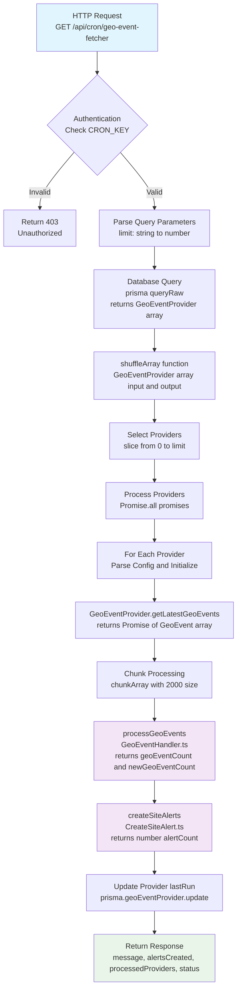
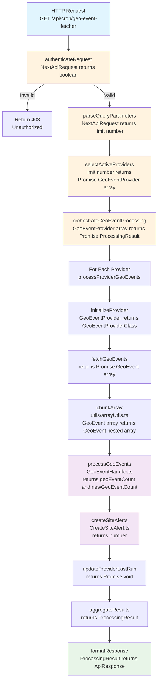

# Design Document

## Overview

This document outlines the refactoring design for the geo-event-fetcher CRON job. The refactoring aims to improve code quality, maintainability, and testability while preserving all existing functionality and maintaining backward compatibility.

## Current Process Flow

The following diagram shows the current implementation flow with file references and function signatures:



### Current Implementation Issues

**File: `apps/server/src/pages/api/cron/geo-event-fetcher.ts`**

1. **Type Safety Issues:**

   - `JSON.parse(JSON.stringify(config))` for type conversion
   - Template literal type errors with `any` types
   - Missing proper type validation

2. **Code Organization:**

   - All logic in single function `alertFetcher()`
   - Utility functions defined inline
   - Complex nested logic with poor separation of concerns

3. **Variable Naming:**

   - `alertFetcher` function name doesn't match file purpose
   - `fetchCount` vs `limit` confusion
   - `promises` is too generic

4. **Dead Code:**
   - Commented-out while loop
   - Unused `processedProviders` variable
   - Commented-out notification logic

## Refactored Process Flow

The following diagram shows the proposed refactored implementation with improved modularity:



## Architecture

### Modular Function Design

The refactored implementation follows SOLID principles with clear separation of concerns:

#### 1. Authentication Module

```typescript
// File: apps/server/src/pages/api/cron/geo-event-fetcher.ts
function authenticateRequest(req: NextApiRequest): boolean;
```

#### 2. Query Parameter Parsing

```typescript
// File: apps/server/src/pages/api/cron/geo-event-fetcher.ts
function parseQueryParameters(req: NextApiRequest): { limit: number };
```

#### 3. Provider Selection

```typescript
// File: apps/server/src/pages/api/cron/geo-event-fetcher.ts
async function selectActiveProviders(
  limit: number
): Promise<GeoEventProvider[]>;
```

#### 4. Main Orchestration

```typescript
// File: apps/server/src/pages/api/cron/geo-event-fetcher.ts
async function orchestrateGeoEventProcessing(
  providers: GeoEventProvider[]
): Promise<ProcessingResult>;
```

#### 5. Utility Functions

```typescript
// File: apps/server/src/utils/arrayUtils.ts (new file)
export function shuffleArray<T>(array: T[]): T[];
export function chunkArray<T>(array: T[], size: number): T[][];
```

### Components and Interfaces

#### Core Types

```typescript
interface ProcessingResult {
  totalProviders: number;
  totalGeoEvents: number;
  totalNewGeoEvents: number;
  totalSiteAlerts: number;
  executionDuration: number;
}

interface ApiResponse {
  message: string;
  alertsCreated: number;
  processedProviders: number;
  status: number;
  metrics?: ProcessingResult; // New metrics for enhanced monitoring
}
```

#### Provider Processing

```typescript
interface ProviderProcessingResult {
  providerId: string;
  geoEventsFetched: number;
  newGeoEventsCreated: number;
  siteAlertsCreated: number;
}
```

### Data Models

The refactored implementation maintains the same data models but improves type safety:

#### Enhanced GeoEventProvider Handling

```typescript
// Improved type-safe config parsing
function parseProviderConfig(config: unknown): GeoEventProviderConfig {
  // Use Zod validation instead of JSON.parse(JSON.stringify())
  return GeoEventProviderConfigSchema.parse(config);
}
```

#### FIRMS API Key Override

```typescript
// Development testing support
function getApiKey(provider: GeoEventProvider): string {
  if (env.FIRMS_MAP_KEY && isFirmsProvider(provider)) {
    return env.FIRMS_MAP_KEY;
  }
  return provider.clientApiKey;
}
```

## Error Handling

### Comprehensive Error Management

```typescript
interface ErrorContext {
  operation: string;
  providerId?: string;
  details?: Record<string, unknown>;
}

function handleError(error: Error, context: ErrorContext): void {
  logger(`${context.operation} failed: ${error.message}`, "error", context);
}
```

### Provider-Level Error Isolation

- Individual provider failures don't stop other providers
- Detailed error logging with provider context
- Graceful degradation for partial failures

## Testing Strategy

### Unit Testing Approach

1. **Function-Level Testing**: Each extracted function can be tested independently
2. **Mock Dependencies**: Database and external API calls can be easily mocked
3. **Type Safety Testing**: Zod schemas ensure runtime type validation
4. **Error Scenario Testing**: Each error path can be tested in isolation

### Integration Testing

1. **End-to-End Flow**: Test complete CRON job execution
2. **Database Integration**: Test with real database operations
3. **Provider Integration**: Test with actual provider implementations

## Implementation Constraints

### Minimal File Changes

To keep the review manageable, the refactoring will:

1. **Single File Focus**: Primary changes in `geo-event-fetcher.ts`
2. **New Utility File**: Only one new file `utils/arrayUtils.ts` for shared utilities
3. **No Service Changes**: Existing `GeoEventHandler` and `CreateSiteAlert` services remain unchanged
4. **Interface Preservation**: All existing interfaces and types remain the same

### Backward Compatibility

1. **API Response Structure**: Maintains existing response format
2. **Additional Metrics**: New metrics added without removing existing fields
3. **Database Operations**: No changes to database schema or queries
4. **Provider Interface**: No changes to existing provider implementations

### Development Features

1. **FIRMS API Key Override**: Environment variable `FIRMS_MAP_KEY` for development testing
2. **Enhanced Logging**: Improved logging with structured context
3. **Performance Metrics**: Execution timing and detailed statistics

## Key Design Decisions

### 1. Function Extraction Strategy

- Extract authentication, parsing, and selection logic into separate functions
- Keep orchestration logic clear and readable
- Maintain single responsibility for each function

### 2. Error Handling Approach

- Wrap all async operations in try-catch blocks
- Log errors with sufficient context for debugging
- Continue processing other providers when one fails

### 3. Type Safety Improvements

- Replace `JSON.parse(JSON.stringify())` with proper type validation
- Use explicit return types for all functions
- Implement proper query parameter validation

### 4. Utility Function Organization

- Move array utilities to shared module for reusability
- Keep provider-specific logic in the main file
- Maintain clear separation between utilities and business logic

This design ensures the refactored code is more maintainable, testable, and follows SOLID principles while preserving all existing functionality and maintaining backward compatibility.
