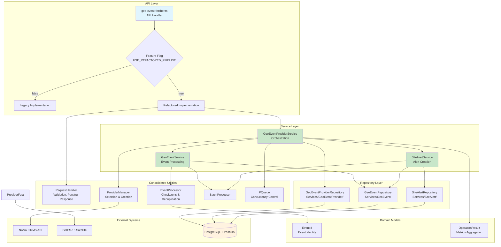
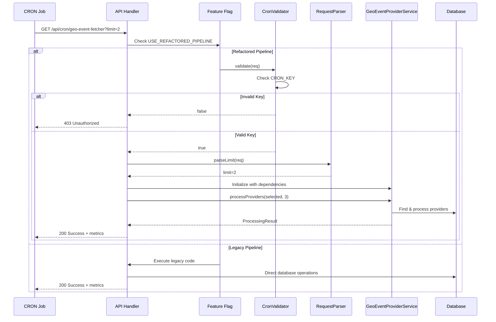
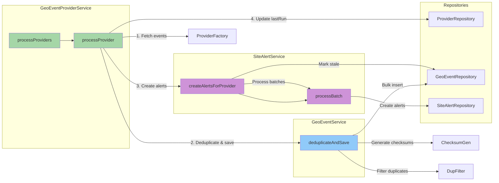
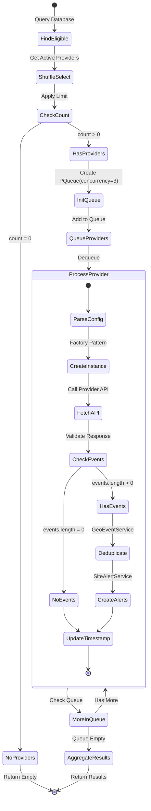
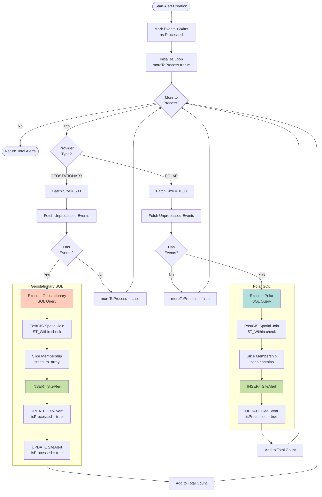
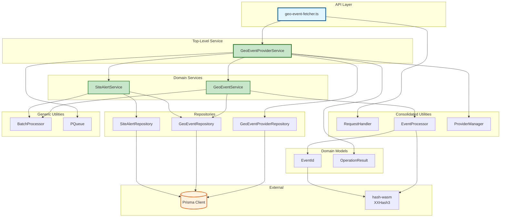

# GeoEventFetcher Architecture Flow Diagram

## Overview

This document provides comprehensive Mermaid diagrams visualizing the current architecture and data flow of the refactored GeoEventFetcher system.

## Table of Contents

1. [High-Level System Architecture](#high-level-system-architecture)
2. [Request Flow Sequence](#request-flow-sequence)
3. [Service Layer Architecture](#service-layer-architecture)
4. [Data Flow Through Layers](#data-flow-through-layers)
5. [Provider Processing Workflow](#provider-processing-workflow)
6. [Event Processing Pipeline](#event-processing-pipeline)
7. [Alert Creation Workflow](#alert-creation-workflow)
8. [Component Dependency Graph](#component-dependency-graph)

---

## High-Level System Architecture

---

## Request Flow Sequence

---

## Service Layer Architecture

---

## Data Flow Through Layers

```mermaid
flowchart TD
    Start([CRON Trigger]) --> Handler[API Handler]

    Handler --> Validate{Validate<br/>CRON_KEY}
    Validate -->|Invalid| Reject[403 Unauthorized]
    Validate -->|Valid| Parse[Parse Request<br/>limit parameter]

    Parse --> FindProviders[Find Eligible Providers<br/>ProviderRepository]
    FindProviders --> Shuffle[Shuffle & Select<br/>ProviderSelector]

    Shuffle --> HasProviders{Has<br/>Providers?}
    HasProviders -->|No| EmptyResult[Return Empty Result]
    HasProviders -->|Yes| InitServices[Initialize Services<br/>with Dependencies]

    InitServices --> ProcessLoop[Process Each Provider<br/>with PQueue concurrency=3]

    ProcessLoop --> FetchEvents[Fetch Latest Events<br/>from Provider API]
    FetchEvents --> HasEvents{Has<br/>Events?}

    HasEvents -->|No| UpdateLastRun[Update Provider<br/>lastRun timestamp]
    HasEvents -->|Yes| GenChecksums[Generate Checksums<br/>ChecksumGenerator]

    GenChecksums --> FetchExisting[Fetch Existing IDs<br/>from DB 30hrs window]
    FetchExisting --> FilterDB[Filter DB Duplicates<br/>DuplicateFilter]
    FilterDB --> FilterMem[Filter In-Memory<br/>Duplicates]
    FilterMem --> BulkInsert[Bulk Insert Events<br/>batch size 1000]

    BulkInsert --> MarkStale[Mark Stale Events<br/>>24hrs as processed]
    MarkStale --> AlertLoop[Process Unprocessed<br/>Events in Batches]

    AlertLoop --> CheckType{Provider<br/>Type?}
    CheckType -->|GEOSTATIONARY| GeoAlert[Create Geostationary<br/>Alerts batch=500]
    CheckType -->|POLAR| PolarAlert[Create Polar<br/>Alerts batch=1000]

    GeoAlert --> SpatialJoin1[PostGIS Spatial Join<br/>with Site geometries]
    PolarAlert --> SpatialJoin2[PostGIS Spatial Join<br/>with Site geometries]

    SpatialJoin1 --> MarkProcessed1[Mark Events<br/>as Processed]
    SpatialJoin2 --> MarkProcessed2[Mark Events<br/>as Processed]

    MarkProcessed1 --> UpdateLastRun
    MarkProcessed2 --> UpdateLastRun

    UpdateLastRun --> MoreProviders{More<br/>Providers?}
    MoreProviders -->|Yes| ProcessLoop
    MoreProviders -->|No| AggregateResults[Aggregate Results<br/>ProcessingResult.merge]

    AggregateResults --> Response[Return Success<br/>with Metrics]

    style Handler fill:#e1f5fe
    style FindProviders fill:#fff9c4
    style FetchEvents fill:#c8e6c9
    style GenChecksums fill:#b2dfdb
    style BulkInsert fill:#b2dfdb
    style GeoAlert fill:#f8bbd0
    style PolarAlert fill:#f8bbd0
    style Response fill:#dcedc8
```

---

## Provider Processing Workflow

---

## Event Processing Pipeline

```mermaid
flowchart LR
    subgraph "Input"
        Events[Raw GeoEvents<br/>from Provider API]
    end

    subgraph "Checksum Generation"
        Gen[Generate Checksums<br/>XXHash3]
        Events --> Gen
        Gen --> WithIDs[Events with IDs]
    end

    subgraph "Database Deduplication"
        FetchDB[Fetch Existing IDs<br/>30 hour window]
        FilterDB[Filter Against DB]
        WithIDs --> FetchDB
        FetchDB --> FilterDB
        FilterDB --> NewEvents[New Events]
    end

    subgraph "In-Memory Deduplication"
        FilterMem[Filter Duplicates<br/>within Batch]
        NewEvents --> FilterMem
        FilterMem --> UniqueEvents[Unique Events]
    end

    subgraph "Batch Insertion"
        Chunk[Chunk into Batches<br/>size = 1000]
        Insert[Bulk Insert<br/>skipDuplicates]
        UniqueEvents --> Chunk
        Chunk --> Insert
        Insert --> Saved[Saved Events]
    end

    subgraph "Output"
        Result[ProcessingResult<br/>created count<br/>new count]
        Saved --> Result
    end

    style Gen fill:#b2dfdb
    style FilterDB fill:#ffccbc
    style FilterMem fill:#ffccbc
    style Insert fill:#c5e1a5
    style Result fill:#dcedc8
```

---

## Alert Creation Workflow

---

## Component Dependency Graph

---

## Key Architectural Patterns

### 1. **Dependency Injection**

All services receive their dependencies through constructors, enabling:

- Easy testing with mocks
- Clear dependency graph
- Flexible configuration

### 2. **Repository Pattern**

Data access is centralized in repository classes:

- `GeoEventProviderRepository` - Provider queries
- `GeoEventRepository` - Event CRUD operations
- `SiteAlertRepository` - Alert creation with PostGIS

### 3. **Service Layer**

Business logic is organized in service classes:

- `GeoEventProviderService` - Orchestration
- `GeoEventService` - Event processing
- `SiteAlertService` - Alert creation

### 4. **Factory Pattern**

`GeoEventProviderFactory` creates provider instances based on configuration

### 5. **Concurrency Control**

`PQueue` limits concurrent provider processing to prevent resource exhaustion

### 6. **Domain Models**

- `GeoEventChecksum` - Value object for event identity
- `ProcessingResult` - Aggregates metrics across operations

### 7. **Feature Flag**

`USE_REFACTORED_PIPELINE` enables safe gradual rollout with instant rollback

---

## Data Flow Summary

1. **Request Validation** → CronValidator checks CRON_KEY
2. **Parameter Parsing** → RequestParser extracts limit
3. **Provider Selection** → Query DB → Shuffle → Select
4. **Concurrent Processing** → PQueue manages 3 concurrent providers
5. **Event Fetching** → Provider API calls
6. **Deduplication** → Checksum generation → DB filter → Memory filter
7. **Persistence** → Bulk insert in batches of 1000
8. **Alert Creation** → PostGIS spatial joins → Batch processing
9. **Result Aggregation** → Merge all ProcessingResults
10. **Response** → Return metrics to client

---

## Performance Characteristics

| Operation                      | Batch Size  | Concurrency  | Database Impact          |
| ------------------------------ | ----------- | ------------ | ------------------------ |
| Provider Processing            | N/A         | 3 concurrent | Low (sequential updates) |
| Event Insertion                | 1000 events | Sequential   | Medium (bulk inserts)    |
| Alert Creation (GEOSTATIONARY) | 500 events  | Sequential   | High (spatial joins)     |
| Alert Creation (POLAR)         | 1000 events | Sequential   | High (spatial joins)     |

---

## Error Handling Strategy

- **Per-Provider Isolation**: Errors in one provider don't affect others
- **Result Aggregation**: Errors are collected in ProcessingResult
- **Transaction Safety**: Alert creation uses database transactions
- **Graceful Degradation**: System continues processing remaining providers

---

## Monitoring Points

1. **Request Level**: CRON key validation failures
2. **Provider Level**: Fetch failures, API errors
3. **Event Level**: Duplicate ratios, insertion failures
4. **Alert Level**: Spatial join performance, creation counts
5. **System Level**: Processing time, memory usage

---

**Last Updated**: November 18, 2024  
**Version**: 1.0  
**Status**: Current Architecture (Refactored Implementation)
