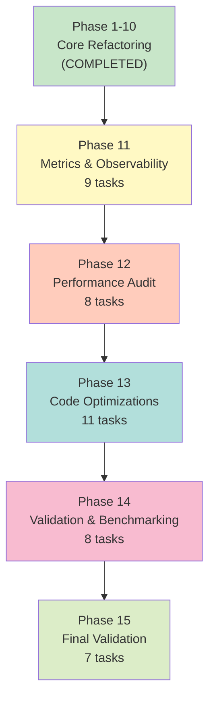

# Task Phases Overview: Complete Refactoring Journey

## Complete Refactoring Timeline

```
Phase 1-10 (COMPLETED)
├── Phase 1: Foundation (Domain Models & Utilities)
├── Phase 2: Repositories (Data Access Layer)
├── Phase 3: Services (Business Logic Layer)
├── Phase 4: Refactor Handler
├── Phase 5: Validation & Cleanup
├── Phase 6: Type Safety Improvements
├── Phase 7: Bug Fixes & Performance Improvements
├── Phase 8: Fix SiteAlert Creation Bug
├── Phase 9: Consolidate & Reorganize Utilities
└── Phase 10: Update Imports & Type Definitions

Phase 11-15 (NEW - PERFORMANCE & OPTIMIZATION)
├── Phase 11: Performance Metrics & Observability ⭐ NEW
├── Phase 12: Performance Audit & Bottleneck Analysis ⭐ NEW
├── Phase 13: Code Optimizations & Advanced Improvements ⭐ NEW
├── Phase 14: Performance Validation & Benchmarking ⭐ NEW
└── Phase 15: Final Validation & Documentation ⭐ NEW
```

## Phase Progression & Dependencies



## Task Count by Phase

| Phase     | Name                      | Tasks  | Optional | Total  |
| --------- | ------------------------- | ------ | -------- | ------ |
| 1-10      | Core Refactoring          | 17     | -        | 17     |
| 11        | Metrics & Observability   | 8      | 1        | 9      |
| 12        | Performance Audit         | 8      | 0        | 8      |
| 13        | Code Optimizations        | 11     | 0        | 11     |
| 14        | Validation & Benchmarking | 8      | 0        | 8      |
| 15        | Final Validation          | 7      | 0        | 7      |
| **TOTAL** |                           | **53** | **1**    | **54** |

## Phase 11: Performance Metrics & Observability

**Duration:** ~2-3 days  
**Complexity:** Medium  
**Dependencies:** Phase 1-10 complete

### What Gets Built:

- `PerformanceMetrics` class for timing collection
- Metrics integration in all services
- Performance-based logging
- Metrics in API response

### Key Deliverables:

```json
{
  "message": "Geo-event-fetcher Cron job executed successfully",
  "alertsCreated": 150,
  "eventsProcessed": 5000,
  "metrics": {
    "total_duration_ms": 8500,
    "provider_processing": {
      "provider_1": {
        "total_ms": 3200,
        "fetch_ms": 800,
        "deduplication_ms": 1500,
        "alert_creation_ms": 900
      }
    }
  }
}
```

### Tasks:

- 18.1: Create PerformanceMetrics class
- 18.2: Unit tests (optional)
- 18.3: Integrate with OperationResult
- 18.4: Add timing to GeoEventProviderService
- 18.5: Add timing to GeoEventService
- 18.6: Add timing to SiteAlertService
- 18.7: Update response formatting
- 18.8: Add performance-based logging
- 18.9: Verify metrics output

---

## Phase 12: Performance Audit & Bottleneck Analysis

**Duration:** ~3-4 days  
**Complexity:** High  
**Dependencies:** Phase 11 complete

### What Gets Analyzed:

1. Database indexes and query patterns
2. Spatial join query performance
3. Memory usage patterns
4. Transaction overhead
5. Concurrency settings
6. Initialization overhead

### Key Deliverables:

- Performance audit report
- Database index verification
- Query execution plans (EXPLAIN ANALYZE)
- Memory usage analysis
- Recommendations for optimization

### Tasks:

- 19.1: Verify database indexes
- 19.2: Optimize fetchExistingIds query
- 19.3: Profile spatial join queries
- 19.4: Make PQueue concurrency configurable
- 19.5: Analyze ChecksumGenerator initialization
- 19.6: Monitor memory usage
- 19.7: Analyze transaction overhead
- 19.8: Create audit report

---

## Phase 13: Code Optimizations & Advanced Performance Improvements

**Duration:** ~4-5 days  
**Complexity:** High  
**Dependencies:** Phase 12 complete

### What Gets Optimized:

1. Batch provider updates (reduce writes)
2. Single existing IDs query (reduce reads)
3. Early exit strategies (skip unnecessary work)
4. Provider-level skip logic (skip inactive providers)
5. Logging optimization (appropriate levels)
6. Micro-optimizations (array operations)
7. Prepared statements verification
8. Optional caching strategies
9. Parallel processing evaluation

### Expected Improvements:

- Provider processing time: **>30% reduction**
- Database query count: **>40% reduction**
- Memory usage: **<512MB for 50k events**
- Correctness: **No increase in duplicates**

### Tasks:

- 20.1: Batch provider updates
- 20.2: Single existing IDs query
- 20.3: Early exit strategies
- 20.4: Provider-level skip logic
- 20.5: Logging optimization
- 20.6: Micro-optimizations
- 20.7: Verify prepared statements
- 20.8: Site data caching (optional)
- 20.9: Provider config caching
- 20.10: Parallel chunk processing evaluation
- 20.11: Optimization summary

---

## Phase 14: Performance Validation & Benchmarking

**Duration:** ~3-4 days  
**Complexity:** Medium  
**Dependencies:** Phase 13 complete

### What Gets Tested:

- Provider processing time with various event volumes
- Memory usage patterns
- Database query performance
- Alert creation performance
- Deduplication accuracy
- Correctness validation

### Test Scenarios:

- 1k events
- 10k events
- 50k events
- 100k events

### Key Deliverables:

- Performance baseline report
- Before/after comparisons
- Performance improvement percentages
- Correctness validation
- Production monitoring setup

### Tasks:

- 21.1: Create benchmarking suite
- 21.2: Benchmark provider processing time
- 21.3: Benchmark memory usage
- 21.4: Benchmark database query performance
- 21.5: Benchmark alert creation performance
- 21.6: Create baseline report
- 21.7: Verify no duplicate increase
- 21.8: Monitor production metrics

---

## Phase 15: Final Validation & Documentation

**Duration:** ~2-3 days  
**Complexity:** Medium  
**Dependencies:** Phase 14 complete

### What Gets Finalized:

1. Integration test suite validation
2. Feature flag functionality verification
3. System documentation updates
4. Performance tuning guide
5. Deployment guide with rollback
6. Code review and cleanup
7. Production deployment checklist

### Key Deliverables:

- Complete system documentation
- Performance tuning guide for operators
- Deployment guide with rollback procedure
- Production-ready code
- Deployment checklist

### Tasks:

- 22.1: Run full integration test suite
- 22.2: Verify feature flag functionality
- 22.3: Update system documentation
- 22.4: Create performance tuning guide
- 22.5: Create deployment guide
- 22.6: Final code review and cleanup
- 22.7: Production deployment checklist

---

## Effort Estimation

### Phase 11: Performance Metrics & Observability

- Implementation: 16-20 hours
- Testing: 4-6 hours
- **Total: 20-26 hours**

### Phase 12: Performance Audit & Bottleneck Analysis

- Analysis: 12-16 hours
- Documentation: 4-6 hours
- **Total: 16-22 hours**

### Phase 13: Code Optimizations & Advanced Improvements

- Implementation: 20-28 hours
- Testing: 8-12 hours
- **Total: 28-40 hours**

### Phase 14: Performance Validation & Benchmarking

- Benchmarking: 16-20 hours
- Analysis: 8-12 hours
- **Total: 24-32 hours**

### Phase 15: Final Validation & Documentation

- Testing: 8-12 hours
- Documentation: 8-12 hours
- **Total: 16-24 hours**

### **Grand Total: 104-144 hours (~3-4 weeks)**

---

## Success Criteria Checklist

### Phase 11 Success:

- [ ] PerformanceMetrics class implemented
- [ ] Metrics visible in API response
- [ ] Performance-based logging working
- [ ] All tests passing

### Phase 12 Success:

- [ ] Database indexes verified
- [ ] Query execution plans analyzed
- [ ] Memory usage patterns documented
- [ ] Audit report completed

### Phase 13 Success:

- [ ] All optimizations implemented
- [ ] Code quality maintained
- [ ] Tests passing
- [ ] No correctness regressions

### Phase 14 Success:

- [ ] Benchmarks completed
- [ ] Performance improvements verified
- [ ] Baseline report created
- [ ] Correctness validated

### Phase 15 Success:

- [ ] All tests passing
- [ ] Documentation complete
- [ ] Feature flag working
- [ ] Ready for production

---

## Risk Mitigation

### Phase 11 Risks:

- **Risk:** Metrics overhead impacts performance
- **Mitigation:** Profile metrics collection, optimize if needed

### Phase 12 Risks:

- **Risk:** Database changes needed
- **Mitigation:** Document recommendations, don't implement without approval

### Phase 13 Risks:

- **Risk:** Optimizations introduce bugs
- **Mitigation:** Comprehensive testing, feature flag for rollback

### Phase 14 Risks:

- **Risk:** Performance improvements not as expected
- **Mitigation:** Investigate root causes, adjust optimizations

### Phase 15 Risks:

- **Risk:** Production issues after deployment
- **Mitigation:** Feature flag, gradual rollout, monitoring

---

## Rollback Strategy

Each phase can be rolled back independently:

1. **Phase 11 Rollback:** Remove metrics collection (no impact on core logic)
2. **Phase 12 Rollback:** No code changes, only analysis
3. **Phase 13 Rollback:** Use feature flag to switch to legacy implementation
4. **Phase 14 Rollback:** No code changes, only testing
5. **Phase 15 Rollback:** No code changes, only documentation

---

## Monitoring & Observability

### Key Metrics to Track:

- Provider processing time (target: <5s per provider)
- Memory usage (target: <512MB for 50k events)
- Database query count (target: >40% reduction)
- Alert creation success rate (target: 100%)
- Duplicate alert rate (target: 0%)

### Logging Thresholds:

- INFO: Providers >5s, chunks >2s, alerts >3s
- WARN: Providers >30s, timeouts
- ERROR: Processing failures

### Alerts to Set Up:

- Memory usage >500MB
- Provider processing >30s
- Alert creation failures
- Duplicate alerts detected

---

## Documentation Updates

### Files to Update:

1. `ARCHITECTURE_FLOW_DIAGRAM.md` - Add metrics flow
2. `CONSOLIDATION_STRATEGY.md` - Reference for structure
3. `README.md` - Performance tuning guide
4. `DEPLOYMENT_GUIDE.md` - New file with rollback procedure
5. `PERFORMANCE_TUNING.md` - New file with operator guidance

---

## Next Steps

1. **Review** - User reviews extended tasks and approves
2. **Plan** - Schedule phases across team
3. **Execute** - Follow phases in order (11 → 15)
4. **Monitor** - Track progress and metrics
5. **Deploy** - Use feature flag for safe rollout
6. **Optimize** - Iterate based on production metrics
