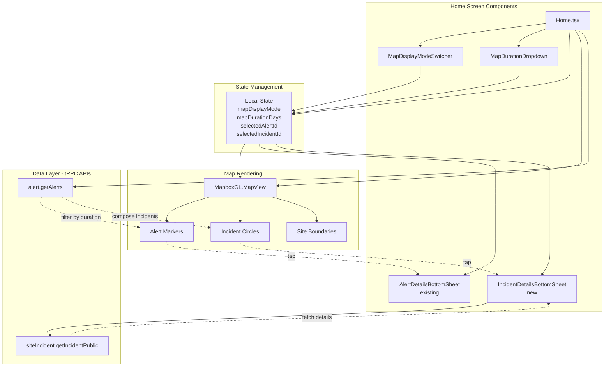
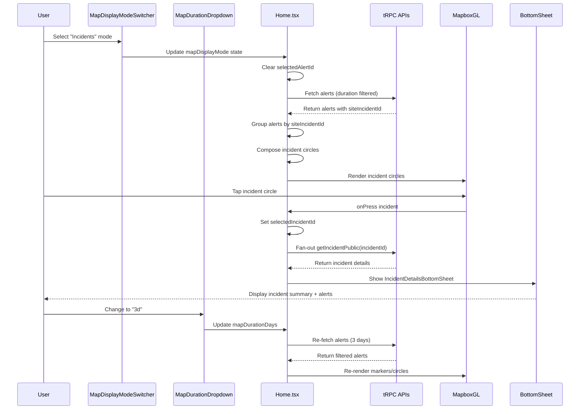

# Design Document: Home Map Display Mode

## Overview

This feature adds independent map display mode controls to the FireAlert mobile app Home screen, allowing users to toggle between "Alerts" and "Incidents" views with duration-based filtering. The implementation is frontend-only, composing data from existing tRPC APIs without requiring backend changes. The feature integrates with the new @gorhom/bottom-sheet migration for incident detail views.

## Architecture



## Main Algorithm/Workflow



## Components and Interfaces

### Component 1: MapDisplayModeSwitcher

**Purpose**: Icon-only segmented control for switching between Alerts and Incidents display modes

**Interface**:

```typescript
interface MapDisplayModeSwitcherProps {
  mode: "alerts" | "incidents";
  onModeChange: (mode: "alerts" | "incidents") => void;
}
```

**Responsibilities**:

- Render two-segment control with RadarIcon (Alerts) and IncidentActiveIcon (Incidents)
- Highlight active segment
- Trigger mode change callback
- Accessible with proper labels

**Visual Design**:

- Horizontal segmented control
- Icon-only (no text labels)
- Active segment: filled background with primary color
- Inactive segment: transparent background with border
- Position: Top-left of map, below user avatar

### Component 2: MapDurationDropdown

**Purpose**: Dropdown selector for filtering alerts/incidents by time duration

**Interface**:

```typescript
interface MapDurationDropdownProps {
  durationDays: number;
  onDurationChange: (days: number) => void;
}
```

**Responsibilities**:

- Display current duration selection (1d, 3d, 7d, 30d)
- Show dropdown menu on tap
- Trigger duration change callback
- Default to 7 days

**Visual Design**:

- Compact dropdown button
- Shows selected duration (e.g., "7d")
- Position: Adjacent to MapDisplayModeSwitcher
- Dropdown menu: 4 options with checkmark on selected

### Component 3: IncidentDetailsBottomSheet

**Purpose**: Display incident summary and associated alerts in a bottom sheet

**Interface**:

```typescript
interface IncidentDetailsBottomSheetProps {
  isVisible: boolean;
  incidentId: string | null;
  onClose: () => void;
  onAlertTap: (alert: SiteAlertData) => void;
}
```

**Responsibilities**:

- Fetch incident data using siteIncident.getIncidentPublic
- Display IncidentSummaryCard at top
- Render FlatList of associated alerts
- Handle alert item tap to center map
- Use @gorhom/bottom-sheet implementation
- Show loading state during fetch
- Handle error states

**Visual Design**:

- Bottom sheet with drag handle
- IncidentSummaryCard: incident status, start/latest alert info
- Alert list: scrollable FlatList
- Alert item: detection time, confidence, source, coordinates
- Tap alert: center map on that point

## Data Models

### MapDisplayMode

```typescript
type MapDisplayMode = "alerts" | "incidents";
```

**Description**: Enum for map display mode selection

### HomeScreenState

```typescript
interface HomeScreenState {
  mapDisplayMode: MapDisplayMode;
  mapDurationDays: number;
  selectedAlertId: string | null;
  selectedIncidentId: string | null;
}
```

**Validation Rules**:

- mapDisplayMode: must be 'alerts' or 'incidents'
- mapDurationDays: must be one of [1, 3, 7, 30]
- selectedAlertId: null when mapDisplayMode is 'incidents'
- selectedIncidentId: null when mapDisplayMode is 'alerts'

### ComposedIncident

```typescript
interface ComposedIncident {
  incidentId: string;
  siteId: string;
  alertCount: number;
  alerts: Array<{
    id: string;
    latitude: number;
    longitude: number;
    eventDate: Date;
  }>;
  circle: IncidentCircleResult | null;
}
```

**Description**: Frontend-composed incident data from alerts with siteIncidentId

**Validation Rules**:

- incidentId: non-empty string
- alertCount: positive integer
- alerts: non-empty array
- circle: calculated from alert coordinates

## Algorithmic Pseudocode

### Main Display Mode Logic

```pascal
ALGORITHM handleDisplayModeChange(newMode)
INPUT: newMode of type MapDisplayMode
OUTPUT: Updated map rendering

BEGIN
  // Clear conflicting state
  IF newMode = 'incidents' THEN
    selectedAlertId ← null
  ELSE IF newMode = 'alerts' THEN
    selectedIncidentId ← null
    incidentCircleData ← null
  END IF

  // Update mode
  mapDisplayMode ← newMode

  // Re-render map based on mode
  IF mapDisplayMode = 'alerts' THEN
    CALL renderAlertMarkers(filteredAlerts)
    HIDE incidentCircles
  ELSE IF mapDisplayMode = 'incidents' THEN
    CALL composeIncidents(filteredAlerts)
    CALL renderIncidentCircles(composedIncidents)
    HIDE alertMarkers
  END IF
END
```

**Preconditions**:

- newMode is valid MapDisplayMode value
- alerts data is available

**Postconditions**:

- mapDisplayMode is updated
- Conflicting state is cleared
- Map rendering reflects new mode

### Incident Composition Algorithm

```pascal
ALGORITHM composeIncidents(alerts)
INPUT: alerts array filtered by duration
OUTPUT: composedIncidents array

BEGIN
  incidentMap ← empty Map

  // Group alerts by siteIncidentId
  FOR each alert IN alerts DO
    IF alert.siteIncidentId IS NOT NULL THEN
      IF incidentMap.has(alert.siteIncidentId) THEN
        incidentMap.get(alert.siteIncidentId).alerts.push(alert)
      ELSE
        incidentMap.set(alert.siteIncidentId, {
          incidentId: alert.siteIncidentId,
          siteId: alert.site.id,
          alertCount: 1,
          alerts: [alert]
        })
      END IF
    END IF
  END FOR

  // Calculate circles for each incident (limit to N=60)
  composedIncidents ← []
  count ← 0

  FOR each [incidentId, incident] IN incidentMap DO
    IF count >= 60 THEN
      BREAK
    END IF

    firePoints ← incident.alerts.map(a => {
      latitude: a.latitude,
      longitude: a.longitude
    })

    circle ← generateIncidentCircle(firePoints, 2)
    incident.circle ← circle
    composedIncidents.push(incident)
    count ← count + 1
  END FOR

  RETURN composedIncidents
END
```

**Preconditions**:

- alerts is a valid array
- Each alert has latitude, longitude, siteIncidentId

**Postconditions**:

- Returns array of composed incidents
- Each incident has calculated circle
- Maximum 60 incidents returned

**Loop Invariants**:

- All processed alerts are grouped correctly
- count never exceeds 60
- Each incident has valid circle or null

### Duration Filtering Algorithm

```pascal
ALGORITHM filterAlertsByDuration(alerts, durationDays)
INPUT: alerts array, durationDays number
OUTPUT: filtered alerts array

BEGIN
  currentDate ← getCurrentDate()
  cutoffDate ← currentDate - durationDays

  filteredAlerts ← []

  FOR each alert IN alerts DO
    IF alert.eventDate >= cutoffDate THEN
      filteredAlerts.push(alert)
    END IF
  END FOR

  RETURN filteredAlerts
END
```

**Preconditions**:

- alerts is valid array
- durationDays is positive integer
- Each alert has valid eventDate

**Postconditions**:

- Returns alerts within duration window
- Alerts are sorted by eventDate (descending)

## Example Usage

```typescript
// Home.tsx - State management
const [mapDisplayMode, setMapDisplayMode] = useState<MapDisplayMode>('alerts');
const [mapDurationDays, setMapDurationDays] = useState<number>(7);
const [selectedAlertId, setSelectedAlertId] = useState<string | null>(null);
const [selectedIncidentId, setSelectedIncidentId] = useState<string | null>(null);

// Handle mode change
const handleModeChange = (mode: MapDisplayMode) => {
  setMapDisplayMode(mode);
  if (mode === 'incidents') {
    setSelectedAlertId(null);
  } else {
    setSelectedIncidentId(null);
    setIncidentCircleData(null);
  }
};

// Handle duration change
const handleDurationChange = (days: number) => {
  setMapDurationDays(days);
};

// Filter alerts by duration
const filteredAlerts = useMemo(() => {
  const cutoffDate = moment().subtract(mapDurationDays, 'days');
  return alerts?.json?.data?.filter(alert =>
    moment(alert.eventDate).isAfter(cutoffDate)
  ) || [];
}, [alerts, mapDurationDays]);

// Compose incidents from filtered alerts
const composedIncidents = useMemo(() => {
  if (mapDisplayMode !== 'incidents') return [];

  const incidentMap = new Map();
  filteredAlerts.forEach(alert => {
    if (alert.siteIncidentId) {
      if (!incidentMap.has(alert.siteIncidentId)) {
        incidentMap.set(alert.siteIncidentId, {
          incidentId: alert.siteIncidentId,
          siteId: alert.site.id,
          alerts: []
        });
      }
      incidentMap.get(alert.siteIncidentId).alerts.push(alert);
    }
  });

  return Array.from(incidentMap.values())
    .slice(0, 60)
    .map(incident => ({
      ...incident,
      alertCount: incident.alerts.length,
      circle: generateIncidentCircle(
        incident.alerts.map(a => ({
          latitude: a.latitude,
          longitude: a.longitude
        })),
        2
      )
    }));
}, [filteredAlerts, mapDisplayMode]);

// Render controls
<MapDisplayModeSwitcher
  mode={mapDisplayMode}
  onModeChange={handleModeChange}
/>
<MapDurationDropdown
  durationDays={mapDurationDays}
  onDurationChange={handleDurationChange}
/>

// Conditional rendering based on mode
{mapDisplayMode === 'alerts' && renderAnnotations(true)}
{mapDisplayMode === 'incidents' && renderIncidentCircles()}

// Incident bottom sheet
<IncidentDetailsBottomSheet
  isVisible={!!selectedIncidentId}
  incidentId={selectedIncidentId}
  onClose={() => setSelectedIncidentId(null)}
  onAlertTap={(alert) => {
    camera.current.setCamera({
      centerCoordinate: [alert.longitude, alert.latitude],
      zoomLevel: 15,
      animationDuration: 500
    });
  }}
/>
```

## Error Handling

### Error Scenario 1: Incident Fetch Failure

**Condition**: siteIncident.getIncidentPublic API call fails
**Response**: Display error message in bottom sheet
**Recovery**: Retry button, fallback to showing alert data only

### Error Scenario 2: Invalid Duration Selection

**Condition**: User selects invalid duration value
**Response**: Revert to previous valid duration (7 days default)
**Recovery**: Log error, show toast notification

### Error Scenario 3: Empty Incident Data

**Condition**: No alerts with siteIncidentId in duration window
**Response**: Show empty state in Incidents mode
**Recovery**: Suggest increasing duration or switching to Alerts mode

## Testing Strategy

### Unit Testing Approach

- Test composeIncidents function with various alert datasets
- Test filterAlertsByDuration with edge cases (0 alerts, boundary dates)
- Test state transitions (mode changes, duration changes)
- Test incident circle calculation with 1, 2, many fire points
- Test N=60 cap on incident queries

### Property-Based Testing Approach

**Property Test Library**: fast-check (JavaScript/TypeScript)

**Properties to Test**:

1. Duration filtering: All returned alerts have eventDate within duration window
2. Incident grouping: All alerts with same siteIncidentId are in same incident
3. Circle calculation: Circle encompasses all fire points with correct radius
4. State consistency: selectedAlertId and selectedIncidentId are never both non-null

### Integration Testing Approach

- Test mode switching with real alert data
- Test bottom sheet interactions (open, close, scroll)
- Test map interactions (tap markers, tap circles, pan, zoom)
- Test API integration with mock tRPC responses
- Test @gorhom/bottom-sheet integration

## Performance Considerations

- Memoize filteredAlerts to avoid re-filtering on every render
- Memoize composedIncidents to avoid re-grouping on every render
- Cap incident queries at N=60 to prevent excessive API calls
- Use FlatList for alert list in bottom sheet (virtualization)
- Debounce duration changes to avoid rapid API calls
- Cache incident data to avoid re-fetching on mode toggle

## Security Considerations

- No new security concerns (uses existing authenticated APIs)
- Incident data is already public via getIncidentPublic endpoint
- No sensitive data exposed in UI

## Dependencies

- Existing: @rnmapbox/maps, @tanstack/react-query, moment-timezone
- New: @gorhom/bottom-sheet (already planned in migration)
- Existing tRPC APIs: alert.getAlerts, siteIncident.getIncidentPublic
- Existing components: IncidentSummaryCard, existing icons
- Existing utilities: generateIncidentCircle, getFireIcon
