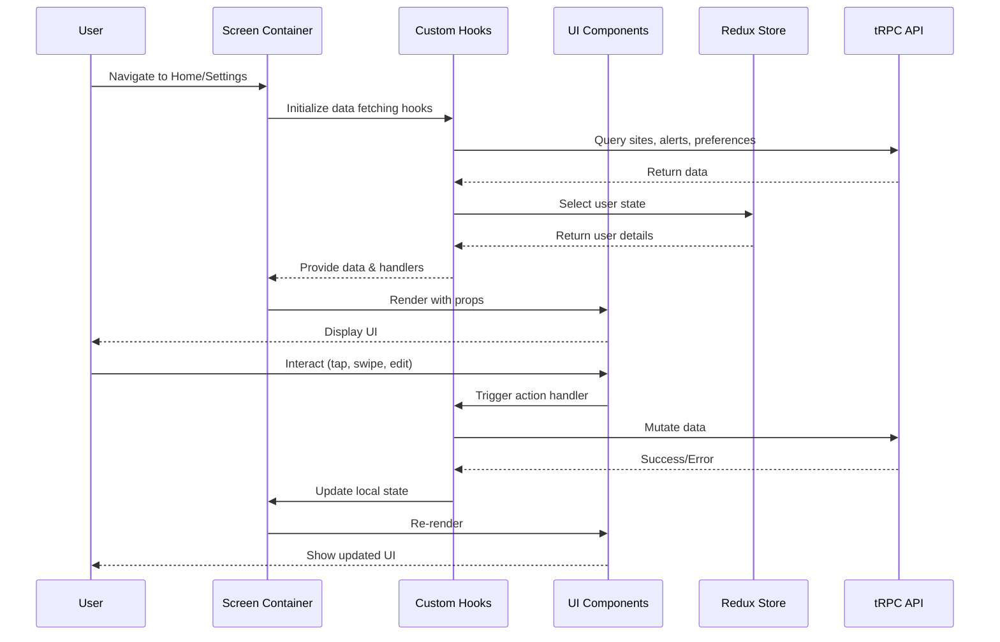
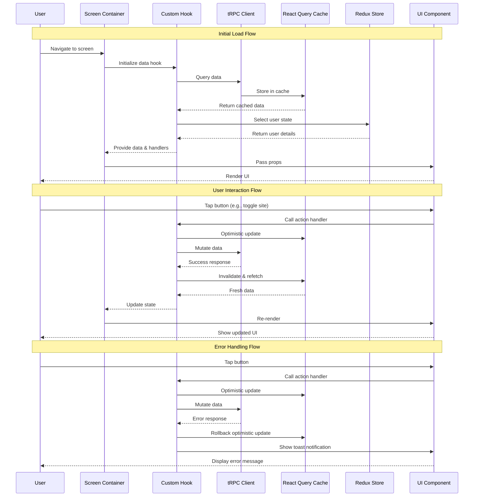

# Design Document: Home & Settings Screen Refactoring

## Overview

This design document outlines the technical approach for refactoring two monolithic React Native screen components (Home.tsx ~2006 LOC, Settings.tsx ~2227 LOC) into smaller, maintainable, and testable modules. The refactoring maintains strict feature parity—no changes to behavior, visuals, copy, or navigation—while improving code organization, type safety, and developer experience.

## Main Algorithm/Workflow



## Core Interfaces/Types

### Home Screen Types

```typescript
// apps/nativeapp/app/screens/Home/types.ts

import type { NativeStackNavigationProp } from "@react-navigation/native-stack";
import type { RouteProp } from "@react-navigation/native";
import type MapboxGL from "@rnmapbox/maps";
import type Geolocation from "react-native-geolocation-service";

// Navigation types
export interface HomeRouteParams {
  bboxGeo?: [number, number, number, number];
  siteInfo?: SiteFeature[];
  siteIncidentId?: string;
}

export type HomeNavigationProp = NativeStackNavigationProp<
  RootStackParamList,
  "Home"
>;
export type HomeRouteProp = RouteProp<RootStackParamList, "Home">;

// Site and Alert types
export interface SiteFeature {
  type: "Feature";
  geometry: GeoJSON.Geometry;
  properties: SiteProperties;
}

export interface SiteProperties {
  id: string;
  name: string;
  radius: number;
  geometry: string;
  stopAlerts: boolean;
  isPlanetRO: boolean;
  projectId?: string;
}

export interface AlertData {
  id: string;
  latitude: number;
  longitude: number;
  confidence: string;
  detectedAt: string;
  siteId: string;
  siteName: string;
}

// Component Props
export interface HomeMapViewProps {
  mapRef: React.RefObject<MapboxGL.MapView>;
  cameraRef: React.RefObject<MapboxGL.Camera>;
  selectedLayer: string;
  location: MapboxGL.Location | Geolocation.GeoPosition | undefined;
  selectedArea: SiteFeature[] | null;
  selectedAlert: AlertData | null;
  incidentCircleData: IncidentCircleResult | null;
  onMapReady: () => void;
  onRegionDidChange: () => void;
}

export interface HomeFloatingActionsProps {
  onLayerPress: () => void;
  onMyLocationPress: () => void;
  onProfilePress: () => void;
  userDetails: UserDetails | null;
}

export interface ProfileSheetProps {
  visible: boolean;
  onClose: () => void;
  userDetails: UserDetails | null;
  onEditProfile: () => void;
  onLogout: () => void;
  onDeleteAccount: () => void;
}

export interface AlertDetailsSheetProps {
  visible: boolean;
  onClose: () => void;
  alertData: AlertData | null;
  siteData: SiteProperties | null;
  onOpenInMaps: () => void;
}

export interface SiteDetailsSheetProps {
  visible: boolean;
  onClose: () => void;
  siteData: SiteProperties | null;
  onToggleMonitoring: (enabled: boolean) => void;
  onEditSite: () => void;
  onDeleteSite: () => void;
  isDeleting: boolean;
}

export interface EditSiteModalProps {
  visible: boolean;
  onClose: () => void;
  siteId: string;
  siteName: string;
  siteRadius: number;
  siteGeometry: string;
  onSave: (name: string, radius: number) => Promise<void>;
  isLoading: boolean;
}

// Hook return types
export interface UseHomeLocationReturn {
  location: MapboxGL.Location | Geolocation.GeoPosition | undefined;
  isPermissionDenied: boolean;
  isPermissionBlocked: boolean;
  requestLocation: () => Promise<void>;
  clearPermissionState: () => void;
}

export interface UseHomeSiteActionsReturn {
  updateSite: (siteId: string, data: UpdateSiteInput) => Promise<void>;
  deleteSite: (siteId: string) => Promise<void>;
  isUpdating: boolean;
  isDeleting: boolean;
}

export interface UseHomeIncidentCircleReturn {
  incidentCircleData: IncidentCircleResult | null;
  generateCircle: (siteIncidentId: string) => Promise<void>;
  clearCircle: () => void;
}

export interface UseHomeMapSelectionReturn {
  selectedSite: SiteProperties | null;
  selectedAlert: AlertData | null;
  selectedArea: SiteFeature[] | null;
  setSelectedSite: (site: SiteProperties | null) => void;
  setSelectedAlert: (alert: AlertData | null) => void;
  setSelectedArea: (area: SiteFeature[] | null) => void;
  clearSelection: () => void;
}
```

### Settings Screen Types

```typescript
// apps/nativeapp/app/screens/Settings/types.ts

import type { AlertMethod, Site, Project } from "@firealert/types";

// Component Props
export interface ProjectsSectionProps {
  projects: GroupedProject[];
  onSitePress: (site: Site) => void;
  onToggleMonitoring: (siteId: string, enabled: boolean) => Promise<void>;
  isLoading: boolean;
}

export interface MySitesSectionProps {
  sites: Site[];
  onSitePress: (site: Site) => void;
  onAddSite: () => void;
  onToggleMonitoring: (siteId: string, enabled: boolean) => Promise<void>;
  onEditSite: (site: Site) => void;
  onDeleteSite: (siteId: string) => Promise<void>;
  isLoading: boolean;
}

export interface NotificationsSectionProps {
  alertMethods: CategorizedAlertMethods;
  deviceAlertPreferences: AlertMethod[];
  onToggleMethod: (methodId: string, enabled: boolean) => Promise<void>;
  onAddMethod: (method: AlertMethodType) => void;
  onVerifyMethod: (method: AlertMethod) => void;
  onRemoveMethod: (methodId: string) => Promise<void>;
  isLoading: boolean;
}

export interface SiteRowProps {
  site: Site;
  onPress: () => void;
  onToggleMonitoring: (enabled: boolean) => Promise<void>;
  showRadius?: boolean;
  isLoading?: boolean;
}

export interface NotificationMethodRowProps {
  method: AlertMethod;
  onToggle: (enabled: boolean) => Promise<void>;
  onVerify: () => void;
  onRemove: () => Promise<void>;
  isLoading?: boolean;
}

export interface SiteInfoSheetProps {
  visible: boolean;
  onClose: () => void;
  site: Site | null;
  onToggleMonitoring: (enabled: boolean) => Promise<void>;
  onEditSite: () => void;
  onDeleteSite: () => Promise<void>;
  onNavigateToMap: () => void;
  isLoading: boolean;
}

export interface EditSiteModalProps {
  visible: boolean;
  onClose: () => void;
  site: Site | null;
  onSave: (name: string, radius: number) => Promise<void>;
  isLoading: boolean;
}

export interface RadiusDropdownOverlayProps {
  visible: boolean;
  onClose: () => void;
  currentRadius: number;
  position: { x: number; y: number };
  onSelectRadius: (radius: number) => Promise<void>;
  isLoading: boolean;
}

// Hook return types
export interface UseSettingsDataReturn {
  sites: Site[];
  groupedProjects: GroupedProject[];
  alertMethods: CategorizedAlertMethods;
  deviceAlertPreferences: AlertMethod[];
  isLoading: boolean;
  isFetching: boolean;
  refetch: () => Promise<void>;
}

export interface UseSettingsActionsReturn {
  updateSite: (siteId: string, data: UpdateSiteInput) => Promise<void>;
  deleteSite: (siteId: string) => Promise<void>;
  toggleSiteMonitoring: (siteId: string, enabled: boolean) => Promise<void>;
  toggleAlertMethod: (methodId: string, enabled: boolean) => Promise<void>;
  removeAlertMethod: (methodId: string) => Promise<void>;
  isUpdating: boolean;
  isDeleting: boolean;
}

export interface UseAlertPreferencesVMReturn {
  deviceAlertPreferences: AlertMethod[];
  refreshDevicePreferences: () => Promise<void>;
}

// Utility types
export interface GroupedProject {
  projectId: string;
  projectName: string;
  sites: Site[];
}

export interface CategorizedAlertMethods {
  email: AlertMethod[];
  sms: AlertMethod[];
  device: AlertMethod[];
  whatsapp: AlertMethod[];
  webhook: AlertMethod[];
}

export type AlertMethodType =
  | "email"
  | "sms"
  | "device"
  | "whatsapp"
  | "webhook";
```

### Navigation Types

```typescript
// apps/nativeapp/app/types/navigation.ts

import type { NativeStackNavigationProp } from "@react-navigation/native-stack";
import type { RouteProp } from "@react-navigation/native";
import type { SiteFeature } from "../screens/Home/types";

export type RootStackParamList = {
  Home: {
    bboxGeo?: [number, number, number, number];
    siteInfo?: SiteFeature[];
    siteIncidentId?: string;
  };
  Settings: undefined;
  Verification: {
    method: "email" | "sms" | "whatsapp" | "webhook";
    destination?: string;
  };
  Otp: {
    alertMethodId: string;
    destination: string;
    method: string;
  };
  SelectLocation: undefined;
  CreatePolygon: undefined;
  ProtectedAreas: undefined;
};

export type NavigationProp<T extends keyof RootStackParamList> =
  NativeStackNavigationProp<RootStackParamList, T>;

export type RouteProps<T extends keyof RootStackParamList> = RouteProp<
  RootStackParamList,
  T
>;
```

## Key Functions with Formal Specifications

### Home Screen Hooks

#### useHomeLocation

```typescript
// apps/nativeapp/app/screens/Home/hooks/useHomeLocation.ts

function useHomeLocation(): UseHomeLocationReturn;
```

**Preconditions:**

- React Native Geolocation service is available
- Hook is called within a React component

**Postconditions:**

- Returns current location state (granted, denied, or blocked)
- Provides `requestLocation` function that handles permission flow
- Updates permission state based on user response
- No side effects on global state

**Responsibilities:**

- Request and manage location permissions
- Track permission denial and blocking states
- Provide current device location when permission granted
- Handle permission errors gracefully

#### useHomeSiteActions

```typescript
// apps/nativeapp/app/screens/Home/hooks/useHomeSiteActions.ts

function useHomeSiteActions(): UseHomeSiteActionsReturn;
```

**Preconditions:**

- tRPC client is initialized
- User is authenticated
- Query client is available in context

**Postconditions:**

- Returns mutation functions for site operations
- Updates cache optimistically on success
- Rolls back on error
- Provides loading states for UI feedback

**Responsibilities:**

- Wrap tRPC mutations for site updates and deletions
- Handle optimistic updates and cache invalidation
- Provide loading states for each operation
- Handle errors with toast notifications

#### useHomeIncidentCircle

```typescript
// apps/nativeapp/app/screens/Home/hooks/useHomeIncidentCircle.ts

function useHomeIncidentCircle(): UseHomeIncidentCircleReturn;
```

**Preconditions:**

- `siteIncidentId` is a valid UUID string
- tRPC query for incident data is available

**Postconditions:**

- Returns incident circle geometry data or null
- Circle data includes center point and radius
- Provides function to generate circle from incident ID
- No mutations to external state

**Responsibilities:**

- Fetch incident data by ID
- Generate circle geometry using `generateIncidentCircle` utility
- Manage circle visibility state
- Clear circle data when needed

#### useHomeMapSelection

```typescript
// apps/nativeapp/app/screens/Home/hooks/useHomeMapSelection.ts

function useHomeMapSelection(): UseHomeMapSelectionReturn;
```

**Preconditions:**

- Hook is called within Home screen component tree

**Postconditions:**

- Returns current selection state (site, alert, area)
- Provides setters for each selection type
- Provides `clearSelection` to reset all selections
- State updates trigger re-renders

**Responsibilities:**

- Manage selected site state
- Manage selected alert state
- Manage selected area (polygon/multipolygon) state
- Provide unified clear function

### Settings Screen Hooks

#### useSettingsData

```typescript
// apps/nativeapp/app/screens/Settings/hooks/useSettingsData.ts

function useSettingsData(): UseSettingsDataReturn;
```

**Preconditions:**

- tRPC client is initialized
- User is authenticated
- React Query context is available

**Postconditions:**

- Returns sites data from `site.getSites` query
- Returns alert methods from `alertMethod.getAlertMethods` query
- Returns grouped projects computed from sites
- Provides loading and fetching states
- Provides refetch function for pull-to-refresh

**Responsibilities:**

- Fetch and cache sites data
- Fetch and cache alert methods data
- Compute grouped projects using `groupSitesAsProject` utility
- Categorize alert methods by type using `categorizedRes` utility
- Handle query errors with toast notifications

#### useSettingsActions

```typescript
// apps/nativeapp/app/screens/Settings/hooks/useSettingsActions.ts

function useSettingsActions(): UseSettingsActionsReturn;
```

**Preconditions:**

- tRPC client is initialized
- User is authenticated
- Query client is available for cache updates

**Postconditions:**

- Returns mutation functions for all settings operations
- Updates cache optimistically on success
- Provides loading states for each operation type
- Handles errors with user feedback

**Responsibilities:**

- Wrap site update, delete, and toggle mutations
- Wrap alert method toggle and remove mutations
- Handle optimistic updates and rollbacks
- Provide granular loading states (updating, deleting)
- Show toast notifications for success/error

#### useAlertPreferencesVM

```typescript
// apps/nativeapp/app/screens/Settings/hooks/useAlertPreferencesVM.ts

function useAlertPreferencesVM(
  formattedAlertPreferences: CategorizedAlertMethods
): UseAlertPreferencesVMReturn;
```

**Preconditions:**

- `formattedAlertPreferences` is a valid categorized alert methods object
- OneSignal state is available via `useOneSignal` hook
- Device info can be retrieved via `getDeviceInfo` utility

**Postconditions:**

- Returns filtered device alert preferences for current device
- Prioritizes current device's alert method in list
- Returns empty array if OneSignal userId is null
- No side effects on input data

**Responsibilities:**

- Filter device alert methods by current device ID
- Match OneSignal userId with alert method destination
- Sort results to show current device first
- Handle missing OneSignal state gracefully

## Algorithmic Pseudocode

### Home Screen Initialization Algorithm

```pascal
ALGORITHM initializeHomeScreen(routeParams)
INPUT: routeParams containing optional bboxGeo, siteInfo, siteIncidentId
OUTPUT: Initialized screen state with map positioned correctly

BEGIN
  // Step 1: Initialize hooks
  locationState ← useHomeLocation()
  siteActions ← useHomeSiteActions()
  incidentCircle ← useHomeIncidentCircle()
  mapSelection ← useHomeMapSelection()

  // Step 2: Handle route parameters for deep linking
  IF routeParams.bboxGeo EXISTS AND routeParams.siteInfo EXISTS THEN
    WAIT FOR camera.current to be ready

    camera.current.fitBounds(
      [routeParams.bboxGeo[0], routeParams.bboxGeo[1]],
      [routeParams.bboxGeo[2], routeParams.bboxGeo[3]],
      padding: 60,
      duration: 500
    )

    mapSelection.setSelectedArea(routeParams.siteInfo)
    mapSelection.setSelectedSite(routeParams.siteInfo[0].properties)
  END IF

  // Step 3: Handle incident circle rendering
  IF routeParams.siteIncidentId EXISTS THEN
    incidentCircle.generateCircle(routeParams.siteIncidentId)
  END IF

  // Step 4: Request location permission if not determined
  IF locationState.location IS NULL THEN
    locationState.requestLocation()
  END IF

  RETURN initialized screen state
END
```

**Preconditions:**

- Route params are validated by React Navigation
- Map and camera refs are initialized
- All hooks are properly mounted

**Postconditions:**

- Map is positioned to show selected site if bboxGeo provided
- Incident circle is rendered if siteIncidentId provided
- Location permission is requested if needed
- Screen is ready for user interaction

### Settings Data Refresh Algorithm

```pascal
ALGORITHM refreshSettingsData()
INPUT: None (uses current authentication context)
OUTPUT: Updated sites and alert preferences data

BEGIN
  // Step 1: Set refreshing state
  setRefreshing(true)

  // Step 2: Refetch sites data
  TRY
    sitesResult ← refetchSites()
    ASSERT sitesResult.isSuccess = true
  CATCH error
    DISPLAY toast("Failed to refresh sites", type: "danger")
  END TRY

  // Step 3: Refetch alert preferences
  TRY
    alertPrefsResult ← refetchAlertPreferences()
    ASSERT alertPrefsResult.isSuccess = true
  CATCH error
    DISPLAY toast("Failed to refresh alert preferences", type: "danger")
  END TRY

  // Step 4: Refresh device-specific preferences
  devicePrefs ← refreshDevicePreferences()

  // Step 5: Clear refreshing state
  setRefreshing(false)

  RETURN {sites: sitesResult.data, alertPrefs: alertPrefsResult.data}
END
```

**Preconditions:**

- User is authenticated
- tRPC queries are enabled
- Network connection is available

**Postconditions:**

- Sites data is refreshed from server
- Alert preferences are refreshed from server
- Device preferences are recalculated
- UI shows updated data
- Loading state is cleared

### Site Monitoring Toggle Algorithm

```pascal
ALGORITHM toggleSiteMonitoring(siteId, enabled)
INPUT: siteId (string UUID), enabled (boolean)
OUTPUT: Updated site with new stopAlerts value

BEGIN
  // Step 1: Validate inputs
  ASSERT siteId IS NOT NULL
  ASSERT siteId matches UUID format
  ASSERT enabled IS boolean

  // Step 2: Optimistic update
  previousSites ← queryClient.getQueryData(['site', 'getSites'])

  queryClient.setQueryData(['site', 'getSites'], (oldData) => {
    RETURN oldData.map(site => {
      IF site.id = siteId THEN
        RETURN {...site, stopAlerts: NOT enabled}
      ELSE
        RETURN site
      END IF
    })
  })

  // Step 3: Execute mutation
  TRY
    result ← updateSiteMutation.mutateAsync({
      id: siteId,
      stopAlerts: NOT enabled
    })

    ASSERT result.success = true
    DISPLAY toast("Site monitoring updated", type: "success")

  CATCH error
    // Step 4: Rollback on error
    queryClient.setQueryData(['site', 'getSites'], previousSites)
    DISPLAY toast("Failed to update site", type: "danger")
    THROW error
  END TRY

  RETURN result
END
```

**Preconditions:**

- `siteId` exists in database
- User has permission to update site
- Site is not a Planet RO project site (enforced by backend)

**Postconditions:**

- Site's `stopAlerts` field is toggled
- Cache is updated optimistically
- On error, cache is rolled back to previous state
- User receives feedback via toast

**Loop Invariants:** N/A (no loops)

### Device Alert Preferences Filtering Algorithm

```pascal
ALGORITHM filterDeviceAlertPreferences(allDeviceAlerts, currentDeviceId, oneSignalUserId)
INPUT: allDeviceAlerts (array), currentDeviceId (string), oneSignalUserId (string or null)
OUTPUT: Filtered and sorted device alert preferences

BEGIN
  // Step 1: Handle missing OneSignal user ID
  IF oneSignalUserId IS NULL THEN
    RETURN empty array
  END IF

  // Step 2: Filter for current device
  currentDeviceAlerts ← FILTER allDeviceAlerts WHERE (
    alert.destination = oneSignalUserId AND
    alert.deviceId = currentDeviceId
  )

  // Step 3: Filter for other devices
  otherDeviceAlerts ← FILTER allDeviceAlerts WHERE (
    alert.destination ≠ oneSignalUserId OR
    alert.deviceId ≠ currentDeviceId
  ) AND alert.deviceName ≠ ""

  // Step 4: Prioritize current device
  IF currentDeviceAlerts.length > 0 THEN
    currentDevice ← currentDeviceAlerts[0]
    RETURN [currentDevice, ...otherDeviceAlerts]
  ELSE
    RETURN otherDeviceAlerts
  END IF
END
```

**Preconditions:**

- `allDeviceAlerts` is a valid array of alert method objects
- `currentDeviceId` is retrieved from device info
- `oneSignalUserId` may be null if user hasn't granted push permissions

**Postconditions:**

- Returns array with current device's alert method first (if exists)
- Filters out alerts with empty device names
- Returns empty array if OneSignal user ID is null
- No mutations to input arrays

**Loop Invariants:**

- All filtered alerts have valid destination and deviceId fields
- Current device alert (if exists) is always at index 0

## Architecture

### Component Hierarchy

```mermaid
graph TD
    subgraph "Home Screen Architecture"
        HomeContainer[Home Container<br/>Orchestration Only]

        HomeContainer --> HomeMapView[HomeMapView<br/>Map Rendering]
        HomeContainer --> HomeFloatingActions[HomeFloatingActions<br/>Layer, Location, Profile Buttons]
        HomeContainer --> IncidentDebugOverlay[IncidentDebugOverlay<br/>Debug Info Display]

        HomeMapView --> HomeMapSources[HomeMapSources<br/>GeoJSON Sources & Layers]

        HomeContainer --> ProfileSheet[ProfileSheet<br/>User Profile Display]
        HomeContainer --> AlertDetailsSheet[AlertDetailsSheet<br/>Alert Information]
        HomeContainer --> SiteDetailsSheet[SiteDetailsSheet<br/>Site Management]
        HomeContainer --> EditSiteModal[EditSiteModal<br/>Site Name & Radius Edit]
        HomeContainer --> EditProfileModal[EditProfileModal<br/>Profile Name Edit]
        HomeContainer --> PermissionModals[PermissionModals<br/>Location Permission Alerts]
        HomeContainer --> LayerModal[LayerModal<br/>Map Layer Selection]

        HomeContainer -.uses.-> useHomeLocation[useHomeLocation<br/>Location & Permissions]
        HomeContainer -.uses.-> useHomeSiteActions[useHomeSiteActions<br/>Site CRUD Operations]
        HomeContainer -.uses.-> useHomeIncidentCircle[useHomeIncidentCircle<br/>Incident Circle Rendering]
        HomeContainer -.uses.-> useHomeMapSelection[useHomeMapSelection<br/>Selection State Management]
    end

    subgraph "Settings Screen Architecture"
        SettingsContainer[Settings Container<br/>Orchestration Only]

        SettingsContainer --> ProjectsSection[ProjectsSection<br/>Planet RO Projects List]
        SettingsContainer --> MySitesSection[MySitesSection<br/>User-Created Sites List]
        SettingsContainer --> NotificationsSection[NotificationsSection<br/>Alert Methods Management]
        SettingsContainer --> WarningSections[WarningSections<br/>Info Cards & Warnings]
        SettingsContainer --> SatelliteInfoSection[SatelliteInfoSection<br/>NASA FIRMS Info & Links]

        ProjectsSection --> SiteRow[SiteRow<br/>Reusable Site Item]
        MySitesSection --> SiteRow

        NotificationsSection --> NotificationMethodRows[NotificationMethodRows<br/>Email, SMS, Device, etc.]

        SettingsContainer --> SiteInfoSheet[SiteInfoSheet<br/>Site Details & Actions]
        SettingsContainer --> EditSiteModal2[EditSiteModal<br/>Site Name & Radius Edit]
        SettingsContainer --> RadiusDropdownOverlay[RadiusDropdownOverlay<br/>Radius Selection Dropdown]

        SettingsContainer -.uses.-> useSettingsData[useSettingsData<br/>Data Fetching & Caching]
        SettingsContainer -.uses.-> useSettingsActions[useSettingsActions<br/>Mutations & Updates]
        SettingsContainer -.uses.-> useAlertPreferencesVM[useAlertPreferencesVM<br/>Device Preferences Logic]
    end

    subgraph "Shared Dependencies"
        Redux[Redux Store<br/>loginSlice, settingsSlice]
        tRPC[tRPC Client<br/>Type-safe API]
        ReactQuery[React Query<br/>Cache Management]
        BottomBarContext[BottomBarContext<br/>Tab Navigation State]
        MapLayerContext[MapLayerContext<br/>Map Layer State]
    end

    HomeContainer -.reads.-> Redux
    HomeContainer -.reads.-> BottomBarContext
    HomeContainer -.reads.-> MapLayerContext
    useHomeSiteActions -.mutates.-> tRPC
    useHomeSiteActions -.updates.-> ReactQuery

    SettingsContainer -.reads.-> Redux
    SettingsContainer -.reads.-> BottomBarContext
    useSettingsData -.queries.-> tRPC
    useSettingsData -.caches.-> ReactQuery
    useSettingsActions -.mutates.-> tRPC
    useSettingsActions -.updates.-> ReactQuery

    classDef container fill:#e1f5fe,stroke:#01579b,stroke-width:3px
    classDef component fill:#f3e5f5,stroke:#4a148c,stroke-width:2px
    classDef hook fill:#e8f5e8,stroke:#1b5e20,stroke-width:2px
    classDef shared fill:#fff3e0,stroke:#e65100,stroke-width:2px

    class HomeContainer,SettingsContainer container
    class HomeMapView,HomeFloatingActions,ProfileSheet,AlertDetailsSheet,SiteDetailsSheet,EditSiteModal,EditProfileModal,PermissionModals,LayerModal,IncidentDebugOverlay,HomeMapSources,ProjectsSection,MySitesSection,NotificationsSection,WarningSections,SatelliteInfoSection,SiteRow,NotificationMethodRows,SiteInfoSheet,EditSiteModal2,RadiusDropdownOverlay component
    class useHomeLocation,useHomeSiteActions,useHomeIncidentCircle,useHomeMapSelection,useSettingsData,useSettingsActions,useAlertPreferencesVM hook
    class Redux,tRPC,ReactQuery,BottomBarContext,MapLayerContext shared
```



### Data Flow Architecture



### Module Boundaries

The refactoring establishes clear module boundaries:

1. **Screen Containers** (`Home.tsx`, `Settings.tsx`)

   - Orchestration only
   - No business logic
   - Minimal local state (UI-only state like modal visibility)
   - Compose hooks and components
   - Handle navigation

2. **Custom Hooks** (`hooks/`)

   - Encapsulate business logic
   - Manage data fetching and mutations
   - Handle side effects
   - Provide clean interfaces to containers
   - No UI rendering

3. **UI Components** (`components/`)

   - Pure presentation logic
   - Receive data via props
   - Emit events via callbacks
   - No direct API calls
   - No direct Redux access (except via props)

4. **Style Modules** (`styles/`)

   - Section-based organization
   - Shared style tokens
   - No logic, only StyleSheet definitions
   - Imported by components

5. **Type Definitions** (`types.ts`)
   - Screen-level interfaces
   - Component prop types
   - Hook return types
   - No implementation

## Components and Interfaces

### Home Screen Components

#### HomeMapView

**Purpose**: Renders the Mapbox map with camera controls and handles map lifecycle events

**Interface**:

```typescript
interface HomeMapViewProps {
  mapRef: React.RefObject<MapboxGL.MapView>;
  cameraRef: React.RefObject<MapboxGL.Camera>;
  selectedLayer: string;
  location: MapboxGL.Location | Geolocation.GeoPosition | undefined;
  selectedArea: SiteFeature[] | null;
  selectedAlert: AlertData | null;
  incidentCircleData: IncidentCircleResult | null;
  onMapReady: () => void;
  onRegionDidChange: () => void;
}
```

**Responsibilities**:

- Render MapboxGL.MapView with proper configuration
- Manage camera positioning and animations
- Handle map ready and region change events
- Pass through refs to parent container
- Render HomeMapSources as child

**File**: `apps/nativeapp/app/screens/Home/components/HomeMapView.tsx`

#### HomeMapSources

**Purpose**: Renders all GeoJSON sources and layers for sites, alerts, and incident circles

**Interface**:

```typescript
interface HomeMapSourcesProps {
  sites: SiteFeature[];
  alerts: AlertData[];
  selectedArea: SiteFeature[] | null;
  selectedAlert: AlertData | null;
  incidentCircleData: IncidentCircleResult | null;
  onAlertPress: (alert: AlertData) => void;
  onSitePress: (site: SiteProperties) => void;
}
```

**Responsibilities**:

- Render MapboxGL.ShapeSource for sites (polygons, multipolygons, points)
- Render MapboxGL.ShapeSource for alerts (markers)
- Render incident circle geometry
- Handle marker press events
- Apply conditional styling based on selection state

**File**: `apps/nativeapp/app/screens/Home/components/HomeMapSources.tsx`

#### HomeFloatingActions

**Purpose**: Renders floating action buttons (layer, my location, profile)

**Interface**:

```typescript
interface HomeFloatingActionsProps {
  onLayerPress: () => void;
  onMyLocationPress: () => void;
  onProfilePress: () => void;
  userDetails: UserDetails | null;
}
```

**Responsibilities**:

- Render layer selection button
- Render my location button
- Render profile avatar button
- Handle button press events
- Display user avatar or placeholder

**File**: `apps/nativeapp/app/screens/Home/components/HomeFloatingActions.tsx`

#### IncidentDebugOverlay

**Purpose**: Displays debug information for incident circles (development/testing only)

**Interface**:

```typescript
interface IncidentDebugOverlayProps {
  incidentCircleData: IncidentCircleResult | null;
  visible: boolean;
}
```

**Responsibilities**:

- Render debug overlay with incident details
- Show circle center coordinates and radius
- Display incident status (active/resolved)
- Conditionally render based on visibility flag

**File**: `apps/nativeapp/app/screens/Home/components/IncidentDebugOverlay.tsx`

#### ProfileSheet

**Purpose**: Bottom sheet displaying user profile with edit, logout, and delete account options

**Interface**:

```typescript
interface ProfileSheetProps {
  visible: boolean;
  onClose: () => void;
  userDetails: UserDetails | null;
  onEditProfile: () => void;
  onLogout: () => void;
  onDeleteAccount: () => void;
}
```

**Responsibilities**:

- Render BottomSheet component
- Display user name, email, and avatar
- Render action buttons (edit, logout, delete)
- Handle button press events
- Close sheet on backdrop press

**File**: `apps/nativeapp/app/screens/Home/components/ProfileSheet.tsx`

#### AlertDetailsSheet

**Purpose**: Bottom sheet displaying alert details with map navigation option

**Interface**:

```typescript
interface AlertDetailsSheetProps {
  visible: boolean;
  onClose: () => void;
  alertData: AlertData | null;
  siteData: SiteProperties | null;
  onOpenInMaps: () => void;
}
```

**Responsibilities**:

- Render BottomSheet component
- Display alert confidence, detection time, and location
- Show associated site name
- Render "Open in Google Maps" button
- Handle sheet close and navigation events
- Render IncidentSummaryCard if siteIncidentId exists

**File**: `apps/nativeapp/app/screens/Home/components/AlertDetailsSheet.tsx`

#### SiteDetailsSheet

**Purpose**: Bottom sheet displaying site details with monitoring toggle, edit, and delete options

**Interface**:

```typescript
interface SiteDetailsSheetProps {
  visible: boolean;
  onClose: () => void;
  siteData: SiteProperties | null;
  onToggleMonitoring: (enabled: boolean) => void;
  onEditSite: () => void;
  onDeleteSite: () => void;
  isDeleting: boolean;
}
```

**Responsibilities**:

- Render BottomSheet component
- Display site name, radius, and geometry type
- Render monitoring toggle switch
- Render edit and delete buttons
- Disable delete for Planet RO project sites
- Show loading state during deletion

**File**: `apps/nativeapp/app/screens/Home/components/SiteDetailsSheet.tsx`

#### EditSiteModal

**Purpose**: Modal for editing site name and radius

**Interface**:

```typescript
interface EditSiteModalProps {
  visible: boolean;
  onClose: () => void;
  siteId: string;
  siteName: string;
  siteRadius: number;
  siteGeometry: string;
  onSave: (name: string, radius: number) => Promise<void>;
  isLoading: boolean;
}
```

**Responsibilities**:

- Render Modal component with KeyboardAvoidingView
- Display FloatingInput for site name (min 5 characters)
- Display DropDown for radius selection (RADIUS_ARR or POINT_RADIUS_ARR)
- Validate inputs before save
- Handle save and cancel actions
- Show loading state on save button

**File**: `apps/nativeapp/app/screens/Home/components/EditSiteModal.tsx`

#### EditProfileModal

**Purpose**: Modal for editing user profile name

**Interface**:

```typescript
interface EditProfileModalProps {
  visible: boolean;
  onClose: () => void;
  currentName: string;
  onSave: (name: string) => Promise<void>;
  isLoading: boolean;
}
```

**Responsibilities**:

- Render Modal component with KeyboardAvoidingView
- Display FloatingInput for profile name
- Validate input before save
- Handle save and cancel actions
- Show loading state on save button

**File**: `apps/nativeapp/app/screens/Home/components/EditProfileModal.tsx`

#### PermissionModals

**Purpose**: Renders location permission denied and blocked alert modals

**Interface**:

```typescript
interface PermissionModalsProps {
  isDenied: boolean;
  isBlocked: boolean;
  onDeniedRetry: () => void;
  onDeniedCancel: () => void;
  onBlockedOpenSettings: () => void;
  onBlockedExit: () => void;
}
```

**Responsibilities**:

- Render PermissionDeniedAlert component
- Render PermissionBlockedAlert component
- Handle retry, cancel, open settings, and exit actions
- Show appropriate modal based on permission state

**File**: `apps/nativeapp/app/screens/Home/components/PermissionModals.tsx`

### Settings Screen Components

#### ProjectsSection

**Purpose**: Renders list of Planet RO projects with their associated sites

**Interface**:

```typescript
interface ProjectsSectionProps {
  projects: GroupedProject[];
  onSitePress: (site: Site) => void;
  onToggleMonitoring: (siteId: string, enabled: boolean) => Promise<void>;
  isLoading: boolean;
}
```

**Responsibilities**:

- Render section header "My Projects"
- Map over grouped projects
- Render project name and site count
- Render SiteRow for each site in project
- Handle site press and toggle events
- Show loading states

**File**: `apps/nativeapp/app/screens/Settings/components/ProjectsSection.tsx`

#### MySitesSection

**Purpose**: Renders list of user-created sites with add site button

**Interface**:

```typescript
interface MySitesSectionProps {
  sites: Site[];
  onSitePress: (site: Site) => void;
  onAddSite: () => void;
  onToggleMonitoring: (siteId: string, enabled: boolean) => Promise<void>;
  onEditSite: (site: Site) => void;
  onDeleteSite: (siteId: string) => Promise<void>;
  isLoading: boolean;
}
```

**Responsibilities**:

- Render section header "My Sites"
- Render "Add Site" button if sites exist
- Render empty state with "Add Site" button if no sites
- Map over sites and render SiteRow for each
- Handle all site actions (press, toggle, edit, delete)
- Show loading states

**File**: `apps/nativeapp/app/screens/Settings/components/MySitesSection.tsx`

#### NotificationsSection

**Purpose**: Renders alert method cards with enable/disable toggles

**Interface**:

```typescript
interface NotificationsSectionProps {
  alertMethods: CategorizedAlertMethods;
  deviceAlertPreferences: AlertMethod[];
  onToggleMethod: (methodId: string, enabled: boolean) => Promise<void>;
  onAddMethod: (method: AlertMethodType) => void;
  onVerifyMethod: (method: AlertMethod) => void;
  onRemoveMethod: (methodId: string) => Promise<void>;
  isLoading: boolean;
}
```

**Responsibilities**:

- Render section header "Notifications"
- Render NotificationMethodRows for each method type
- Handle toggle, add, verify, and remove actions
- Show loading states for each method
- Display verification warnings for unverified methods

**File**: `apps/nativeapp/app/screens/Settings/components/NotificationsSection.tsx`

#### WarningSections

**Purpose**: Renders informational cards and warnings

**Interface**:

```typescript
interface WarningSectionsProps {
  // No props needed - renders static content
}
```

**Responsibilities**:

- Render DisabledNotificationInfo card
- Render ComingSoonBadge for future features
- Render DisabledBadge for disabled features
- Display static warning messages

**File**: `apps/nativeapp/app/screens/Settings/components/WarningSections.tsx`

#### SatelliteInfoSection

**Purpose**: Renders NASA FIRMS information and footer links

**Interface**:

```typescript
interface SatelliteInfoSectionProps {
  // No props needed - renders static content with links
}
```

**Responsibilities**:

- Render NASA and Planet logos
- Display satellite data source information
- Render footer links (Imprint, Privacy, Terms, NASA, FIRMS)
- Handle link press events using `handleLink` utility

**File**: `apps/nativeapp/app/screens/Settings/components/SatelliteInfoSection.tsx`

#### SiteRow

**Purpose**: Reusable row component for displaying site information

**Interface**:

```typescript
interface SiteRowProps {
  site: Site;
  onPress: () => void;
  onToggleMonitoring: (enabled: boolean) => Promise<void>;
  showRadius?: boolean;
  isLoading?: boolean;
}
```

**Responsibilities**:

- Render site name and icon
- Display radius if `showRadius` is true
- Render monitoring toggle switch
- Handle press and toggle events
- Show loading state on switch

**File**: `apps/nativeapp/app/screens/Settings/components/SiteRow.tsx`

#### NotificationMethodRows

**Purpose**: Renders rows for each alert method type (Email, SMS, Device, WhatsApp, Webhook)

**Interface**:

```typescript
interface NotificationMethodRowsProps {
  methods: AlertMethod[];
  methodType: AlertMethodType;
  onToggle: (methodId: string, enabled: boolean) => Promise<void>;
  onAdd: () => void;
  onVerify: (method: AlertMethod) => void;
  onRemove: (methodId: string) => Promise<void>;
  isLoading: boolean;
}
```

**Responsibilities**:

- Render method icon and label
- Display destination (email, phone, device name)
- Render enable/disable switch
- Show verification warning if not verified
- Render add, verify, and remove buttons
- Handle all action events
- Show loading states

**File**: `apps/nativeapp/app/screens/Settings/components/NotificationMethodRows.tsx`

#### SiteInfoSheet

**Purpose**: Bottom sheet displaying detailed site information with actions

**Interface**:

```typescript
interface SiteInfoSheetProps {
  visible: boolean;
  onClose: () => void;
  site: Site | null;
  onToggleMonitoring: (enabled: boolean) => Promise<void>;
  onEditSite: () => void;
  onDeleteSite: () => Promise<void>;
  onNavigateToMap: () => void;
  isLoading: boolean;
}
```

**Responsibilities**:

- Render BottomSheet component
- Display site name, radius, geometry type, detection area
- Render monitoring toggle switch
- Render action buttons (edit, delete, view on map)
- Disable delete for Planet RO project sites
- Handle all action events
- Show loading states

**File**: `apps/nativeapp/app/screens/Settings/components/SiteInfoSheet.tsx`

#### RadiusDropdownOverlay

**Purpose**: Positioned dropdown overlay for selecting site radius

**Interface**:

```typescript
interface RadiusDropdownOverlayProps {
  visible: boolean;
  onClose: () => void;
  currentRadius: number;
  position: { x: number; y: number };
  onSelectRadius: (radius: number) => Promise<void>;
  isLoading: boolean;
}
```

**Responsibilities**:

- Render Modal with absolute positioning
- Display radius options from RADIUS_ARR or POINT_RADIUS_ARR
- Highlight current radius
- Handle radius selection
- Close on backdrop press
- Show loading state during update

**File**: `apps/nativeapp/app/screens/Settings/components/RadiusDropdownOverlay.tsx`

## Data Models

### Redux State Models

#### Login Slice Enhancement

```typescript
// apps/nativeapp/app/redux/slices/login/loginSlice.ts

interface LoginState {
  isLoggedIn: boolean;
  accessToken: string;
  userDetails: UserDetails | null;
  configData: ConfigData | null;
}

interface UserDetails {
  id: string;
  name: string;
  email: string;
  avatar?: string;
  settings?: {
    alertMethods?: {
      enabled?: {
        email: boolean;
        device: boolean;
        sms: boolean;
        whatsapp: boolean;
        webhook: boolean;
      };
    };
  };
}

interface ConfigData {
  // Configuration data structure
  [key: string]: any;
}

// Typed selectors (NEW)
export const selectIsLoggedIn = (state: RootState): boolean =>
  state.loginSlice.isLoggedIn;

export const selectAccessToken = (state: RootState): string =>
  state.loginSlice.accessToken;

export const selectUserDetails = (state: RootState): UserDetails | null =>
  state.loginSlice.userDetails;

export const selectConfigData = (state: RootState): ConfigData | null =>
  state.loginSlice.configData;

// Memoized selectors for derived data (NEW)
export const selectUserName = createSelector(
  [selectUserDetails],
  (userDetails) => userDetails?.name ?? ""
);

export const selectUserEmail = createSelector(
  [selectUserDetails],
  (userDetails) => userDetails?.email ?? ""
);

export const selectUserAvatar = createSelector(
  [selectUserDetails],
  (userDetails) => userDetails?.avatar ?? null
);
```

**Validation Rules**:

- `userDetails` must be null or valid UserDetails object
- `accessToken` must be non-empty string when `isLoggedIn` is true
- `configData` structure is flexible but must be serializable

#### Settings Slice Enhancement

```typescript
// apps/nativeapp/app/redux/slices/login/settingsSlice.ts

interface SettingsState {
  alertMethods: {
    enabled: {
      email: boolean;
      device: boolean;
      sms: boolean;
      whatsapp: boolean;
      webhook: boolean;
    };
  };
}

// Typed selectors (NEW)
export const selectAlertMethodsEnabled = (state: RootState) =>
  state.settingsSlice.alertMethods.enabled;

export const selectIsEmailEnabled = (state: RootState): boolean =>
  state.settingsSlice.alertMethods.enabled.email;

export const selectIsDeviceEnabled = (state: RootState): boolean =>
  state.settingsSlice.alertMethods.enabled.device;

export const selectIsSmsEnabled = (state: RootState): boolean =>
  state.settingsSlice.alertMethods.enabled.sms;

export const selectIsWhatsAppEnabled = (state: RootState): boolean =>
  state.settingsSlice.alertMethods.enabled.whatsapp;

export const selectIsWebhookEnabled = (state: RootState): boolean =>
  state.settingsSlice.alertMethods.enabled.webhook;

// Memoized selector for method-specific enabled state (NEW)
export const selectAlertMethodEnabled = createSelector(
  [
    selectAlertMethodsEnabled,
    (_state: RootState, method: AlertMethodType) => method,
  ],
  (enabled, method) => enabled[method] ?? true
);
```

**Validation Rules**:

- All enabled flags must be boolean values
- Default to `true` if not explicitly set to `false`

### tRPC Query Data Models

#### Site Data Model

```typescript
interface Site {
  id: string;
  name: string;
  radius: number;
  geometry: string; // GeoJSON string
  stopAlerts: boolean;
  isPlanetRO: boolean;
  projectId?: string;
  userId: string;
  createdAt: string;
  updatedAt: string;
  deletedAt?: string;
}

interface SiteFeature {
  type: "Feature";
  geometry: GeoJSON.Geometry;
  properties: Site;
}
```

#### Alert Method Data Model

```typescript
interface AlertMethod {
  id: string;
  method: "email" | "sms" | "device" | "whatsapp" | "webhook";
  destination: string;
  verified: boolean;
  enabled: boolean;
  deviceId?: string;
  deviceName?: string;
  userId: string;
  createdAt: string;
  updatedAt: string;
}

interface CategorizedAlertMethods {
  email: AlertMethod[];
  sms: AlertMethod[];
  device: AlertMethod[];
  whatsapp: AlertMethod[];
  webhook: AlertMethod[];
}
```

#### Alert Data Model

```typescript
interface Alert {
  id: string;
  latitude: number;
  longitude: number;
  confidence: string;
  detectedAt: string;
  siteId: string;
  siteName: string;
  siteIncidentId?: string;
}
```

## Style Organization

### Home Screen Styles

#### Shared Styles

```typescript
// apps/nativeapp/app/screens/Home/styles/sharedStyles.ts

export const sharedStyles = StyleSheet.create({
  container: {
    flex: 1,
    backgroundColor: Colors.WHITE,
  },
  loadingContainer: {
    flex: 1,
    justifyContent: "center",
    alignItems: "center",
    backgroundColor: Colors.WHITE,
  },
  toastContainer: {
    // Toast notification styles
  },
});
```

#### Map Styles

```typescript
// apps/nativeapp/app/screens/Home/styles/mapStyles.ts

export const mapStyles = StyleSheet.create({
  map: {
    flex: 1,
  },
  compassImage: {
    width: 40,
    height: 40,
  },
  // Polygon fill and stroke styles
  polygonFill: {
    fillColor: Colors.PRIMARY_LIGHT,
    fillOpacity: 0.3,
  },
  polygonStroke: {
    lineColor: Colors.PRIMARY,
    lineWidth: 2,
  },
  selectedPolygonFill: {
    fillColor: Colors.SECONDARY_LIGHT,
    fillOpacity: 0.5,
  },
  // Point marker styles
  pointCircle: {
    circleRadius: 8,
    circleColor: Colors.PRIMARY,
    circleStrokeWidth: 2,
    circleStrokeColor: Colors.WHITE,
  },
  // Alert marker styles
  alertMarker: {
    iconImage: "fire-icon",
    iconSize: 1.2,
    iconAllowOverlap: true,
  },
});
```

#### Modal Styles

```typescript
// apps/nativeapp/app/screens/Home/styles/modalStyles.ts

export const modalStyles = StyleSheet.create({
  modalContainer: {
    flex: 1,
    backgroundColor: "rgba(0, 0, 0, 0.5)",
    justifyContent: "flex-end",
  },
  modalContent: {
    backgroundColor: Colors.WHITE,
    borderTopLeftRadius: 20,
    borderTopRightRadius: 20,
    padding: 20,
  },
  modalHeader: {
    flexDirection: "row",
    justifyContent: "space-between",
    alignItems: "center",
    marginBottom: 16,
  },
  modalTitle: {
    ...Typography.FONT_BOLD,
    fontSize: 18,
    color: Colors.TEXT_PRIMARY,
  },
  modalCloseButton: {
    padding: 8,
  },
  // Sheet-specific styles
  sheetContainer: {
    backgroundColor: Colors.WHITE,
    borderTopLeftRadius: 20,
    borderTopRightRadius: 20,
  },
  sheetHandle: {
    width: 40,
    height: 4,
    backgroundColor: Colors.GRAY_LIGHT,
    borderRadius: 2,
    alignSelf: "center",
    marginTop: 8,
  },
});
```

#### Action Styles

```typescript
// apps/nativeapp/app/screens/Home/styles/actionStyles.ts

export const actionStyles = StyleSheet.create({
  floatingButtonContainer: {
    position: "absolute",
    right: 16,
    flexDirection: "column",
    gap: 12,
  },
  floatingButton: {
    width: 48,
    height: 48,
    borderRadius: 24,
    backgroundColor: Colors.WHITE,
    justifyContent: "center",
    alignItems: "center",
    shadowColor: Colors.BLACK,
    shadowOffset: { width: 0, height: 2 },
    shadowOpacity: 0.25,
    shadowRadius: 4,
    elevation: 5,
  },
  profileButton: {
    width: 48,
    height: 48,
    borderRadius: 24,
    overflow: "hidden",
  },
  profileImage: {
    width: "100%",
    height: "100%",
  },
  // Debug overlay styles
  debugOverlay: {
    position: "absolute",
    top: 100,
    left: 16,
    right: 16,
    backgroundColor: "rgba(0, 0, 0, 0.8)",
    padding: 12,
    borderRadius: 8,
  },
  debugText: {
    color: Colors.WHITE,
    fontSize: 12,
    fontFamily: FONT_FAMILY_REGULAR,
  },
});
```

### Settings Screen Styles

#### Shared Styles

```typescript
// apps/nativeapp/app/screens/Settings/styles/sharedStyles.ts

export const sharedStyles = StyleSheet.create({
  container: {
    flex: 1,
    backgroundColor: Colors.BACKGROUND,
  },
  scrollContent: {
    paddingBottom: 100,
  },
  sectionHeader: {
    ...Typography.FONT_BOLD,
    fontSize: 18,
    color: Colors.TEXT_PRIMARY,
    marginTop: 24,
    marginBottom: 12,
    marginHorizontal: 16,
  },
  divider: {
    height: 1,
    backgroundColor: Colors.GRAY_LIGHT,
    marginVertical: 8,
  },
});
```

#### Sites Styles

```typescript
// apps/nativeapp/app/screens/Settings/styles/sitesStyles.ts

export const sitesStyles = StyleSheet.create({
  siteRow: {
    flexDirection: "row",
    alignItems: "center",
    paddingVertical: 12,
    paddingHorizontal: 16,
    backgroundColor: Colors.WHITE,
  },
  siteIcon: {
    width: 24,
    height: 24,
    marginRight: 12,
  },
  siteInfo: {
    flex: 1,
  },
  siteName: {
    ...Typography.FONT_REGULAR,
    fontSize: 16,
    color: Colors.TEXT_PRIMARY,
  },
  siteRadius: {
    ...Typography.FONT_REGULAR,
    fontSize: 14,
    color: Colors.TEXT_SECONDARY,
    marginTop: 2,
  },
  siteToggle: {
    marginLeft: 12,
  },
  addSiteButton: {
    flexDirection: "row",
    alignItems: "center",
    justifyContent: "center",
    paddingVertical: 12,
    paddingHorizontal: 16,
    backgroundColor: Colors.PRIMARY,
    borderRadius: 8,
    marginHorizontal: 16,
    marginTop: 12,
  },
  addSiteText: {
    ...Typography.FONT_BOLD,
    fontSize: 16,
    color: Colors.WHITE,
    marginLeft: 8,
  },
  emptyState: {
    alignItems: "center",
    paddingVertical: 32,
    paddingHorizontal: 16,
  },
  emptyStateText: {
    ...Typography.FONT_REGULAR,
    fontSize: 16,
    color: Colors.TEXT_SECONDARY,
    textAlign: "center",
    marginBottom: 16,
  },
});
```

#### Notification Styles

```typescript
// apps/nativeapp/app/screens/Settings/styles/notificationStyles.ts

export const notificationStyles = StyleSheet.create({
  notificationCard: {
    backgroundColor: Colors.WHITE,
    borderRadius: 12,
    padding: 16,
    marginHorizontal: 16,
    marginBottom: 12,
    shadowColor: Colors.BLACK,
    shadowOffset: { width: 0, height: 1 },
    shadowOpacity: 0.1,
    shadowRadius: 2,
    elevation: 2,
  },
  notificationHeader: {
    flexDirection: "row",
    alignItems: "center",
    marginBottom: 12,
  },
  notificationIcon: {
    width: 24,
    height: 24,
    marginRight: 12,
  },
  notificationTitle: {
    ...Typography.FONT_BOLD,
    fontSize: 16,
    color: Colors.TEXT_PRIMARY,
    flex: 1,
  },
  notificationToggle: {
    // Switch styles
  },
  notificationRow: {
    flexDirection: "row",
    alignItems: "center",
    paddingVertical: 8,
  },
  notificationDestination: {
    ...Typography.FONT_REGULAR,
    fontSize: 14,
    color: Colors.TEXT_SECONDARY,
    flex: 1,
  },
  verificationWarning: {
    flexDirection: "row",
    alignItems: "center",
    backgroundColor: Colors.WARNING_LIGHT,
    padding: 8,
    borderRadius: 6,
    marginTop: 8,
  },
  verificationText: {
    ...Typography.FONT_REGULAR,
    fontSize: 12,
    color: Colors.WARNING_DARK,
    marginLeft: 8,
    flex: 1,
  },
  verifyButton: {
    paddingVertical: 4,
    paddingHorizontal: 12,
    backgroundColor: Colors.PRIMARY,
    borderRadius: 4,
  },
  verifyButtonText: {
    ...Typography.FONT_BOLD,
    fontSize: 12,
    color: Colors.WHITE,
  },
  addButton: {
    flexDirection: "row",
    alignItems: "center",
    paddingVertical: 8,
    marginTop: 8,
  },
  addButtonText: {
    ...Typography.FONT_REGULAR,
    fontSize: 14,
    color: Colors.PRIMARY,
    marginLeft: 8,
  },
  removeButton: {
    padding: 8,
  },
});
```

#### Modal Styles

```typescript
// apps/nativeapp/app/screens/Settings/styles/modalStyles.ts

export const modalStyles = StyleSheet.create({
  // Similar structure to Home modal styles
  // Reuse common patterns but keep separate for Settings-specific needs
  modalContainer: {
    flex: 1,
    backgroundColor: "rgba(0, 0, 0, 0.5)",
    justifyContent: "flex-end",
  },
  sheetContainer: {
    backgroundColor: Colors.WHITE,
    borderTopLeftRadius: 20,
    borderTopRightRadius: 20,
    paddingBottom: 32,
  },
  sheetHeader: {
    flexDirection: "row",
    justifyContent: "space-between",
    alignItems: "center",
    padding: 16,
    borderBottomWidth: 1,
    borderBottomColor: Colors.GRAY_LIGHT,
  },
  sheetTitle: {
    ...Typography.FONT_BOLD,
    fontSize: 18,
    color: Colors.TEXT_PRIMARY,
  },
  sheetContent: {
    padding: 16,
  },
  // Radius dropdown specific
  radiusDropdown: {
    position: "absolute",
    backgroundColor: Colors.WHITE,
    borderRadius: 8,
    shadowColor: Colors.BLACK,
    shadowOffset: { width: 0, height: 2 },
    shadowOpacity: 0.25,
    shadowRadius: 4,
    elevation: 5,
    minWidth: 150,
  },
  radiusOption: {
    paddingVertical: 12,
    paddingHorizontal: 16,
    borderBottomWidth: 1,
    borderBottomColor: Colors.GRAY_LIGHT,
  },
  radiusOptionSelected: {
    backgroundColor: Colors.PRIMARY_LIGHT,
  },
  radiusOptionText: {
    ...Typography.FONT_REGULAR,
    fontSize: 14,
    color: Colors.TEXT_PRIMARY,
  },
  radiusOptionTextSelected: {
    ...Typography.FONT_BOLD,
    color: Colors.PRIMARY,
  },
});
```

#### Info Card Styles

```typescript
// apps/nativeapp/app/screens/Settings/styles/infoCardStyles.ts

export const infoCardStyles = StyleSheet.create({
  infoCard: {
    backgroundColor: Colors.INFO_LIGHT,
    borderRadius: 12,
    padding: 16,
    marginHorizontal: 16,
    marginBottom: 12,
    borderLeftWidth: 4,
    borderLeftColor: Colors.INFO,
  },
  warningCard: {
    backgroundColor: Colors.WARNING_LIGHT,
    borderLeftColor: Colors.WARNING,
  },
  infoHeader: {
    flexDirection: "row",
    alignItems: "center",
    marginBottom: 8,
  },
  infoIcon: {
    width: 20,
    height: 20,
    marginRight: 8,
  },
  infoTitle: {
    ...Typography.FONT_BOLD,
    fontSize: 14,
    color: Colors.TEXT_PRIMARY,
  },
  infoText: {
    ...Typography.FONT_REGULAR,
    fontSize: 13,
    color: Colors.TEXT_SECONDARY,
    lineHeight: 18,
  },
  // NASA/FIRMS section
  satelliteSection: {
    backgroundColor: Colors.WHITE,
    padding: 16,
    marginTop: 24,
  },
  logoContainer: {
    flexDirection: "row",
    justifyContent: "space-around",
    alignItems: "center",
    marginBottom: 16,
  },
  logo: {
    width: 80,
    height: 40,
    resizeMode: "contain",
  },
  satelliteText: {
    ...Typography.FONT_REGULAR,
    fontSize: 13,
    color: Colors.TEXT_SECONDARY,
    textAlign: "center",
    lineHeight: 18,
    marginBottom: 16,
  },
  footerLinks: {
    flexDirection: "row",
    flexWrap: "wrap",
    justifyContent: "center",
    marginTop: 16,
  },
  footerLink: {
    paddingHorizontal: 8,
    paddingVertical: 4,
  },
  footerLinkText: {
    ...Typography.FONT_REGULAR,
    fontSize: 12,
    color: Colors.PRIMARY,
  },
  footerDivider: {
    color: Colors.TEXT_SECONDARY,
    paddingHorizontal: 4,
  },
});
```

### Style Migration Strategy

1. **Extract styles from existing files**:

   - Copy exact style values from `Home.tsx` and `Settings.tsx`
   - Preserve all spacing, colors, and typography values
   - No visual changes allowed

2. **Update style imports in existing files**:

   - `Badges.tsx` imports from `styles/sharedStyles.ts`
   - `ProtectedSitesSettings.tsx` imports from `styles/sharedStyles.ts`

3. **Consistency checks**:
   - Verify all extracted styles match original values
   - Run visual regression tests
   - Compare screenshots before/after

## Error Handling

### Error Scenario 1: tRPC Query Failure

**Condition**: Network error or server error during data fetching
**Response**:

- React Query automatically retries with exponential backoff (3 retries, 3000ms delay)
- Error state is captured in query result
- Toast notification displays user-friendly error message
  **Recovery**:
- User can manually trigger refetch via pull-to-refresh
- Cached data remains available during error state
- Automatic retry on network reconnection

### Error Scenario 2: tRPC Mutation Failure

**Condition**: Network error or validation error during site/alert method update
**Response**:

- Optimistic update is rolled back to previous state
- Error is caught in mutation handler
- Toast notification displays specific error message
  **Recovery**:
- User can retry the operation
- Cache is restored to consistent state
- No partial updates are persisted

### Error Scenario 3: Location Permission Denied

**Condition**: User denies location permission when requested
**Response**:

- `isPermissionDenied` state is set to true
- PermissionDeniedAlert modal is displayed
- Map continues to function without user location
  **Recovery**:
- User can retry permission request via modal button
- User can dismiss modal and use app without location
- Permission state is cleared on modal dismiss

### Error Scenario 4: Location Permission Blocked

**Condition**: User has permanently blocked location permission in system settings
**Response**:

- `isPermissionBlocked` state is set to true
- PermissionBlockedAlert modal is displayed
- Modal offers "Open Settings" and "Exit App" options
  **Recovery**:
- User can open system settings to enable permission
- User can exit app if they don't want to grant permission
- On app restart, permission check is performed again

### Error Scenario 5: Site Deletion Failure (Planet RO Site)

**Condition**: User attempts to delete a Planet RO project site
**Response**:

- Delete button is disabled in UI (preventive)
- If somehow triggered, backend returns validation error
- Toast notification explains site cannot be deleted
  **Recovery**:
- User is informed that project sites are managed externally
- No action required from user
- Site remains in list

### Error Scenario 6: Invalid Site Name (< 5 characters)

**Condition**: User attempts to save site with name shorter than 5 characters
**Response**:

- Save button remains disabled until validation passes
- Input field shows validation error state
- No API call is made
  **Recovery**:
- User must enter at least 5 characters
- Validation is real-time on input change
- Save button enables when validation passes

### Error Scenario 7: OneSignal User ID Not Available

**Condition**: OneSignal hasn't initialized or user hasn't granted push permission
**Response**:

- `useAlertPreferencesVM` returns empty array for device preferences
- Device notification section shows empty state or disabled state
- No error toast is shown (expected state)
  **Recovery**:
- User can grant push notification permission in system settings
- On next app launch, OneSignal initializes and device preferences load
- User can add device alert method once OneSignal is ready

### Error Scenario 8: Alert Method Verification Failure

**Condition**: User enters invalid OTP or verification token expires
**Response**:

- Backend returns verification error
- OTP screen displays error message
- User can request new verification code
  **Recovery**:
- User can retry with new OTP
- User can go back and re-enter destination
- Alert method remains unverified until successful verification

## Testing Strategy

### Unit Testing Approach

**Test Coverage Goals**:

- 80%+ coverage for custom hooks
- 70%+ coverage for UI components
- 90%+ coverage for utility functions

**Key Test Cases**:

1. **Hook Tests** (`__tests__/hooks/`)

   - `useHomeLocation.test.ts`: Permission states, location updates, error handling
   - `useHomeSiteActions.test.ts`: Mutation success/failure, optimistic updates, cache invalidation
   - `useHomeIncidentCircle.test.ts`: Circle generation, data fetching, null states
   - `useHomeMapSelection.test.ts`: Selection state management, clear function
   - `useSettingsData.test.ts`: Query orchestration, data transformation, error handling
   - `useSettingsActions.test.ts`: All mutation types, loading states, error handling
   - `useAlertPreferencesVM.test.ts`: Device filtering logic, OneSignal state handling

2. **Component Tests** (`__tests__/components/`)

   - Snapshot tests for all presentational components
   - Interaction tests for buttons, toggles, and inputs
   - Prop validation tests
   - Conditional rendering tests (loading, error, empty states)

3. **Redux Selector Tests** (`__tests__/redux/`)
   - Selector return value tests
   - Memoization tests
   - Derived data computation tests

**Testing Tools**:

- Jest for test runner
- React Native Testing Library for component tests
- @testing-library/react-hooks for hook tests
- Mock Service Worker (MSW) for tRPC mocking

### Property-Based Testing Approach

**Property Test Library**: fast-check (JavaScript/TypeScript property-based testing)

**Key Properties to Test**:

1. **Site Name Validation Property**

   ```typescript
   // Property: Site name validation is consistent
   fc.assert(
     fc.property(fc.string(), (name) => {
       const isValid = name.length >= 5;
       const result = validateSiteName(name);
       return result.isValid === isValid;
     })
   );
   ```

2. **Radius Selection Property**

   ```typescript
   // Property: Selected radius is always in valid range
   fc.assert(
     fc.property(
       fc.integer({ min: 0, max: RADIUS_ARR.length - 1 }),
       (index) => {
         const radius = RADIUS_ARR[index];
         return radius.value >= 100 && radius.value <= 10000;
       }
     )
   );
   ```

3. **Device Filtering Property**

   ```typescript
   // Property: Current device is always first if it exists
   fc.assert(
     fc.property(
       fc.array(
         fc.record({
           destination: fc.string(),
           deviceId: fc.string(),
           deviceName: fc.string(),
         })
       ),
       fc.string(),
       fc.string(),
       (alerts, deviceId, userId) => {
         const result = filterDeviceAlertPreferences(alerts, deviceId, userId);
         if (result.length > 0 && result[0].deviceId === deviceId) {
           return result[0].destination === userId;
         }
         return true;
       }
     )
   );
   ```

4. **Optimistic Update Rollback Property**

   ```typescript
   // Property: Failed mutations always restore previous state
   fc.assert(
     fc.property(
       fc.record({ id: fc.uuid(), name: fc.string(), radius: fc.integer() }),
       fc.record({ name: fc.string(), radius: fc.integer() }),
       async (originalSite, updates) => {
         const cache = createTestQueryCache();
         cache.setQueryData(["sites"], [originalSite]);

         // Simulate failed mutation
         try {
           await updateSiteWithOptimisticUpdate(
             originalSite.id,
             updates,
             cache
           );
         } catch (error) {
           const restoredData = cache.getQueryData(["sites"]);
           return restoredData[0].name === originalSite.name;
         }
       }
     )
   );
   ```

### Integration Testing Approach

**Integration Test Scenarios**:

1. **Home Screen Navigation Flow**

   - Test: Navigate to Home with route params → Map positions correctly → Site is selected
   - Validates: Route param handling, camera positioning, selection state

2. **Settings to Home Navigation**

   - Test: Tap site in Settings → Navigate to Home with bboxGeo → Map shows site
   - Validates: Cross-screen navigation, deep linking, state passing

3. **Site CRUD Flow**

   - Test: Create site → View in list → Edit name/radius → Delete site
   - Validates: Full CRUD cycle, cache updates, UI synchronization

4. **Alert Method Verification Flow**

   - Test: Add email → Navigate to verification → Enter OTP → Return to settings → Method is verified
   - Validates: Multi-screen flow, verification state, navigation stack

5. **Pull-to-Refresh Flow**
   - Test: Pull down in Settings → Loading indicator shows → Data refreshes → UI updates
   - Validates: Refresh control, query refetch, loading states

**Integration Testing Tools**:

- Detox for end-to-end testing (iOS/Android)
- React Navigation testing utilities
- tRPC testing utilities for API mocking

### Manual QA Checklist

All 30 scenarios from the plan document must pass:

1. ✅ Home map opens with same default layer and camera behavior
2. ✅ Home receives `bboxGeo/siteInfo` navigation params and highlights target site
3. ✅ Tapping alert marker opens same alert sheet content and map recenter behavior
4. ✅ Incident summary card appears for alerts with `siteIncidentId`
5. ✅ Incident circle appears with same color logic (`active` vs `resolved`)
6. ✅ My-location button behavior is unchanged when permission is granted
7. ✅ Permission denied flow shows same denied alert and retry actions
8. ✅ Permission blocked flow shows same blocked alert and app-exit behavior
9. ✅ Layer button opens/closes layer modal exactly as before
10. ✅ Profile avatar button opens profile sheet and displays same user data
11. ✅ Edit profile name modal saves and refreshes profile data correctly
12. ✅ Logout clears session and returns to sign-in flow
13. ✅ Delete account flow still shows confirmation modal and performs soft-delete/logout
14. ✅ Site details sheet opens for polygon, multipolygon, and point sites
15. ✅ Enable/disable monitoring toggle works for normal sites and protected sites
16. ✅ Delete site works for eligible sites and stays disabled for project-synced sites
17. ✅ Edit site modal enforces minimum 5-char name and radius update behavior
18. ✅ "Open in Google Maps" from alert sheet opens correct coordinates
19. ✅ Settings pull-to-refresh updates sites and alert preferences with same loading UX
20. ✅ My Projects list renders same project/site grouping and controls
21. ✅ My Sites list renders same controls and empty state with Add Site button
22. ✅ Protected Areas section still works (toggle, open details, delete protected area)
23. ✅ Radius dropdown overlay opens in same location and applies selected radius
24. ✅ Notification cards render for Mobile, Email, SMS, Webhook with same enable/disable logic
25. ✅ Verify flow for unverified alert methods still navigates to Otp with correct payload
26. ✅ Add Email/SMS/Webhook navigation to Verification screen remains unchanged
27. ✅ Remove alert method shows same loader and removal behavior
28. ✅ Warning/info blocks render with identical copy and visual style
29. ✅ Footer links (Imprint, Privacy, Terms, NASA/FIRMS links) navigate correctly
30. ✅ Bottom tab navigation between Explore and Settings remains unchanged

## Performance Considerations

### React Query Optimization

**Caching Strategy**:

- Sites query: `staleTime: Infinity`, `cacheTime: Infinity` (data rarely changes)
- Alert methods query: `staleTime: 5 minutes`, `cacheTime: 10 minutes`
- Incident data query: `staleTime: 1 minute`, `cacheTime: 5 minutes`

**Prefetching**:

- Prefetch alert methods when Settings tab is focused
- Prefetch incident data when alert marker is tapped

**Query Invalidation**:

- Invalidate sites query after create/update/delete mutations
- Invalidate alert methods query after enable/disable/remove mutations
- Use selective invalidation to avoid unnecessary refetches

### Component Optimization

**Memoization**:

- Use `React.memo` for all presentational components
- Use `useMemo` for expensive computations (groupSitesAsProject, categorizedRes)
- Use `useCallback` for event handlers passed to child components

**Lazy Loading**:

- Lazy load modals and sheets (only render when visible)
- Lazy load map sources (only render when data is available)

**List Optimization**:

- Use `FlatList` with `keyExtractor` for site lists
- Implement `getItemLayout` for fixed-height items
- Use `removeClippedSubviews` for long lists

### Map Performance

**GeoJSON Optimization**:

- Simplify polygon geometries for display (use turf.simplify if needed)
- Limit number of rendered features (paginate or cluster if > 100 sites)
- Use native driver for map animations

**Camera Optimization**:

- Debounce camera movements to avoid excessive re-renders
- Use `fitBounds` with appropriate padding and duration
- Avoid unnecessary camera updates when selection doesn't change

### Redux Optimization

**Selector Memoization**:

- Use `createSelector` from reselect for derived data
- Avoid creating new objects/arrays in selectors
- Use shallow equality checks for primitive values

**Action Optimization**:

- Batch related Redux actions when possible
- Avoid dispatching actions in render phase
- Use Redux Toolkit's `createAsyncThunk` for async actions

## Security Considerations

### Authentication

**Token Management**:

- Access token stored in Redux (memory only, cleared on logout)
- Auth0 handles token refresh automatically
- No sensitive data persisted to AsyncStorage

**Authorization**:

- All tRPC queries/mutations require authentication
- Backend validates user permissions for site operations
- Planet RO sites have restricted delete permissions

### Data Validation

**Input Validation**:

- Site name: Min 5 characters, max 100 characters
- Radius: Must be in predefined RADIUS_ARR or POINT_RADIUS_ARR
- Email: RFC 5322 compliant email validation
- Phone: E.164 format validation for SMS

**Output Sanitization**:

- User-generated content (site names) is sanitized before display
- GeoJSON is validated before rendering on map
- URLs are validated before opening in browser

### Privacy

**Location Data**:

- Location permission requested only when needed
- User location not sent to server unless explicitly creating a site
- Location data not persisted beyond session

**Personal Information**:

- User email/phone only used for alert delivery
- No PII logged to analytics or error tracking
- User can delete account and all associated data

## Dependencies

### Core Dependencies (No Changes)

- `react-native`: 0.71+
- `@react-navigation/native`: 6.x
- `@rnmapbox/maps`: Latest
- `@tanstack/react-query`: Latest
- `@reduxjs/toolkit`: Current version
- `react-redux`: Current version
- `@trpc/client`: Current version
- `react-native-auth0`: Current version
- `react-native-geolocation-service`: Current version
- `moment-timezone`: Current version

### Development Dependencies

- `@testing-library/react-native`: For component testing
- `@testing-library/react-hooks`: For hook testing
- `jest`: Test runner
- `fast-check`: Property-based testing
- `detox`: E2E testing (optional)

### Dependency Update Strategy

**Patch/Minor Updates Only**:

- Check for patch/minor updates to `@reduxjs/toolkit` and `react-redux`
- Test thoroughly in development before upgrading
- If any regression detected, skip upgrade and keep current versions
- Document any skipped upgrades with reason

**No Major Updates**:

- No major version bumps during this refactor
- Major updates require separate planning and testing cycle

## File Structure

### Home Screen File Structure

```
apps/nativeapp/app/screens/Home/
├── Home.tsx                          # Container (orchestration only)
├── types.ts                          # TypeScript interfaces
├── components/
│   ├── HomeMapView.tsx
│   ├── HomeMapSources.tsx
│   ├── HomeFloatingActions.tsx
│   ├── IncidentDebugOverlay.tsx
│   ├── ProfileSheet.tsx
│   ├── AlertDetailsSheet.tsx
│   ├── SiteDetailsSheet.tsx
│   ├── EditSiteModal.tsx
│   ├── EditProfileModal.tsx
│   └── PermissionModals.tsx
├── hooks/
│   ├── useHomeLocation.ts
│   ├── useHomeSiteActions.ts
│   ├── useHomeIncidentCircle.ts
│   └── useHomeMapSelection.ts
├── styles/
│   ├── sharedStyles.ts
│   ├── mapStyles.ts
│   ├── modalStyles.ts
│   └── actionStyles.ts
└── PermissionAlert/
    └── LocationPermissionAlerts.tsx  # Existing, no changes
```

### Settings Screen File Structure

```
apps/nativeapp/app/screens/Settings/
├── Settings.tsx                      # Container (orchestration only)
├── types.ts                          # TypeScript interfaces
├── components/
│   ├── ProjectsSection.tsx
│   ├── MySitesSection.tsx
│   ├── NotificationsSection.tsx
│   ├── WarningSections.tsx
│   ├── SatelliteInfoSection.tsx
│   ├── SiteRow.tsx
│   ├── NotificationMethodRows.tsx
│   ├── SiteInfoSheet.tsx
│   ├── EditSiteModal.tsx
│   └── RadiusDropdownOverlay.tsx
├── hooks/
│   ├── useSettingsData.ts
│   ├── useSettingsActions.ts
│   └── useAlertPreferencesVM.ts
├── styles/
│   ├── sharedStyles.ts
│   ├── sitesStyles.ts
│   ├── notificationStyles.ts
│   ├── modalStyles.ts
│   └── infoCardStyles.ts
├── Badges.tsx                        # Existing, update imports
└── ProtectedSitesSettings.tsx        # Existing, update imports
```

### Redux File Structure

```
apps/nativeapp/app/redux/slices/login/
├── loginSlice.ts                     # Enhanced with typed selectors
└── settingsSlice.ts                  # Enhanced with typed selectors
```

### Navigation Types

```
apps/nativeapp/app/types/
└── navigation.ts                     # New file for navigation types
```

## Implementation Phases

### Phase 1: Foundation (Types & Styles)

**Tasks**:

1. Create type definition files (`types.ts` for Home and Settings)
2. Create navigation types file (`app/types/navigation.ts`)
3. Extract styles into section-based files (no visual changes)
4. Update `Badges.tsx` and `ProtectedSitesSettings.tsx` imports

**Validation**:

- TypeScript compiles without errors
- No visual changes (screenshot comparison)
- All existing functionality works

### Phase 2: Redux Enhancements

**Tasks**:

1. Add typed selectors to `loginSlice.ts`
2. Add typed selectors to `settingsSlice.ts`
3. Add memoized selectors using `createSelector`
4. Update Home and Settings to use typed selectors

**Validation**:

- Redux DevTools shows correct state structure
- Selectors return expected values
- No performance regressions

### Phase 3: Home Screen Decomposition

**Tasks**:

1. Create custom hooks (`useHomeLocation`, `useHomeSiteActions`, etc.)
2. Extract map components (`HomeMapView`, `HomeMapSources`)
3. Extract floating actions component
4. Extract modal/sheet components
5. Refactor `Home.tsx` to use new hooks and components

**Validation**:

- All 18 Home-related manual QA scenarios pass
- No visual changes
- No behavior changes
- TypeScript compiles without errors

### Phase 4: Settings Screen Decomposition

**Tasks**:

1. Create custom hooks (`useSettingsData`, `useSettingsActions`, etc.)
2. Extract section components (`ProjectsSection`, `MySitesSection`, etc.)
3. Extract row components (`SiteRow`, `NotificationMethodRows`)
4. Extract modal/sheet components
5. Refactor `Settings.tsx` to use new hooks and components

**Validation**:

- All 12 Settings-related manual QA scenarios pass
- No visual changes
- No behavior changes
- TypeScript compiles without errors

### Phase 5: Testing & Documentation

**Tasks**:

1. Write unit tests for all custom hooks
2. Write component tests for extracted components
3. Write property-based tests for key algorithms
4. Run full manual QA checklist (30 scenarios)
5. Update documentation

**Validation**:

- 80%+ test coverage achieved
- All manual QA scenarios pass
- Lint and type checks pass
- Performance benchmarks meet targets

## Correctness Properties

_A property is a characteristic or behavior that should hold true across all valid executions of a system—essentially, a formal statement about what the system should do. Properties serve as the bridge between human-readable specifications and machine-verifiable correctness guarantees._

### Property 1: Site Name Validation Consistency

_For any_ string used as a site name, the validation result is consistent: the name is valid if and only if its length is at least 5 characters.

**Validates: Requirements 12.1, 12.3, 19.1**

### Property 2: Optimistic Update Rollback

_For any_ mutation operation and initial cache state, if the mutation fails, then the final cache state equals the initial cache state (complete rollback).

**Validates: Requirements 10.2, 10.4, 17.2**

### Property 3: Device Alert Preference Priority

_For any_ array of device alert methods and current device ID, if the current device exists in the array, then it appears first in the filtered result.

**Validates: Requirements 13.6, 25.1, 25.2, 25.3**

### Property 4: Cache Invalidation After Mutation

_For any_ successful mutation operation (create, update, delete), the relevant query cache is invalidated to ensure data consistency.

**Validates: Requirements 9.5, 12.8**

### Property 5: Component Render Purity

_For any_ UI component and props object, rendering the component with the same props produces the same output (referential transparency).

**Validates: Requirements 16.1**

### Property 6: Mutation Loading State

_For any_ mutation operation in progress, the system displays a loading indicator on the affected UI element.

**Validates: Requirements 10.7**

### Property 7: Mutation Success Notification

_For any_ successful mutation operation, the system displays a success toast notification to the user.

**Validates: Requirements 10.5**

### Property 8: Mutation Error Notification

_For any_ failed mutation operation, the system displays an error toast notification to the user.

**Validates: Requirements 10.6, 17.1**

### Property 9: Site Radius Validation

_For any_ radius value selected for a site, the value must exist in the predefined RADIUS_ARR or POINT_RADIUS_ARR array.

**Validates: Requirements 12.2, 19.2**

### Property 10: Planet RO Site Deletion Prevention

_For any_ site where isPlanetRO is true, deletion operations are prevented at the UI level.

**Validates: Requirements 12.6, 19.10**

### Property 11: Site Monitoring Toggle Behavior

_For any_ site, toggling the monitoring state inverts the stopAlerts boolean field.

**Validates: Requirements 12.7**

### Property 12: Hook Interface Stability

_For any_ custom hook, the returned interface shape remains stable across re-renders (same properties and types).

**Validates: Requirements 5.8**

### Property 13: Project Grouping Consistency

_For any_ array of sites, grouping by projectId produces groups where all sites in a group share the same projectId.

**Validates: Requirements 23.1, 23.2, 23.3**

### Property 14: Alert Method Categorization

_For any_ array of alert methods, categorizing by method type produces categories where all methods in a category share the same method type.

**Validates: Requirements 24.1, 24.2, 24.3**

### Property 15: Device Preference Filtering with Null OneSignal

_For any_ device alert preferences request, if OneSignal user ID is null, then the filtered result is an empty array.

**Validates: Requirements 13.7, 25.5**

### Property 16: Email Validation Format

_For any_ email address input, the validation follows RFC 5322 compliant format rules.

**Validates: Requirements 19.3**

### Property 17: Phone Number Validation Format

_For any_ phone number input, the validation follows E.164 format rules.

**Validates: Requirements 19.4**

### Property 18: Optimistic Update Before Server Response

_For any_ site or alert method mutation, the cache update occurs before the server response is received.

**Validates: Requirements 10.1, 10.3**

### Property 19: Feature Parity Preservation

_For any_ user interaction, the behavior after refactoring is identical to the behavior before refactoring.

**Validates: Requirements 3.1, 3.2**

### Property 20: Selector Memoization

_For any_ memoized Redux selector, calling it multiple times with the same input returns the cached result without recomputation.

**Validates: Requirements 8.5, 16.6**

---

## Summary

This design document provides a comprehensive technical blueprint for refactoring the Home and Settings screens in the FireAlert React Native mobile app. The refactoring decomposes two monolithic components (~2006 and ~2227 LOC) into smaller, maintainable modules while maintaining strict feature parity.

**Key Design Decisions**:

- Container/Hook/Component separation for clear module boundaries
- Section-based style organization with shared tokens
- Minimal Redux scope (typed selectors only, no broad state migration)
- Optimistic updates with rollback for all mutations
- Comprehensive type safety with screen-level interfaces
- Property-based testing for critical algorithms
- Patch/minor dependency updates only

**Success Criteria**:

- All 30 manual QA scenarios pass
- No visual or behavioral changes
- Improved code maintainability and testability
- Enhanced type safety and developer experience
- Reduced file sizes (containers < 500 LOC)
