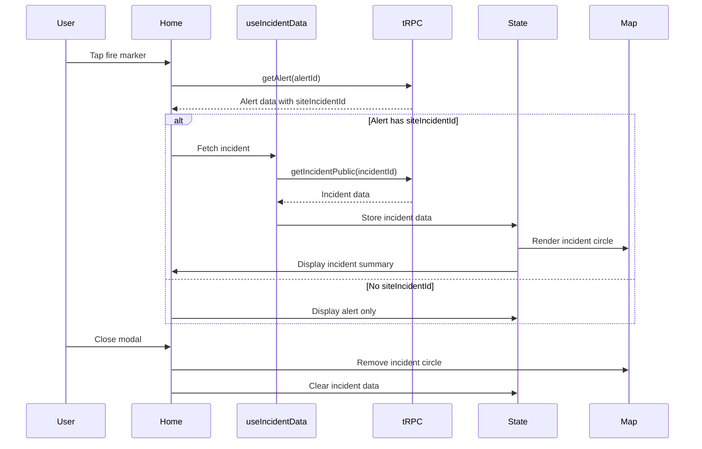

# Design Document: Mobile Incident Display Enhancement

## Overview

This design document outlines the architecture and implementation approach for displaying fire incident information in the FireAlert mobile application. The feature enhances the existing alert details modal by fetching associated incident data, rendering an incident circle on the map, and displaying an incident summary card - all following established patterns from the web application.

### Problem Statement

- Mobile users currently see individual fire alerts without context about related fire activity
- No visual indication of the geographic extent of fire incidents on mobile
- Missing incident summary information that helps users assess fire severity and duration

### Solution Overview

- Extend the existing alert tap handler to fetch incident data when available
- Reuse incident circle calculation logic from the web application
- Create a mobile-optimized Incident Summary Card component
- Render incident circles on the map using MapboxGL layers
- Follow SOLID principles with custom hooks, utility functions, and reusable components

## Architecture

### High-Level Component Structure

```
Home Screen (apps/nativeapp/app/screens/Home/Home.tsx)
├── MapboxGL.MapView
│   ├── Alert Markers (existing)
│   ├── Site Polygons (existing)
│   └── Incident Circle Layer (new)
│       └── MapboxGL.ShapeSource + Fill/Line Layers
│
└── Alert Details Modal (BottomSheet)
    ├── Incident Summary Card (new - conditional)
    │   ├── Header (icon + title + status badge)
    │   ├── Timeline (started at / ended at)
    │   └── Statistics (total fires + area affected)
    └── Alert Details (existing)
        ├── Detection Info
        ├── Site Info
        ├── Location Info
        └── Google Maps Button
```

### Data Flow



## Components and Interfaces

### 1. Custom Hook: useIncidentData

**Location**: `apps/nativeapp/app/hooks/incident/useIncidentData.ts`

**Purpose**: Encapsulates incident data fetching logic and state management

**Interface**:

```typescript
interface UseIncidentDataParams {
  incidentId: string | null | undefined;
  enabled?: boolean;
}

interface UseIncidentDataReturn {
  incident: IncidentData | null;
  isLoading: boolean;
  isError: boolean;
  error: Error | null;
}

function useIncidentData(params: UseIncidentDataParams): UseIncidentDataReturn;
```

**Implementation Details**:

- Uses tRPC's `useQuery` hook with `siteIncident.getIncidentPublic`
- Only fetches when `incidentId` is provided and `enabled` is true
- Returns incident data with all associated alerts
- Handles loading and error states
- Implements proper cleanup on unmount

**Example Usage**:

```typescript
const { incident, isLoading, isError } = useIncidentData({
  incidentId: selectedAlert?.siteIncidentId,
  enabled: !!selectedAlert?.siteIncidentId,
});
```

### 2. Utility Function: generateIncidentCircle

**Location**: `apps/nativeapp/app/utils/incident/incidentCircleUtils.ts`

**Purpose**: Calculates incident circle geometry from fire point coordinates

**Interface**:

```typescript
interface FirePoint {
  latitude: number;
  longitude: number;
}

interface IncidentCircleResult {
  circlePolygon: Feature<Polygon>;
  centroid: Position;
  radiusKm: number;
  areaKm2: number;
}

function generateIncidentCircle(
  fires: FirePoint[],
  paddingKm?: number
): IncidentCircleResult | null;

function calculateIncidentArea(fires: FirePoint[], paddingKm?: number): number;
```

**Implementation Details**:

- Uses `@turf/turf` functions: `point`, `featureCollection`, `center`, `circle`, `distance`, `area`
- Default padding: 2km (matching web implementation)
- Calculates centroid of all fire points
- Finds maximum distance from centroid to any fire
- Creates circle with radius = maxDistance + padding
- Returns GeoJSON polygon with 64 steps for smooth rendering
- Handles edge cases: empty array, single fire point

**Algorithm**:

1. Convert fire points to GeoJSON points
2. Calculate centroid using Turf's `center` function
3. Calculate max distance from centroid to any fire point
4. Add padding to radius (minimum 0.1km + padding for single fire)
5. Generate circle polygon using Turf's `circle` function
6. Calculate area in km² using Turf's `area` function

### 3. Component: IncidentSummaryCard

**Location**: `apps/nativeapp/app/components/Incident/IncidentSummaryCard.tsx`

**Purpose**: Displays incident summary information in the alert details modal

**Interface**:

```typescript
interface AlertData {
  id: string;
  eventDate: Date;
  latitude: number;
  longitude: number;
}

interface IncidentSummaryCardProps {
  isActive: boolean;
  startAlert: AlertData;
  latestAlert: AlertData;
  allAlerts: AlertData[];
}

function IncidentSummaryCard(props: IncidentSummaryCardProps): JSX.Element;
```

**Visual Design**:

```
┌─────────────────────────────────────────────────┐
│ [Icon] Fire Incident Summary        [Badge]    │
│                                                 │
│ Started at          Latest at / Ended at       │
│ 📅 15 Jan 2024      📅 17 Jan 2024            │
│ 🕐 02:30 PM         🕐 04:15 PM               │
│                                                 │
│ ┌──────────────┐  ┌──────────────┐           │
│ │ 🔥 Total Fires│  │ 📍 Area Affected│         │
│ │      12       │  │    2.45 km²   │         │
│ └──────────────┘  └──────────────┘           │
└─────────────────────────────────────────────────┘
```

**Styling**:

- Background: `fire.orange` (#E86F56) with 25% opacity for active, `fire.gray` (#C6C3C2) with 25% opacity for resolved
- Border radius: 12px
- Padding: 16px
- Status badge: Orange for "Active", Gray for "Resolved"
- Icons: Use existing SVG icons or create new ones matching the style
- Typography: Follow existing Typography constants

**Implementation Details**:

- Uses React Native `View`, `Text`, `Image` components
- Formats dates using `moment-timezone`
- Calculates area using `calculateIncidentArea` utility
- Responsive layout using flexbox
- Follows existing component patterns from `apps/nativeapp/app/components/`

### 4. Map Layer: Incident Circle Renderer

**Location**: Integrated into `apps/nativeapp/app/screens/Home/Home.tsx`

**Purpose**: Renders incident circle on the map using MapboxGL

**Implementation**:

```typescript
const renderIncidentCircle = () => {
  if (!incidentCircleData) return null;

  const circleColor = incident?.isActive ? "#E86F56" : "#6b7280";

  return (
    <MapboxGL.ShapeSource
      id="incident-circle"
      shape={incidentCircleData.circlePolygon}
    >
      <MapboxGL.FillLayer
        id="incident-circle-fill"
        style={{
          fillColor: circleColor,
          fillOpacity: 0.15,
        }}
      />
      <MapboxGL.LineLayer
        id="incident-circle-line"
        style={{
          lineWidth: 2,
          lineColor: circleColor,
          lineOpacity: 0.8,
        }}
      />
    </MapboxGL.ShapeSource>
  );
};
```

**Layer Hierarchy** (bottom to top):

1. Base map tiles
2. Site polygons (existing)
3. Incident circle (new)
4. Alert markers (existing)
5. Selected alert highlight (existing)

**Performance Optimization**:

- Use `useMemo` to cache circle calculation
- Only render when incident data is available
- Clean up layers when modal closes
- Limit polygon complexity to 64 steps

## Data Models

### Incident Data Structure (from API)

```typescript
interface IncidentData {
  id: string;
  siteId: string;
  startSiteAlertId: string;
  endSiteAlertId: string | null;
  latestSiteAlertId: string;
  startedAt: Date;
  endedAt: Date | null;
  isActive: boolean;
  isProcessed: boolean;
  startNotificationId: string | null;
  endNotificationId: string | null;
  reviewStatus: "to_review" | "in_review" | "reviewed";
  createdAt: Date;
  updatedAt: Date;

  site: {
    id: string;
    name: string | null;
    geometry: GeoJSON;
    project: {
      id: string;
      name: string;
    } | null;
  };

  startSiteAlert: SiteAlertData;
  latestSiteAlert: SiteAlertData;
  siteAlerts: SiteAlertData[];
}

interface SiteAlertData {
  id: string;
  eventDate: Date;
  latitude: number;
  longitude: number;
  detectedBy: string;
  confidence: "high" | "medium" | "low";
}
```

### Component State Management

```typescript
// In Home.tsx
const [selectedAlert, setSelectedAlert] = useState<AlertData | null>(null);
const [incidentCircleData, setIncidentCircleData] =
  useState<IncidentCircleResult | null>(null);

// Derived from useIncidentData hook
const { incident, isLoading: isIncidentLoading } = useIncidentData({
  incidentId: selectedAlert?.siteIncidentId,
  enabled: !!selectedAlert?.siteIncidentId,
});

// Memoized circle calculation
const incidentCircle = useMemo(() => {
  if (!incident?.siteAlerts) return null;
  const fires = incident.siteAlerts.map((a) => ({
    latitude: a.latitude,
    longitude: a.longitude,
  }));
  return generateIncidentCircle(fires, 2);
}, [incident?.siteAlerts]);
```

## Integration Points

### 1. Alert Tap Handler Enhancement

**Current Implementation** (in `Home.tsx`):

```typescript
const renderAnnotation = (counter) => {
  // ... existing code ...
  return (
    <MapboxGL.PointAnnotation
      onSelected={(e) => {
        // ... existing camera animation ...
        setTimeout(
          () => setSelectedAlert(alertsArr[counter]),
          ANIMATION_DURATION
        );
      }}
      coordinate={coordinate}
    >
      {getFireIcon(daysFromToday(alertsArr[counter]?.eventDate))}
    </MapboxGL.PointAnnotation>
  );
};
```

**Enhanced Implementation**:

```typescript
// No changes needed to renderAnnotation
// Incident fetching happens automatically via useIncidentData hook
// when selectedAlert has siteIncidentId
```

### 2. Alert Details Modal Enhancement

**Current Modal Structure**:

```tsx
<BottomSheet
  onBackdropPress={() => setSelectedAlert({})}
  isVisible={Object.keys(selectedAlert).length > 0}
>
  <View style={[styles.modalContainer, styles.commonPadding]}>
    <View style={styles.modalHeader} />
    {/* Detection Info */}
    {/* Location Info */}
    {/* Google Maps Button */}
  </View>
</BottomSheet>
```

**Enhanced Modal Structure**:

```tsx
<BottomSheet
  onBackdropPress={() => {
    setSelectedAlert({});
    setIncidentCircleData(null); // Clean up
  }}
  isVisible={Object.keys(selectedAlert).length > 0}
>
  <View style={[styles.modalContainer, styles.commonPadding]}>
    <View style={styles.modalHeader} />

    {/* NEW: Incident Summary Card */}
    {incident && (
      <IncidentSummaryCard
        isActive={incident.isActive}
        startAlert={incident.startSiteAlert}
        latestAlert={incident.latestSiteAlert}
        allAlerts={incident.siteAlerts}
      />
    )}

    {/* Existing: Detection Info */}
    {/* Existing: Location Info */}
    {/* Existing: Google Maps Button */}
  </View>
</BottomSheet>
```

### 3. Map Rendering Enhancement

**Current Map Structure**:

```tsx
<MapboxGL.MapView>
  {/* ... existing layers ... */}
  {renderMapSource()}
  {renderProtectedAreasSource()}
  {selectedArea && renderHighlightedMapSource()}
  {renderAnnotations(true)} {/* alerts */}
  {renderAnnotations(false)} {/* point sites */}
</MapboxGL.MapView>
```

**Enhanced Map Structure**:

```tsx
<MapboxGL.MapView>
  {/* ... existing layers ... */}
  {renderMapSource()}
  {renderProtectedAreasSource()}
  {selectedArea && renderHighlightedMapSource()}
  {/* NEW: Incident Circle */}
  {incidentCircle && renderIncidentCircle()}
  {renderAnnotations(true)} {/* alerts */}
  {renderAnnotations(false)} {/* point sites */}
</MapboxGL.MapView>
```

## Color Scheme Implementation

### Color Constants

**Add to** `apps/nativeapp/app/styles/Colors.ts`:

```typescript
// Fire Incident Colors (matching web tailwind config)
export const FIRE_ORANGE = "#E86F56";
export const FIRE_BROWN = "#B47C55";
export const FIRE_GRAY = "#C6C3C2";

// Incident Circle Colors (matching web MapComponent)
export const INCIDENT_ACTIVE_COLOR = "#E86F56"; // fire.orange
export const INCIDENT_RESOLVED_COLOR = "#6b7280"; // gray-500
```

### Color Usage

| Element                 | Active Incident               | Resolved Incident               |
| ----------------------- | ----------------------------- | ------------------------------- |
| Summary Card Background | `FIRE_ORANGE` @ 25%           | `FIRE_GRAY` @ 25%               |
| Status Badge            | `FIRE_ORANGE` @ 100%          | `PLANET_DARK_GRAY` @ 100%       |
| Circle Fill             | `INCIDENT_ACTIVE_COLOR` @ 15% | `INCIDENT_RESOLVED_COLOR` @ 15% |
| Circle Line             | `INCIDENT_ACTIVE_COLOR` @ 80% | `INCIDENT_RESOLVED_COLOR` @ 80% |
| Icons (active)          | `FIRE_ORANGE`                 | `PLANET_DARK_GRAY`              |

## Error Handling

### Error Scenarios

1. **Incident Fetch Failure**

   - **Cause**: Network error, invalid incident ID, server error
   - **Handling**: Display alert details only, show toast notification
   - **User Impact**: Minimal - user still sees alert information

2. **Circle Calculation Failure**

   - **Cause**: Invalid coordinates, empty alert array
   - **Handling**: Skip circle rendering, log error
   - **User Impact**: None - summary card still displays

3. **Invalid Incident Data**
   - **Cause**: Missing required fields, malformed data
   - **Handling**: Validate data structure, fallback to alert-only view
   - **User Impact**: Minimal - graceful degradation

### Error Handling Strategy

```typescript
// In useIncidentData hook
const { data, isLoading, isError, error } =
  trpc.siteIncident.getIncidentPublic.useQuery(
    { incidentId: params.incidentId! },
    {
      enabled: !!params.incidentId && (params.enabled ?? true),
      retry: 1,
      onError: (err) => {
        console.error("Failed to fetch incident:", err);
        // Don't show toast - fail silently and show alert only
      },
    }
  );

// In component
if (isError) {
  // Render alert details only, no incident information
  return <AlertDetailsOnly />;
}
```

## Performance Considerations

### Optimization Strategies

1. **Memoization**

   ```typescript
   const incidentCircle = useMemo(() => {
     if (!incident?.siteAlerts) return null;
     return generateIncidentCircle(
       incident.siteAlerts.map((a) => ({
         latitude: a.latitude,
         longitude: a.longitude,
       })),
       2
     );
   }, [incident?.siteAlerts]);
   ```

2. **Conditional Rendering**

   ```typescript
   // Only render circle if incident data exists
   {
     incidentCircle && renderIncidentCircle();
   }

   // Only fetch incident if alert has siteIncidentId
   enabled: !!selectedAlert?.siteIncidentId;
   ```

3. **Layer Cleanup**

   ```typescript
   useEffect(() => {
     return () => {
       // Clean up incident circle when component unmounts
       setIncidentCircleData(null);
     };
   }, []);
   ```

4. **Polygon Complexity**
   - Limit circle to 64 steps (matching web implementation)
   - Balance between visual smoothness and rendering performance

### Performance Targets

- **Circle Calculation**: <50ms for up to 100 fire points
- **Circle Rendering**: <100ms to display on map
- **Modal Opening**: <200ms from tap to display
- **Map FPS**: Maintain >30 FPS with incident circle visible

## Testing Strategy

### Unit Testing

**Test Files**:

- `apps/nativeapp/__tests__/utils/incident/incidentCircleUtils.test.ts`
- `apps/nativeapp/__tests__/hooks/incident/useIncidentData.test.ts`
- `apps/nativeapp/__tests__/components/Incident/IncidentSummaryCard.test.tsx`

**Test Cases**:

1. **incidentCircleUtils**

   - Calculate circle for single fire point
   - Calculate circle for multiple fire points
   - Handle empty array
   - Handle invalid coordinates
   - Verify padding is applied correctly
   - Verify area calculation accuracy

2. **useIncidentData**

   - Fetch incident successfully
   - Handle fetch error
   - Skip fetch when incidentId is null
   - Skip fetch when enabled is false
   - Clean up on unmount

3. **IncidentSummaryCard**
   - Render active incident correctly
   - Render resolved incident correctly
   - Format dates correctly
   - Calculate area correctly
   - Display correct fire count

### Integration Testing

**Test Scenarios**:

1. **Alert with Incident**

   - Tap alert marker
   - Verify incident data fetched
   - Verify circle rendered
   - Verify summary card displayed
   - Close modal and verify cleanup

2. **Alert without Incident**

   - Tap alert marker
   - Verify no incident fetch
   - Verify no circle rendered
   - Verify only alert details shown

3. **Multiple Alert Selection**
   - Tap first alert with incident
   - Verify incident A displayed
   - Tap second alert with different incident
   - Verify incident B displayed and incident A removed

### Manual Testing Checklist

- [ ] Incident circle renders correctly on iOS
- [ ] Incident circle renders correctly on Android
- [ ] Colors match web implementation
- [ ] Summary card layout is responsive
- [ ] Dates format correctly in user's timezone
- [ ] Area calculation matches web implementation
- [ ] Map remains responsive with circle visible
- [ ] Modal scrolls correctly with summary card
- [ ] Error states handled gracefully
- [ ] Memory leaks checked (circle cleanup)

## Implementation Phases

### Phase 1: Core Infrastructure (Requirements 1, 4, 5)

**Tasks**:

1. Create `useIncidentData` custom hook
2. Create `incidentCircleUtils` utility functions
3. Add color constants to Colors.ts
4. Set up TypeScript interfaces

**Deliverables**:

- `apps/nativeapp/app/hooks/incident/useIncidentData.ts`
- `apps/nativeapp/app/utils/incident/incidentCircleUtils.ts`
- Updated `apps/nativeapp/app/styles/Colors.ts`
- Type definitions file

### Phase 2: UI Components (Requirement 3)

**Tasks**:

1. Create `IncidentSummaryCard` component
2. Create incident icon assets (or reuse existing)
3. Implement date/time formatting utilities
4. Add component styling

**Deliverables**:

- `apps/nativeapp/app/components/Incident/IncidentSummaryCard.tsx`
- Icon assets (if new ones needed)
- Component styles

### Phase 3: Map Integration (Requirement 2, 6)

**Tasks**:

1. Integrate `useIncidentData` hook into Home.tsx
2. Implement incident circle rendering
3. Add circle to map layer hierarchy
4. Implement cleanup logic
5. Add performance optimizations (useMemo)

**Deliverables**:

- Updated `apps/nativeapp/app/screens/Home/Home.tsx`
- Incident circle rendering logic
- Performance optimizations

### Phase 4: Modal Enhancement (Requirement 3)

**Tasks**:

1. Integrate `IncidentSummaryCard` into alert modal
2. Add conditional rendering logic
3. Update modal layout and spacing
4. Test scrolling behavior

**Deliverables**:

- Updated alert details modal in Home.tsx
- Proper layout and spacing

### Phase 5: Testing & Polish (All Requirements)

**Tasks**:

1. Write unit tests
2. Write integration tests
3. Manual testing on iOS and Android
4. Performance testing
5. Error handling verification
6. Code review and refinement

**Deliverables**:

- Test files
- Performance metrics
- Bug fixes
- Documentation

## Dependencies

### Existing Packages (No New Installations)

- `@rnmapbox/maps`: Map rendering and layers
- `@turf/turf`: Geospatial calculations
- `moment-timezone`: Date/time formatting
- `@tanstack/react-query`: Data fetching (via tRPC)
- `react-native`: Core components
- `react`: Hooks and component logic

### Internal Dependencies

- tRPC client configuration
- Existing color constants
- Existing component patterns
- Existing utility functions

## Rollout Strategy

### Development

1. Implement on development branch
2. Test with staging API
3. Code review
4. Merge to main

### Testing

1. Internal testing on iOS and Android
2. Beta testing with select users
3. Performance monitoring
4. Bug fixes

### Deployment

1. Deploy with feature flag (if available)
2. Monitor error rates
3. Gather user feedback
4. Iterate based on feedback

### Rollback Plan

If critical issues arise:

1. Feature can be disabled by removing incident-related code
2. Alert details modal falls back to existing implementation
3. No database changes required (read-only feature)
4. No API changes required (uses existing endpoints)

## Future Enhancements

1. **Incident History View**: Show all incidents for a site
2. **Incident Filtering**: Filter alerts by incident status
3. **Incident Sharing**: Share incident details via deep link
4. **Offline Support**: Cache incident data for offline viewing
5. **Incident Animations**: Animate circle appearance/disappearance
6. **Multi-Incident View**: Show multiple incident circles simultaneously
7. **Incident Timeline**: Visual timeline of fire progression
8. **Incident Comparison**: Compare multiple incidents side-by-side
