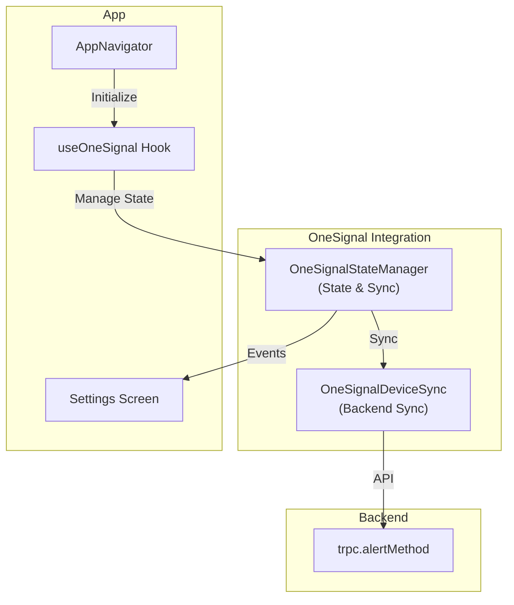

# OneSignal Integration Improvement - Design

## Overview

This design improves the OneSignal integration by introducing a centralized state manager and automatic device synchronization with the backend. The solution is minimal and focused on reliability.

## Architecture



## Components

### 1. OneSignalStateManager

**File**: `apps/nativeapp/app/services/OneSignal/OneSignalStateManager.ts`

Manages device state and lifecycle. Caches device state and emits events when state changes.

```typescript
interface DeviceState {
  userId: string | null;
  pushToken: string | null;
  externalId: string | null;
  optedIn: boolean;
  permission: boolean;
  isInitialized: boolean;
  lastUpdated: number;
}

class OneSignalStateManager {
  private state: DeviceState;
  private listeners: Set<(event: StateChangeEvent) => void>;

  async initialize(appId: string, userId: string): Promise<void>;
  getState(): DeviceState;
  subscribe(listener: (event: StateChangeEvent) => void): () => void;
  async handleLogin(userId: string): Promise<void>;
  async handleLogout(): Promise<void>;
  async checkPermissions(): Promise<void>;
  private setState(newState: Partial<DeviceState>): void;
}
```

**Responsibilities:**

- Initialize OneSignal SDK
- Cache device state (userId, pushToken, permissions)
- Detect permission changes
- Emit state change events
- Handle user login/logout
- Log all operations with `[OneSignal]` prefix

### 2. OneSignalDeviceSync

**File**: `apps/nativeapp/app/services/OneSignal/OneSignalDeviceSync.ts`

Synchronizes device subscriptions with backend alert methods.

```typescript
interface SyncResult {
  action: "created" | "updated" | "no_change";
  alertMethodId?: string;
  message: string;
}

class OneSignalDeviceSync {
  async syncDeviceSubscription(
    deviceState: DeviceState,
    userId: string
  ): Promise<SyncResult>;

  private async checkExistingAlertMethod(
    userId: string,
    deviceId: string
  ): Promise<AlertMethod | null>;

  private async createDeviceAlertMethod(
    deviceState: DeviceState,
    userId: string
  ): Promise<SyncResult>;

  private async updateDeviceAlertMethod(
    alertMethodId: string,
    deviceState: DeviceState
  ): Promise<SyncResult>;

  private async cleanupStaleSubscriptions(
    userId: string,
    currentDeviceId: string
  ): Promise<void>;
}
```

**Responsibilities:**

- Check if device alert method exists in backend
- Create new device alert method if missing
- Update existing alert method if device state changed
- Clean up stale subscriptions from previous devices
- Retry failed sync operations (max 3 attempts)
- Log sync operations with `[DeviceSync]` prefix

### 3. Updated useOneSignal Hook

**File**: `apps/nativeapp/app/hooks/notification/useOneSignal.ts`

Integration point for OneSignal in React components.

```typescript
function useOneSignal(
  appId: string,
  handlers: NotificationHandlers
): {
  state: DeviceState;
  isInitialized: boolean;
};
```

**Responsibilities:**

- Initialize OneSignalStateManager
- Set up notification event listeners
- Trigger device sync on state changes
- Provide state to components

## Data Models

### DeviceState

```typescript
{
  userId: "onesignal-player-id",        // OneSignal device ID
  pushToken: "fcm-or-apns-token",       // Platform push token
  externalId: "user-id-123",            // FireAlert user ID
  optedIn: true,                        // User opted in
  permission: true,                     // OS permission granted
  isInitialized: true,                  // OneSignal ready
  lastUpdated: 1704067200000            // Last update timestamp
}
```

### AlertMethod (Backend)

```typescript
{
  id: "alert-method-id",
  userId: "user-id-123",
  method: "device",
  destination: "onesignal-player-id",   // OneSignal userId
  deviceId: "device-uuid",              // Unique device ID
  deviceName: "iPhone 14",              // Device name
  isEnabled: true,
  isVerified: true,
  createdAt: "2024-01-01T00:00:00Z",
  updatedAt: "2024-01-01T00:00:00Z"
}
```

## Correctness Properties

### Property 1: Device State Consistency

**For any** user session, the cached device state should match the actual OneSignal SDK state.

**Validates: Requirements 1.1, 1.2, 1.3**

### Property 2: Sync Idempotence

**For any** device state, calling sync multiple times should result in the same backend state (no duplicates).

**Validates: Requirements 3.1, 3.2, 3.3**

### Property 3: Permission Change Detection

**For any** change in OS notification permissions, the system should detect and update the backend.

**Validates: Requirements 6.1, 6.2, 6.3**

### Property 4: Stale Subscription Cleanup

**For any** user logging in on a new device, previous device alert methods should be cleaned up.

**Validates: Requirements 4.1, 4.2, 4.3**

### Property 5: Settings Screen Sync

**For any** device alert method in the backend, the Settings screen should display current status.

**Validates: Requirements 7.1, 7.2, 7.3**

### Property 6: Type Safety

**For any** OneSignal API response, the system should validate before using.

**Validates: Requirements 8.1, 8.2**

## Logging Strategy

All operations log with clear prefixes for easy debugging:

```
[OneSignal] Initializing OneSignal with appId: xxx
[OneSignal] Device state retrieved: { userId: xxx, permission: true, ... }
[OneSignal] Permission changed: false -> true
[OneSignal] User logged in: user-id-123
[DeviceSync] Checking existing alert method for device: device-uuid
[DeviceSync] Creating new device alert method
[DeviceSync] Sync attempt 1/3 failed: Network error, retrying...
[DeviceSync] Sync completed successfully
[Error] Failed to sync device: Network timeout after 3 attempts
```

## Error Handling

### Retry Strategy

- **Max Attempts**: 3
- **Initial Delay**: 1 second
- **Backoff**: 2x multiplier (1s, 2s, 4s)
- **Retryable Errors**: Network errors, timeouts, server errors
- **Non-Retryable**: Permission denied, invalid input

### Error Logging

All errors logged with context:

```
[Error] OneSignal initialization failed: Permission denied
  Context: { appId: xxx, userId: yyy }

[Error] Device sync failed after 3 attempts: Network timeout
  Context: { deviceId: xxx, userId: yyy, lastAttempt: 2024-01-01T00:00:00Z }
```

## File Structure

```
apps/nativeapp/app/
├── services/
│   └── OneSignal/
│       ├── OneSignalStateManager.ts
│       ├── OneSignalDeviceSync.ts
│       ├── types.ts
│       └── index.ts
├── hooks/
│   └── notification/
│       └── useOneSignal.ts (updated)
└── utils/
    └── OneSignal/
        └── constants.ts
```

## Implementation Flow

### App Initialization

1. AppNavigator initializes useOneSignal hook
2. useOneSignal creates OneSignalStateManager
3. OneSignalStateManager initializes OneSignal SDK
4. Device state is retrieved and cached
5. OneSignalDeviceSync checks backend for existing alert method
6. If missing, creates new alert method
7. If exists but state changed, updates alert method
8. Settings screen subscribes to state changes

### Permission Change Detection

1. App comes to foreground
2. OneSignalStateManager checks current permissions
3. If permissions changed, updates cached state
4. Emits state change event
5. OneSignalDeviceSync syncs with backend
6. Settings screen receives event and refreshes

### User Login

1. User logs in
2. OneSignalStateManager.handleLogin() called
3. OneSignal.login(userId) called
4. Device state reset and reinitialized
5. OneSignalDeviceSync syncs device
6. Cleans up stale subscriptions from previous devices

### User Logout

1. User logs out
2. OneSignalStateManager.handleLogout() called
3. Device state cleared
4. OneSignal unsubscribed (optional task)

## Optional Tasks

The following are marked as optional and can be implemented later:

- **Error Recovery**: Comprehensive error handling and recovery strategies
- **Logout Cleanup**: Unsubscribe from OneSignal on logout
- **OneSignalErrorHandler**: Dedicated error handling service

These are marked optional in the task list but errors should still be logged clearly.
