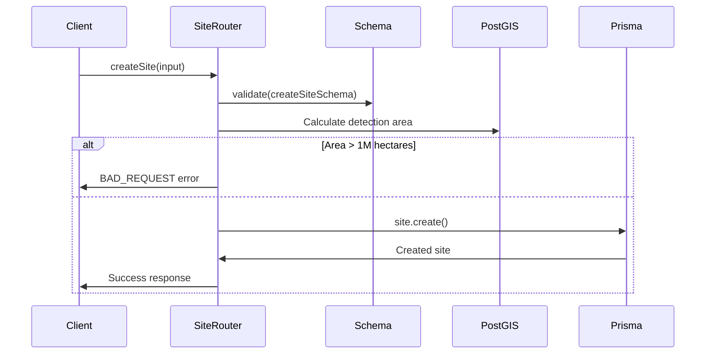
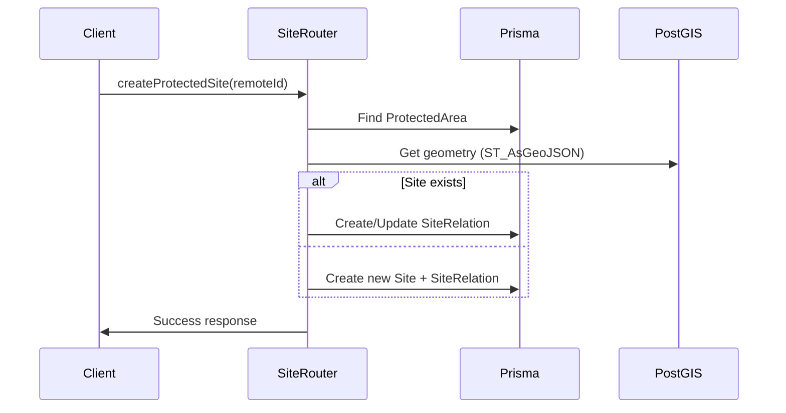

(UNREVIEWED)

# Server Architecture Structure

## Overview

This document visualizes the FireAlert server architecture with focus on the Site Router (`apps/server/src/server/api/routers/site.ts`) and its connections to other system components using C4 Model principles.

## Architecture Diagram

```mermaid
graph TB
    %% C4 Level 1 - System Context
    subgraph "FireAlert Server System"
        subgraph "API Layer"
            SR[Site Router<br/>site.ts]
            AR[Alert Router<br/>alert.ts]
            AMR[AlertMethod Router<br/>alertMethod.ts]
            UR[User Router<br/>user.ts]
            PR[Project Router<br/>project.ts]
            GER[GeoEventProvider Router<br/>geoEventProvider.ts]
        end
        
        subgraph "Validation Layer"
            SS[Site Schema<br/>site.schema.ts]
            AS[Alert Schema<br/>alert.schema.ts]
            AMS[AlertMethod Schema<br/>alertMethod.schema.ts]
        end
        
        subgraph "Business Logic Layer"
            SU[Site Utils<br/>utils/routers/site.ts]
            SAC[SiteAlert Creator<br/>Services/SiteAlert/]
            NC[Notification Creator<br/>Services/Notifications/]
        end
        
        subgraph "Data Layer"
            PRISMA[Prisma ORM]
            POSTGIS[PostGIS Database]
        end
        
        subgraph "External Services"
            COUNTRIES[i18n-iso-countries]
            TRPC[tRPC Framework]
        end
    end
    
    %% C4 Level 2 - Site Router Detail Flow
    subgraph "Site Router Operations"
        direction TB
        CREATE[createSite]
        FIND[findProtectedSites]
        CREATEPROT[createProtectedSite]
        GET[getSites/getSite]
        UPDATE[updateSite]
        DELETE[deleteSite]
        PAUSE[pauseAlertForSite]
        TEST[triggerTestAlert]
    end
    
    %% Connections - API Layer
    SR --> SS
    SR --> SU
    SR --> PRISMA
    SR --> COUNTRIES
    SR --> TRPC
    
    %% Site Router Operations
    SR --> CREATE
    SR --> FIND
    SR --> CREATEPROT
    SR --> GET
    SR --> UPDATE
    SR --> DELETE
    SR --> PAUSE
    SR --> TEST
    
    %% Business Logic Connections
    SU --> PRISMA
    TEST --> SAC
    SAC --> NC
    
    %% Data Layer
    PRISMA --> POSTGIS
    
    %% Cross-router dependencies (implied)
    SR -.-> AR
    SR -.-> AMR
    
    %% Styling
    classDef router fill:#e1f5fe,stroke:#01579b,stroke-width:2px
    classDef schema fill:#f3e5f5,stroke:#4a148c,stroke-width:2px
    classDef service fill:#e8f5e8,stroke:#1b5e20,stroke-width:2px
    classDef data fill:#fff3e0,stroke:#e65100,stroke-width:2px
    classDef external fill:#fce4ec,stroke:#880e4f,stroke-width:2px
    classDef operation fill:#f1f8e9,stroke:#33691e,stroke-width:1px
    
    class SR,AR,AMR,UR,PR,GER router
    class SS,AS,AMS schema
    class SU,SAC,NC service
    class PRISMA,POSTGIS data
    class COUNTRIES,TRPC external
    class CREATE,FIND,CREATEPROT,GET,UPDATE,DELETE,PAUSE,TEST operation
```

## Site Router Architecture Details

### Core Components

#### 1. Site Router (`site.ts`)
- **Purpose**: Handles all site-related API operations
- **Framework**: tRPC with TypeScript
- **Authentication**: Uses `protectedProcedure` for all endpoints
- **Operations**: 12 main endpoints for site management

#### 2. Key Dependencies

**Validation Layer:**
- `site.schema.ts` - Zod schemas for input validation
- Ensures type safety and data integrity

**Business Logic:**
- `utils/routers/site.ts` - Permission checks and business rules
- `Services/SiteAlert/` - Alert creation and management
- `Services/Notifications/` - Notification processing

**Data Layer:**
- Prisma ORM for database operations
- PostGIS for geospatial calculations
- Raw SQL queries for complex geometry operations

### Site Router Operations Flow

#### 1. Site Creation Flow

#### 2. Protected Site Creation Flow

### Database Interactions

#### Tables Accessed by Site Router:
- **Site** - Primary entity for monitoring areas
- **SiteRelation** - User permissions for protected sites
- **ProtectedArea** - WDPA protected area data
- **Project** - Plant-for-the-Planet project integration
- **SiteAlert** - Alert records for sites
- **User** - Authentication and ownership

#### PostGIS Operations:
- `ST_Area()` - Calculate detection area
- `ST_Transform()` - Coordinate system transformations
- `ST_Buffer()` - Create monitoring radius
- `ST_AsGeoJSON()` - Convert geometry to GeoJSON
- `ST_Union()` - Combine multiple geometries

### Security & Authorization

#### Permission Checks:
- `checkUserHasSitePermission()` - Verifies user access to sites
- `checkIfPlanetROSite()` - Restricts operations on Planet-for-the-Planet sites
- User ID validation from authentication context

#### Data Protection:
- Soft deletion with `deletedAt` timestamps
- Cascade deletion prevention for external sites
- Input validation through Zod schemas

### Integration Points

#### External Systems:
- **Plant-for-the-Planet Platform** - Project and site synchronization
- **WDPA Database** - Protected area data
- **i18n-iso-countries** - Country name localization

#### Internal Services:
- **Alert System** - Site monitoring and notifications
- **Notification Service** - Multi-channel alert delivery
- **GeoEvent Processing** - Fire detection data processing

## Key Architectural Patterns

### 1. Layered Architecture
- **API Layer**: tRPC routers handle HTTP requests
- **Validation Layer**: Zod schemas ensure data integrity
- **Business Logic**: Utils and Services contain domain logic
- **Data Layer**: Prisma ORM with PostGIS extensions

### 2. Repository Pattern
- Prisma acts as repository abstraction
- Raw SQL for complex geospatial operations
- Centralized database access patterns

### 3. Service Layer Pattern
- Business logic separated from API handlers
- Reusable services across different routers
- Clear separation of concerns

### 4. Strategy Pattern
- Different site types (FireAlert vs Protected Area)
- Conditional logic based on site origin
- Extensible for new site types

## Performance Considerations

### Database Optimization:
- PostGIS spatial indexing for geometry operations
- Selective field queries to minimize data transfer
- Efficient joins with related entities

### Caching Strategy:
- tRPC built-in query caching
- Prisma query optimization
- Minimal data fetching patterns

## Error Handling

### Standardized Error Responses:
- TRPCError with specific error codes
- Consistent error message formatting
- Proper HTTP status code mapping
- Graceful fallback for database errors

This architecture ensures scalable, maintainable, and secure site management functionality within the FireAlert system.