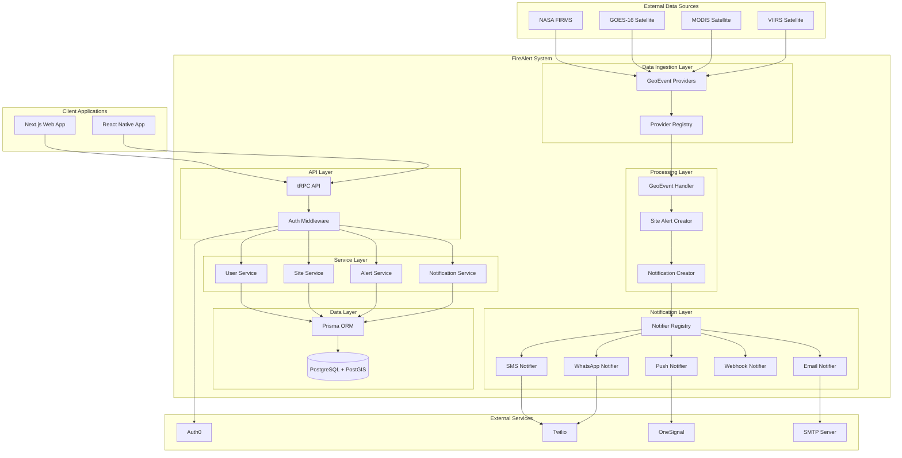
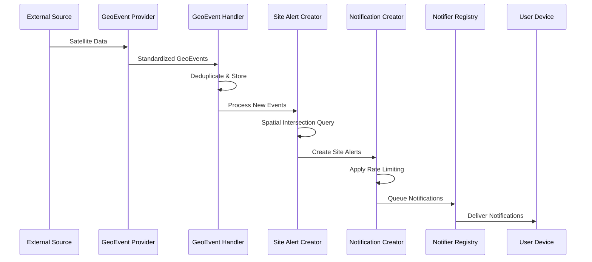
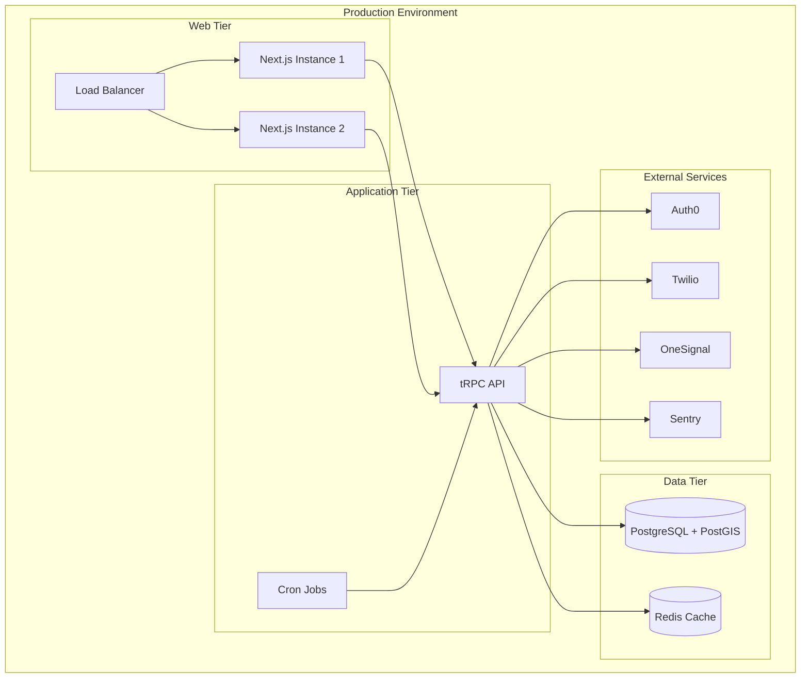
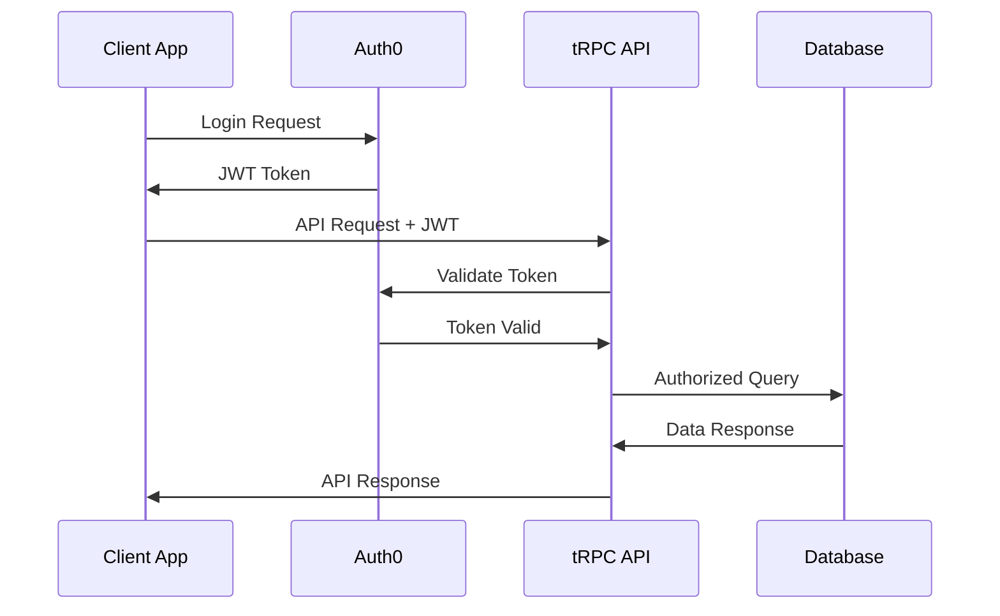

# FireAlert Architecture Overview

## System Overview

FireAlert is a comprehensive geolocation-based alert system that monitors environmental events (primarily fires) and notifies users through multiple channels. The system ingests data from various satellite sources, processes geospatial events, and delivers real-time notifications to users monitoring specific geographic areas.

## High-Level Architecture

## System Components

### 1. Data Ingestion Layer

#### GeoEvent Providers
Responsible for fetching environmental event data from external sources.

**Key Components:**
- `NasaGeoEventProvider` - Fetches fire data from NASA FIRMS
- `GOES16GeoEventProvider` - Processes GOES-16 satellite data
- `GeoEventProviderRegistry` - Manages provider registration and discovery

**Data Flow:**
1. Scheduled cron jobs trigger provider data fetching
2. Providers fetch data from external APIs
3. Raw data is transformed into standardized GeoEvent format
4. Events are deduplicated and stored in the database

### 2. Processing Layer

#### GeoEvent Handler
Processes incoming geospatial events and manages data persistence.

**Responsibilities:**
- Event deduplication using hash-based checksums
- Bulk database operations for performance
- Event validation and transformation

#### Site Alert Creator
Matches GeoEvents with user-defined monitoring sites using spatial queries.

**Key Features:**
- PostGIS spatial intersection queries
- Batch processing for performance
- Distance calculation for alerts
- Site monitoring status validation

#### Notification Creator
Generates notifications based on site alerts and user preferences.

**Logic:**
- Rate limiting to prevent notification spam
- User alert method validation
- Conditional notification creation based on site activity

### 3. API Layer

#### tRPC API
Type-safe API layer providing client-server communication.

**Router Structure:**
- `userRouter` - User management and authentication
- `siteRouter` - Site creation and management
- `alertRouter` - Alert retrieval and management
- `alertMethodRouter` - Notification method management
- `projectRouter` - Project synchronization
- `geoEventProviderRouter` - Provider management

#### Authentication Middleware
Handles user authentication and authorization.

**Features:**
- Auth0 token validation
- Role-based access control
- Admin impersonation support
- Automatic user creation for new signups

### 4. Service Layer

Currently implemented as utility functions, planned for refactoring into proper service classes.

**Planned Services:**
- `UserService` - User lifecycle management
- `SiteService` - Site operations and validation
- `AlertService` - Alert processing and retrieval
- `NotificationService` - Notification orchestration

### 5. Data Layer

#### PostgreSQL with PostGIS
Primary database with geospatial extensions.

**Key Features:**
- Spatial indexing for performance
- Complex geospatial queries
- ACID compliance for data integrity
- Efficient bulk operations

#### Prisma ORM
Database access layer with type safety.

**Benefits:**
- Type-safe database queries
- Migration management
- Connection pooling
- Query optimization

### 6. Notification Layer

#### Notifier Registry
Manages different notification channels through a plugin architecture.

**Supported Channels:**
- **Email** - SMTP-based email notifications
- **SMS** - Twilio SMS integration
- **WhatsApp** - Twilio WhatsApp Business API
- **Push** - OneSignal push notifications
- **Webhook** - HTTP webhook delivery
- **Device** - Direct device notifications

## Data Flow Architecture

## Client Applications

### Next.js Web Application
Server-side rendered web application for site management and alert monitoring.

**Key Features:**
- Interactive map interface using MapLibre GL
- Site creation and management
- Alert history and visualization
- User account management
- Admin dashboard

### React Native Mobile Application
Cross-platform mobile app for iOS and Android.

**Key Features:**
- Location-based site creation
- Push notification handling
- Offline data synchronization
- Map-based alert visualization
- User authentication

## Deployment Architecture

## Technology Stack

### Backend Technologies
- **Runtime**: Node.js 18.x
- **Framework**: Next.js 13.5.4
- **API**: tRPC 10.9.0
- **Database**: PostgreSQL with PostGIS
- **ORM**: Prisma 5.0.0
- **Authentication**: Auth0
- **Validation**: Zod 3.22.3

### Frontend Technologies
- **Web**: React 18.2.0, TypeScript 5.0.3
- **Mobile**: React Native 0.71.1
- **State Management**: Redux Toolkit (Mobile)
- **Maps**: MapLibre GL, Mapbox GL
- **Navigation**: React Navigation (Mobile)

### Infrastructure & DevOps
- **Hosting**: Heroku (Production)
- **Monitoring**: Sentry, Logtail
- **Package Manager**: Yarn Workspaces
- **CI/CD**: GitHub Actions (implied)

## Security Architecture

### Authentication Flow

### Security Features
- **JWT-based authentication** with Auth0
- **Role-based access control** (Client, Admin, Support)
- **Input validation** using Zod schemas
- **SQL injection prevention** through Prisma ORM
- **Rate limiting** for notification channels
- **Environment variable management** for secrets

## Performance Considerations

### Database Optimization
- **Spatial indexing** for geospatial queries
- **Bulk operations** for data ingestion
- **Connection pooling** through Prisma
- **Query optimization** for complex spatial joins

### API Performance
- **Type-safe serialization** with tRPC
- **Efficient data fetching** with proper includes/selects
- **Pagination** for large datasets
- **Caching strategies** for frequently accessed data

### Scalability Patterns
- **Horizontal scaling** for web instances
- **Background job processing** for data ingestion
- **Database read replicas** (future consideration)
- **CDN integration** for static assets

## Monitoring and Observability

### Error Tracking
- **Sentry integration** for error monitoring
- **Structured logging** with Logtail
- **Performance monitoring** for database queries
- **Alert notifications** for system issues

### Metrics and Analytics
- **User engagement tracking**
- **Notification delivery rates**
- **System performance metrics**
- **Geospatial query performance**

## Development Workflow

### Code Organization
- **Monorepo structure** with Yarn workspaces
- **Shared configurations** across applications
- **Type sharing** between client and server
- **Consistent tooling** (ESLint, Prettier, TypeScript)

### Quality Assurance
- **TypeScript strict mode** for type safety
- **Zod schemas** for runtime validation
- **ESLint rules** for code consistency
- **Automated testing** (planned enhancement)

This architecture overview provides the foundation for understanding the FireAlert system and guides future development and maintenance efforts.