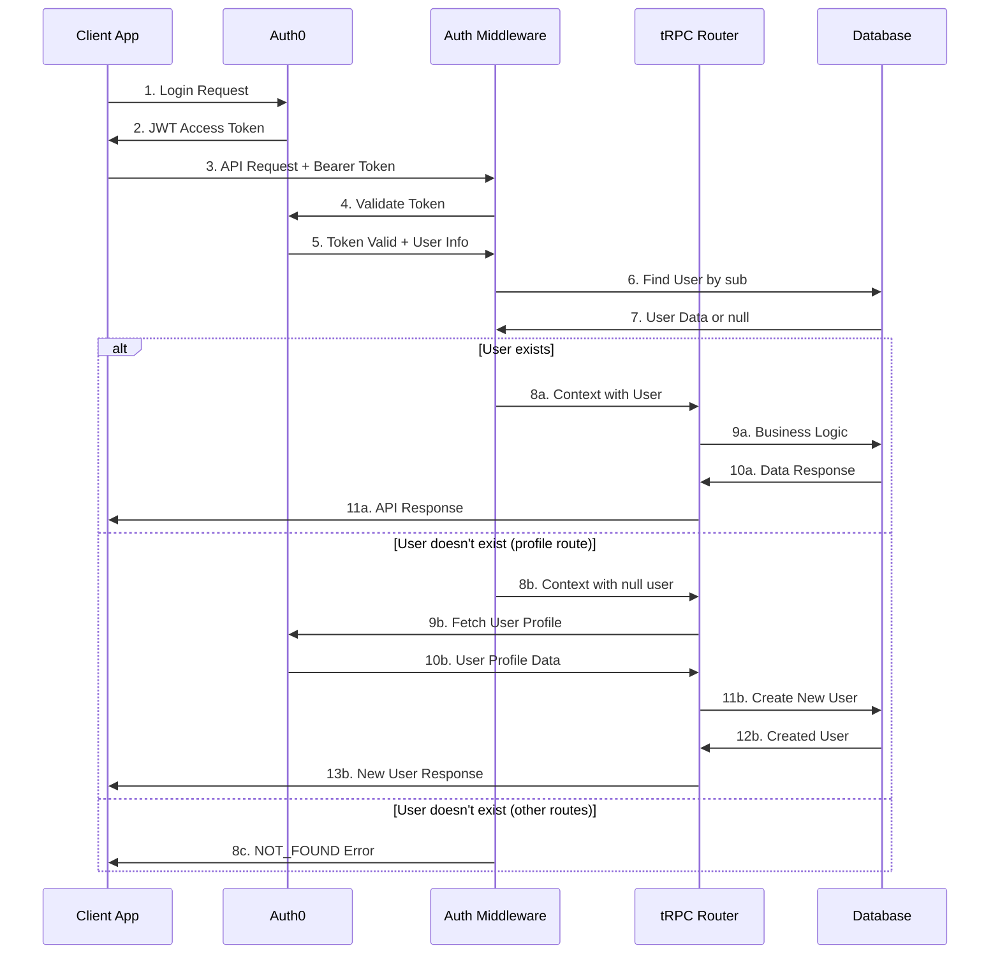

# Authentication and Authorization Guide

## Overview

FireAlert uses Auth0 for authentication and implements role-based access control (RBAC) for authorization. This guide covers the complete authentication flow, role management, and security patterns.

## Authentication Architecture



## Auth0 Configuration

### Environment Variables

```bash
# Auth0 Configuration
NEXT_PUBLIC_AUTH0_CLIENT_ID=your-auth0-client-id
NEXT_PUBLIC_AUTH0_ISSUER=https://your-domain.auth0.com
NEXT_PUBLIC_AUTH0_DOMAIN=your-domain.auth0.com
AUTH0_DOMAIN=your-domain.auth0.com
AUTH0_ISSUER=https://your-domain.auth0.com
```

### Auth0 Application Settings

**Application Type:** Single Page Application (SPA) for web, Native for mobile

**Allowed Callback URLs:**
```
http://localhost:3000/callback,
https://your-production-domain.com/callback
```

**Allowed Logout URLs:**
```
http://localhost:3000,
https://your-production-domain.com
```

**Allowed Web Origins:**
```
http://localhost:3000,
https://your-production-domain.com
```

## Authentication Middleware

The authentication middleware (`ensureUserIsAuthed`) handles token validation and user context creation:

```typescript
const ensureUserIsAuthed = t.middleware(async ({ctx, next}) => {
  // Add Sentry Handler to middleware
  Sentry.Handlers.trpcMiddleware({
    attachRpcInput: true,
  });
  
  // Decode the token
  const {decodedToken, access_token} = await decodeToken(ctx);
  
  // Find the user associated with the token
  const user = await ctx.prisma.user.findFirst({
    where: {
      sub: decodedToken?.sub,
    },
  });
  
  // Handle different scenarios based on user existence and procedure
  const url = ctx.req.url;
  const procedure = url?.substring(url?.lastIndexOf('.') + 1);
  
  // User creation flow for profile procedure
  if (!user && procedure === 'profile') {
    return next({
      ctx: {
        token: { ...decodedToken, access_token },
        user: null,
        isAdmin: false,
        isImpersonatedUser: false,
      },
    });
  }
  
  // Error for non-existent users on other procedures
  if (!user) {
    throw new TRPCError({
      code: 'NOT_FOUND',
      message: 'User is not authenticated. Please sign up first.',
    });
  }
  
  // Admin user handling
  if (user.roles === 'ROLE_ADMIN') {
    const impersonateUserId = ctx.req.headers['x-impersonate-user-id'];
    
    if (!impersonateUserId) {
      // Admin accessing their own data
      return next({
        ctx: {
          token: { ...decodedToken, access_token },
          user: user,
          isAdmin: true,
          isImpersonatedUser: false,
        },
      });
    }
    
    // Admin impersonating another user
    const impersonateUser = await ctx.prisma.user.findUnique({
      where: { id: impersonateUserId as string },
    });
    
    if (!impersonateUser) {
      throw new TRPCError({
        code: 'NOT_FOUND',
        message: 'Cannot find the impersonated user with the given id.',
      });
    }
    
    return next({
      ctx: {
        token: { ...decodedToken, access_token },
        user: impersonateUser,
        isAdmin: true,
        isImpersonatedUser: true,
      },
    });
  }
  
  // Regular user handling
  if (procedure !== 'profile' && user?.deletedAt) {
    throw new TRPCError({
      code: 'UNAUTHORIZED',
      message: 'User account has been deleted. Please log in again.',
    });
  }
  
  return next({
    ctx: {
      token: { ...decodedToken, access_token },
      user: user,
      isAdmin: false,
      isImpersonatedUser: false,
    },
  });
});
```

## Role-Based Access Control

### User Roles

```typescript
enum Role {
  ROLE_CLIENT    // Regular users
  ROLE_ADMIN     // System administrators
  ROLE_SUPPORT   // Support staff
}
```

### Role Permissions

| Role | Permissions |
|------|-------------|
| **ROLE_CLIENT** | - Manage own sites and alerts<br/>- Configure notification methods<br/>- View own alert history<br/>- Update profile |
| **ROLE_ADMIN** | - All client permissions<br/>- Manage GeoEvent providers<br/>- View all users<br/>- Impersonate other users<br/>- System configuration |
| **ROLE_SUPPORT** | - View user data<br/>- Limited administrative functions<br/>- Customer support operations |

### Admin-Only Endpoints

Certain endpoints require admin privileges:

```typescript
const ensureAdmin = (ctx: Context) => {
  if (!ctx.isAdmin) {
    throw new TRPCError({
      code: 'FORBIDDEN',
      message: 'Admin access required',
    });
  }
};

// Usage in routers
export const geoEventProviderRouter = createTRPCRouter({
  createGeoEventProvider: protectedProcedure
    .input(createGeoEventProviderSchema)
    .mutation(async ({ ctx, input }) => {
      ensureAdmin(ctx); // Enforce admin access
      // ... implementation
    }),
});
```

## User Registration Flow

### New User Creation

When a user logs in for the first time, the system automatically creates a user record:

```typescript
// In user.profile procedure
if (ctx.user === null) {
  // Signup logic
  const bearer_token = `Bearer ${ctx.token.access_token}`;
  return await handleNewUser(bearer_token);
}
```

### Plant-for-the-Planet Integration

For Plant-for-the-Planet users, the system synchronizes projects and sites:

```typescript
const handleNewUser = async (bearer_token: string) => {
  // Fetch user profile from Auth0
  const userProfile = await fetchUserProfile(bearer_token);
  
  // Create user in database
  const newUser = await prisma.user.create({
    data: {
      sub: userProfile.sub,
      email: userProfile.email,
      name: userProfile.name,
      // ... other fields
    }
  });
  
  // Check if user is Planet RO user
  if (userProfile.isPlanetRO) {
    // Sync projects and sites from Planet API
    await syncPlanetData(newUser.id, bearer_token);
  }
  
  return newUser;
};
```

## Admin Impersonation

Administrators can impersonate other users for support purposes:

### Client Implementation

```typescript
// Add impersonation header to tRPC client
const trpcClient = trpc.createClient({
  links: [
    httpBatchLink({
      url: '/api/trpc',
      headers: () => {
        const token = getAuthToken();
        const impersonateUserId = getImpersonateUserId();
        
        return {
          authorization: `Bearer ${token}`,
          ...(impersonateUserId && {
            'x-impersonate-user-id': impersonateUserId
          })
        };
      },
    }),
  ],
});
```

### Context Handling

The middleware provides different context based on impersonation:

```typescript
interface AuthContext {
  user: User | null;
  isAdmin: boolean;
  isImpersonatedUser: boolean;
  token: DecodedToken;
}

// Context scenarios:
// 1. user: null, isAdmin: false, isImpersonatedUser: false
//    → New user registration (profile route only)

// 2. user: adminUser, isAdmin: true, isImpersonatedUser: false
//    → Admin accessing their own data

// 3. user: impersonatedUser, isAdmin: true, isImpersonatedUser: true
//    → Admin impersonating another user

// 4. user: regularUser, isAdmin: false, isImpersonatedUser: false
//    → Regular user access
```

## Token Management

### Token Validation

```typescript
const decodeToken = async (ctx: Context) => {
  const authHeader = ctx.req.headers.authorization;
  
  if (!authHeader || !authHeader.startsWith('Bearer ')) {
    throw new TRPCError({
      code: 'UNAUTHORIZED',
      message: 'Missing or invalid authorization header',
    });
  }
  
  const token = authHeader.substring(7);
  
  try {
    // Validate token with Auth0
    const decodedToken = await validateAuth0Token(token);
    return { decodedToken, access_token: token };
  } catch (error) {
    throw new TRPCError({
      code: 'UNAUTHORIZED',
      message: 'Invalid or expired token',
    });
  }
};
```

### Token Refresh

Clients should handle token refresh automatically:

```typescript
// React/Next.js example with Auth0
import { useAuth0 } from '@auth0/auth0-react';

const useAuthenticatedTRPC = () => {
  const { getAccessTokenSilently, isAuthenticated } = useAuth0();
  
  const trpcClient = trpc.createClient({
    links: [
      httpBatchLink({
        url: '/api/trpc',
        headers: async () => {
          if (!isAuthenticated) return {};
          
          try {
            const token = await getAccessTokenSilently();
            return { authorization: `Bearer ${token}` };
          } catch (error) {
            console.error('Token refresh failed:', error);
            return {};
          }
        },
      }),
    ],
  });
  
  return trpcClient;
};
```

## Security Best Practices

### Input Validation

All inputs are validated using Zod schemas:

```typescript
// Example: Site creation validation
export const createSiteSchema = z
  .object({
    type: z.enum(['Point', 'Polygon', 'MultiPolygon']),
    name: nameSchema.optional(),
    geometry: z.union([PointSchema, PolygonSchema, MultiPolygonSchema]),
    radius: z.number().optional().default(0),
    isMonitored: z.boolean().optional(),
  })
  .refine(obj => obj.type === obj.geometry.type, {
    message: 'geometry type does not match the specified type',
  });
```

### SQL Injection Prevention

Prisma ORM provides built-in protection against SQL injection:

```typescript
// Safe: Prisma parameterized queries
const user = await ctx.prisma.user.findFirst({
  where: { sub: decodedToken.sub }
});

// For raw SQL, use parameterized queries
const result = await ctx.prisma.$executeRaw`
  UPDATE "Site" SET "lastMessageCreated" = ${new Date()}
  WHERE "id" = ${siteId}
`;
```

### Rate Limiting

Implement rate limiting for sensitive operations:

```typescript
// Example: Verification token rate limiting
const alertMethod = await ctx.prisma.alertMethod.findUnique({
  where: { id: alertMethodId }
});

if (alertMethod.tokenSentCount >= 5) {
  throw new TRPCError({
    code: 'TOO_MANY_REQUESTS',
    message: 'Too many verification attempts. Please try again later.',
  });
}
```

### CORS Configuration

Configure CORS appropriately for your domains:

```typescript
// Next.js API configuration
export default async function handler(req: NextApiRequest, res: NextApiResponse) {
  // Set CORS headers
  res.setHeader('Access-Control-Allow-Origin', process.env.ALLOWED_ORIGINS || '*');
  res.setHeader('Access-Control-Allow-Methods', 'GET,POST,PUT,DELETE,OPTIONS');
  res.setHeader('Access-Control-Allow-Headers', 'Content-Type,Authorization');
  
  if (req.method === 'OPTIONS') {
    res.status(200).end();
    return;
  }
  
  // Handle tRPC requests
  await createNextApiHandler({
    router: appRouter,
    createContext,
  })(req, res);
}
```

## Client Integration Examples

### React Web Application

```typescript
import { useAuth0 } from '@auth0/auth0-react';
import { trpc } from '../utils/trpc';

const App = () => {
  const { loginWithRedirect, logout, isAuthenticated, isLoading } = useAuth0();
  
  if (isLoading) return <div>Loading...</div>;
  
  if (!isAuthenticated) {
    return (
      <button onClick={() => loginWithRedirect()}>
        Log In
      </button>
    );
  }
  
  return (
    <div>
      <AuthenticatedApp />
      <button onClick={() => logout({ returnTo: window.location.origin })}>
        Log Out
      </button>
    </div>
  );
};

const AuthenticatedApp = () => {
  const { data: profile } = trpc.user.profile.useQuery();
  
  return (
    <div>
      <h1>Welcome, {profile?.data.name}</h1>
      {/* App content */}
    </div>
  );
};
```

### React Native Application

```typescript
import Auth0 from 'react-native-auth0';
import AsyncStorage from '@react-native-async-storage/async-storage';

const auth0 = new Auth0({
  domain: 'your-domain.auth0.com',
  clientId: 'your-client-id',
});

export const AuthService = {
  async login() {
    try {
      const credentials = await auth0.webAuth.authorize({
        scope: 'openid profile email',
      });
      
      await AsyncStorage.setItem('access_token', credentials.accessToken);
      await AsyncStorage.setItem('refresh_token', credentials.refreshToken);
      
      return credentials;
    } catch (error) {
      console.error('Login failed:', error);
      throw error;
    }
  },
  
  async logout() {
    try {
      await auth0.webAuth.clearSession();
      await AsyncStorage.multiRemove(['access_token', 'refresh_token']);
    } catch (error) {
      console.error('Logout failed:', error);
    }
  },
  
  async getToken() {
    try {
      const token = await AsyncStorage.getItem('access_token');
      
      if (!token) return null;
      
      // Check if token is expired and refresh if needed
      const refreshToken = await AsyncStorage.getItem('refresh_token');
      if (refreshToken) {
        const newCredentials = await auth0.auth.refreshToken({
          refreshToken,
        });
        
        await AsyncStorage.setItem('access_token', newCredentials.accessToken);
        return newCredentials.accessToken;
      }
      
      return token;
    } catch (error) {
      console.error('Token refresh failed:', error);
      return null;
    }
  },
};
```

## Troubleshooting

### Common Authentication Issues

1. **Token Expired**
   - Implement automatic token refresh
   - Handle 401 errors gracefully
   - Redirect to login when necessary

2. **CORS Errors**
   - Verify allowed origins in Auth0 dashboard
   - Check CORS configuration in API
   - Ensure proper headers are set

3. **User Not Found**
   - Verify Auth0 user exists
   - Check database user creation flow
   - Ensure proper sub field mapping

4. **Admin Access Denied**
   - Verify user role in database
   - Check admin middleware implementation
   - Ensure proper role assignment

### Debugging Tips

1. **Enable Debug Logging**
   ```typescript
   // Add to middleware
   console.log('Token:', decodedToken);
   console.log('User:', user);
   console.log('Context:', { isAdmin, isImpersonatedUser });
   ```

2. **Verify Token Claims**
   ```typescript
   // Decode JWT to inspect claims
   const decoded = jwt.decode(token);
   console.log('Token claims:', decoded);
   ```

3. **Check Database State**
   ```sql
   -- Verify user exists and has correct role
   SELECT id, sub, email, roles, "deletedAt" 
   FROM "User" 
   WHERE sub = 'auth0|user-id';
   ```

This authentication and authorization system provides robust security while maintaining flexibility for different user types and administrative functions.