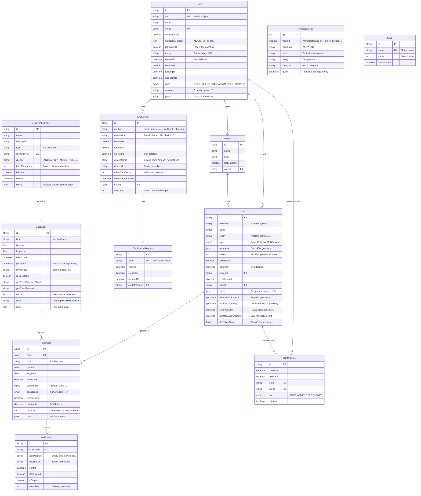
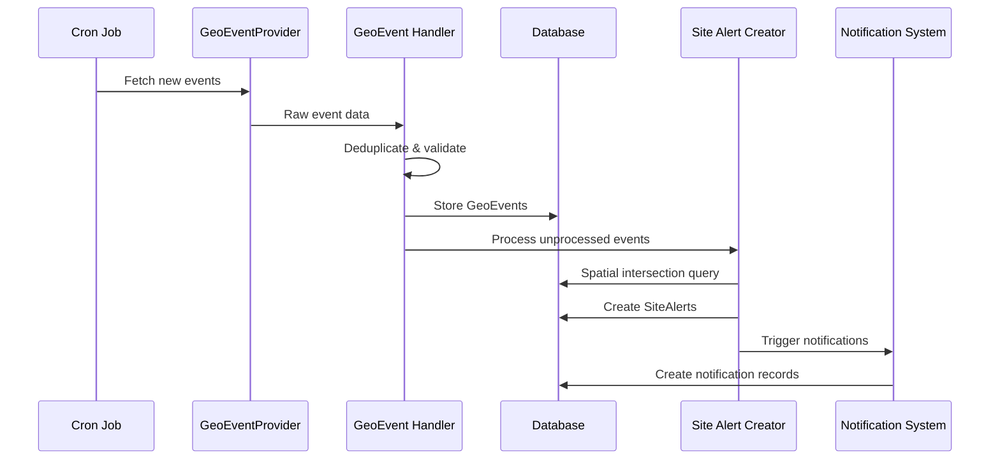
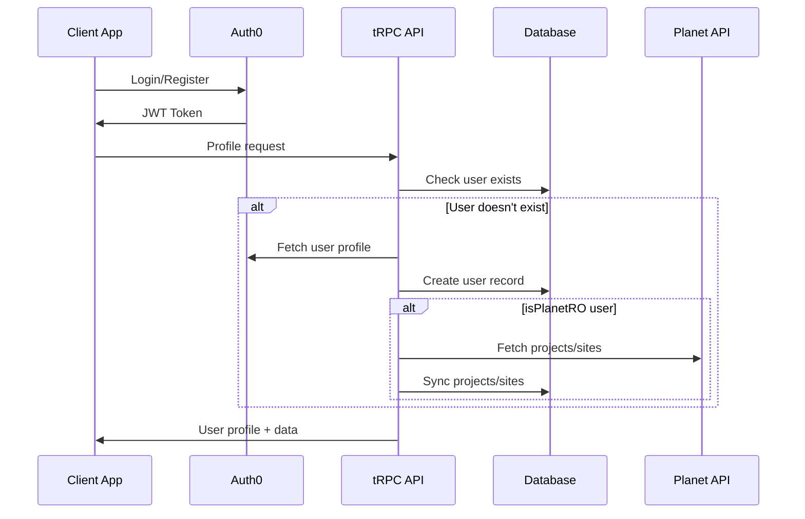

# Database Schema and Relationships Guide

## Overview

FireAlert uses PostgreSQL with PostGIS extensions for geospatial data handling. The database schema is managed through Prisma ORM with a focus on spatial operations, user management, and notification workflows.

## Core Entities and Relationships

### Entity Relationship Diagram



## Detailed Entity Descriptions

### User Management

#### User
The central entity for user management and authentication.

**Key Fields:**
- `sub`: Auth0 subject identifier (unique)
- `detectionMethods`: JSON array of enabled detection methods
- `isPlanetRO`: Flag for Plant-for-the-Planet users
- `roles`: Role-based access control
- `plan`: User subscription plan

**Relationships:**
- One-to-many with Projects, Sites, AlertMethods
- Many-to-many with Sites through SiteRelation

#### AlertMethod
Defines how users want to receive notifications.

**Supported Methods:**
- `email`: Email notifications
- `sms`: SMS via Twilio
- `device`: Push notifications via OneSignal
- `webhook`: HTTP POST to custom endpoint
- `whatsapp`: WhatsApp via Twilio

**Verification Flow:**
1. User creates AlertMethod (unverified)
2. VerificationRequest created with token
3. User verifies via token
4. AlertMethod marked as verified and enabled

### Geographic Data

#### Site
Represents geographic areas that users want to monitor.

**Site Types:**
- `Point`: Single coordinate with radius
- `Polygon`: Defined boundary
- `MultiPolygon`: Multiple disconnected areas

**Key Spatial Fields:**
- `geometry`: Original GeoJSON geometry
- `detectionGeometry`: PostGIS geometry for spatial queries
- `originalGeometry`: Backup of original geometry
- `detectionArea`: Calculated area in square meters

**Monitoring Controls:**
- `isMonitored`: Enable/disable monitoring
- `stopAlertUntil`: Temporary pause until date
- `lastMessageCreated`: Rate limiting for notifications

#### Project
Groups related sites together, often synchronized from external systems.

### Event Processing

#### GeoEventProvider
Configuration for external data sources.

**Provider Types:**
- NASA FIRMS (MODIS, VIIRS, LANDSAT)
- GOES-16 Geostationary
- Custom providers

**Configuration Example:**
```json
{
  "apiUrl": "https://firms.modaps.eosdis.nasa.gov",
  "bbox": "-180,-90,180,90",
  "slice": "1",
  "client": "FIRMS"
}
```

#### GeoEvent
Raw environmental events from external sources.

**Processing Flow:**
1. Provider fetches raw data
2. Data normalized to GeoEvent format
3. Duplicate detection via hash
4. Spatial geometry created
5. Processed flag set after site matching

#### SiteAlert
Events that intersect with monitored sites.

**Creation Process:**
1. Spatial intersection query between GeoEvents and Sites
2. Distance calculation from event to site
3. Confidence level preserved from source
4. Alert marked for notification processing

#### Notification
Individual notification delivery records.

**Delivery Tracking:**
- `sentAt`: When notification was sent
- `isDelivered`: Successful delivery confirmation
- `isSkipped`: Skipped due to rate limiting or errors
- `metadata`: Provider-specific delivery data

## Spatial Data Handling

### PostGIS Integration

FireAlert leverages PostGIS for efficient spatial operations:

```sql
-- Site intersection query example
SELECT s.id, s.name, 
       ST_Distance(ST_SetSRID(ST_MakePoint(e.longitude, e.latitude), 4326), s."detectionGeometry") as distance
FROM "GeoEvent" e
INNER JOIN "Site" s ON ST_Within(ST_SetSRID(ST_MakePoint(e.longitude, e.latitude), 4326), s."detectionGeometry")
WHERE e."isProcessed" = false
  AND s."deletedAt" IS NULL
  AND s."isMonitored" = true;
```

### Geometry Storage

**Coordinate System:** WGS84 (SRID 4326)

**Storage Strategy:**
- `geometry`: JSON for API compatibility
- `detectionGeometry`: PostGIS geometry for spatial queries
- `originalGeometry`: Backup for data integrity

### Spatial Indexing

```sql
-- Spatial index on detection geometry
CREATE INDEX "Site_detectionGeometry_idx" ON "Site" USING GIST ("detectionGeometry");

-- Spatial index on protected areas
CREATE INDEX "ProtectedArea_geom_idx" ON "ProtectedArea" USING GIST ("geom");
```

## Data Flow Patterns

### Event Processing Pipeline



### User Registration Flow



## Performance Optimizations

### Database Indexes

```sql
-- User lookups
CREATE UNIQUE INDEX "User_sub_key" ON "User"("sub");
CREATE UNIQUE INDEX "User_email_key" ON "User"("email");

-- Site queries
CREATE INDEX "Site_userId_idx" ON "Site"("userId");
CREATE INDEX "Site_projectId_idx" ON "Site"("projectId");
CREATE INDEX "Site_isMonitored_idx" ON "Site"("isMonitored") WHERE "deletedAt" IS NULL;

-- Alert processing
CREATE INDEX "GeoEvent_isProcessed_idx" ON "GeoEvent"("isProcessed") WHERE "isProcessed" = false;
CREATE INDEX "SiteAlert_isProcessed_idx" ON "SiteAlert"("isProcessed") WHERE "isProcessed" = false;

-- Notification delivery
CREATE INDEX "Notification_isDelivered_idx" ON "Notification"("isDelivered") WHERE "isDelivered" = false;
```

### Query Optimization Patterns

#### Efficient Site Alert Creation

```sql
-- Batch processing with spatial queries
INSERT INTO "SiteAlert" (id, type, "eventDate", "detectedBy", confidence, latitude, longitude, "siteId", data, distance)
SELECT
    gen_random_uuid(),
    e.type,
    e."eventDate",
    e."geoEventProviderClientId",
    e.confidence,
    e.latitude,
    e.longitude,
    s.id,
    e.data,
    ST_Distance(ST_SetSRID(ST_MakePoint(e.longitude, e.latitude), 4326), s."detectionGeometry")
FROM "GeoEvent" e
INNER JOIN "Site" s ON ST_Within(ST_SetSRID(ST_MakePoint(e.longitude, e.latitude), 4326), s."detectionGeometry")
WHERE e."isProcessed" = false
  AND s."deletedAt" IS NULL
  AND s."isMonitored" = true
  AND s.slices @> ('["' || e.slice || '"]')::jsonb;
```

#### Bulk Notification Processing

```sql
-- Process notifications in batches
WITH notification_batch AS (
  SELECT sa.id as site_alert_id, am.method, am.destination
  FROM "SiteAlert" sa
  JOIN "Site" s ON sa."siteId" = s.id
  JOIN "User" u ON s."userId" = u.id
  JOIN "AlertMethod" am ON u.id = am."userId"
  WHERE sa."isProcessed" = false
    AND am."isEnabled" = true
    AND am."isVerified" = true
  LIMIT 1000
)
INSERT INTO "Notification" ("siteAlertId", "alertMethod", "destination")
SELECT site_alert_id, method, destination FROM notification_batch;
```

## Data Integrity and Constraints

### Foreign Key Constraints

All relationships are enforced with foreign key constraints:

```sql
-- User relationships
ALTER TABLE "Site" ADD CONSTRAINT "Site_userId_fkey" 
  FOREIGN KEY ("userId") REFERENCES "User"("id") ON DELETE CASCADE;

-- Cascade deletions for user data
ALTER TABLE "AlertMethod" ADD CONSTRAINT "AlertMethod_userId_fkey"
  FOREIGN KEY ("userId") REFERENCES "User"("id") ON DELETE CASCADE;

-- Site alert relationships
ALTER TABLE "SiteAlert" ADD CONSTRAINT "SiteAlert_siteId_fkey"
  FOREIGN KEY ("siteId") REFERENCES "Site"("id") ON DELETE CASCADE;
```

### Unique Constraints

```sql
-- Prevent duplicate alert methods
ALTER TABLE "AlertMethod" ADD CONSTRAINT "AlertMethod_destination_userId_method_key"
  UNIQUE ("destination", "userId", "method");

-- Unique verification tokens
ALTER TABLE "VerificationRequest" ADD CONSTRAINT "VerificationRequest_token_key"
  UNIQUE ("token");
```

### Check Constraints

```sql
-- Validate confidence levels
ALTER TABLE "GeoEvent" ADD CONSTRAINT "GeoEvent_confidence_check"
  CHECK ("confidence" IN ('high', 'medium', 'low'));

-- Validate site types
ALTER TABLE "Site" ADD CONSTRAINT "Site_type_check"
  CHECK ("type" IN ('Point', 'Polygon', 'MultiPolygon'));
```

## Soft Deletion Pattern

Many entities use soft deletion to maintain data integrity:

```sql
-- Soft delete implementation
UPDATE "User" SET "deletedAt" = NOW() WHERE id = $1;

-- Cascade soft deletion to related entities
UPDATE "Site" SET "deletedAt" = NOW() 
WHERE "userId" = $1 AND "deletedAt" IS NULL;

UPDATE "AlertMethod" SET "deletedAt" = NOW()
WHERE "userId" = $1 AND "deletedAt" IS NULL;
```

**Benefits:**
- Data recovery capability
- Audit trail preservation
- Referential integrity maintenance
- Gradual cleanup processes

## Migration Strategies

### Schema Evolution

Prisma migrations handle schema changes:

```bash
# Generate migration
npx prisma migrate dev --name add-new-feature

# Deploy to production
npx prisma migrate deploy
```

### Data Migration Examples

```sql
-- Add new column with default value
ALTER TABLE "Site" ADD COLUMN "newField" TEXT DEFAULT 'default_value';

-- Populate existing data
UPDATE "Site" SET "newField" = 'calculated_value' 
WHERE "newField" IS NULL;

-- Make column required
ALTER TABLE "Site" ALTER COLUMN "newField" SET NOT NULL;
```

## Backup and Recovery

### Backup Strategy

```bash
# Full database backup
pg_dump -h localhost -U username -d firealert > backup.sql

# Schema-only backup
pg_dump -h localhost -U username -d firealert --schema-only > schema.sql

# Data-only backup
pg_dump -h localhost -U username -d firealert --data-only > data.sql
```

### Point-in-Time Recovery

```bash
# Enable WAL archiving in postgresql.conf
archive_mode = on
archive_command = 'cp %p /path/to/archive/%f'

# Create base backup
pg_basebackup -D /path/to/backup -Ft -z -P

# Restore to specific time
pg_ctl stop -D /path/to/data
rm -rf /path/to/data/*
tar -xzf /path/to/backup/base.tar.gz -C /path/to/data
# Configure recovery.conf for point-in-time recovery
```

This database schema provides a robust foundation for FireAlert's geospatial alert system, with proper indexing, constraints, and optimization patterns for handling large-scale environmental monitoring data.