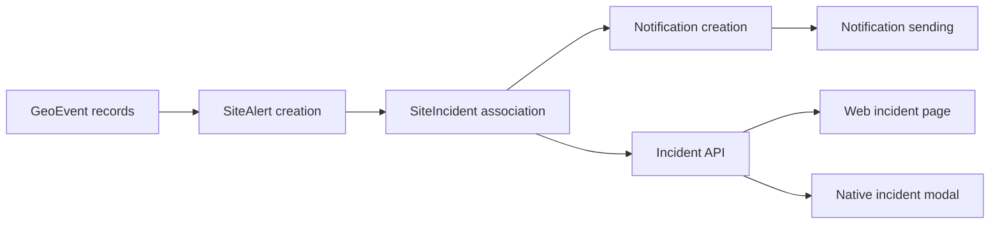
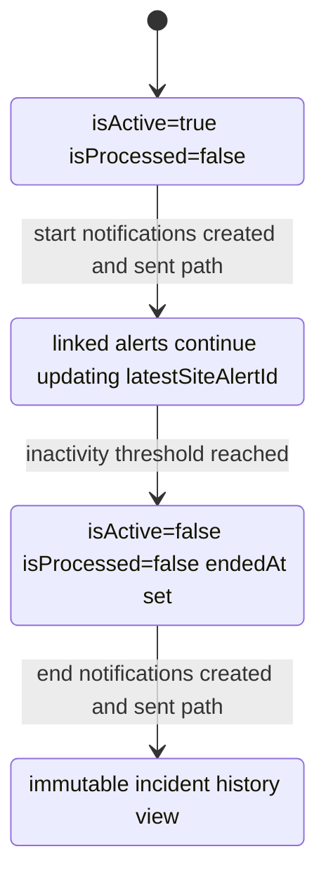
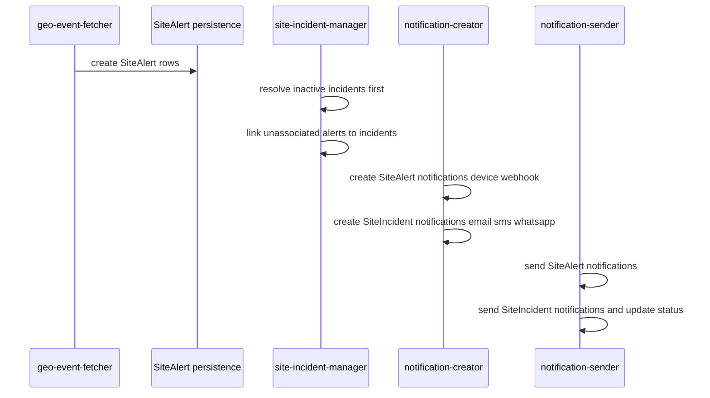
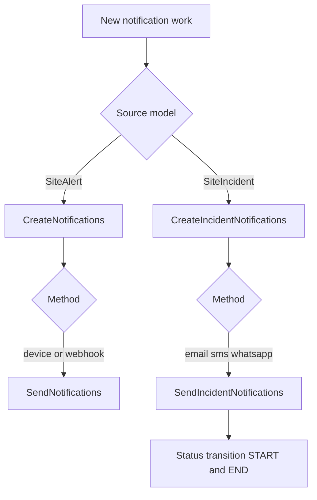
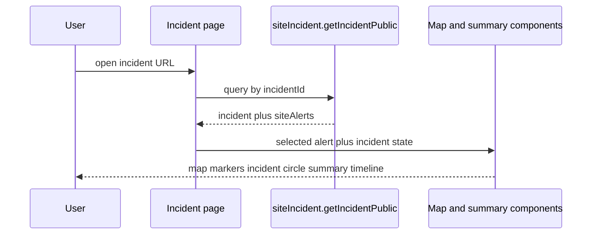
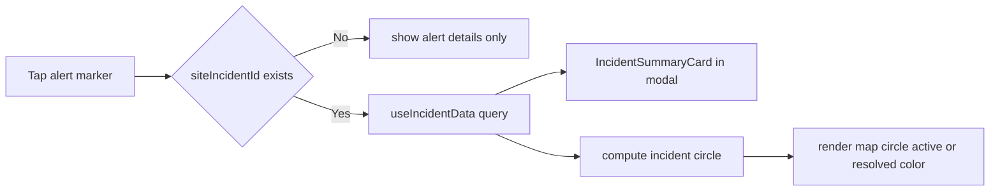

# Fire Incident Implementation Reference

## 1. What this implementation introduced
The feature adds incident-centric fire tracking on top of existing alert generation.

Core implementation outcomes:
- Added persistent incident domain model (`SiteIncident`) and alert linkage (`SiteAlert.siteIncidentId`).
- Added incident notification lifecycle states on `Notification.notificationStatus`.
- Added incident lifecycle APIs in `siteIncident` tRPC router.
- Added method-based notification routing:
  - real-time per-alert: `device`, `webhook`
  - aggregated per-incident: `email`, `sms`, `whatsapp`
- Added incident maintenance CRON (`site-incident-manager`) for linking and inactivity resolution.
- Added incident UI consumption in both web and native clients.

## 2. High-level architecture

## 3. Database implementation
### 3.1 Schema additions
- `SiteIncident` model in `apps/server/prisma/schema.prisma`.
- `SiteAlert.siteIncidentId` relation to `SiteIncident`.
- `Notification.notificationStatus` enum values:
  - `START_SCHEDULED`
  - `START_SENT`
  - `END_SCHEDULED`
  - `END_SENT`

### 3.2 Migrations
- `apps/server/prisma/migrations/20251202144925_site_incidents/migration.sql`
- `apps/server/prisma/migrations/20251205101546_added_notification_status/migration.sql`

### 3.3 Runtime lifecycle model

## 4. Server implementation by concern

## 4.1 Incident domain services
Primary files:
- `apps/server/src/Services/SiteIncident/SiteIncidentRepository.ts`
- `apps/server/src/Services/SiteIncident/IncidentResolver.ts`
- `apps/server/src/Services/SiteIncident/SiteIncidentService.ts`

Responsibilities in code:
- Find active incident by site.
- Create incident when none is active.
- Associate new alert to active incident.
- Resolve inactive incidents by threshold (`INCIDENT_RESOLUTION_HOURS`).
- Mark resolved incidents with `isActive=false`, `isProcessed=false`, `endedAt` set.

## 4.2 CRON orchestration
### Active CRON endpoints
- `apps/server/src/pages/api/cron/geo-event-fetcher.ts`
- `apps/server/src/pages/api/cron/site-incident-manager.ts`
- `apps/server/src/pages/api/cron/notification-creator.ts`
- `apps/server/src/pages/api/cron/notification-sender.ts`

### CRON execution model

### Important runtime note
In current wiring, the refactored `geo-event-fetcher` path constructs `SiteAlertService` without injecting `SiteIncidentService`. Incident association is therefore handled by `site-incident-manager` rather than inline in fetch processing.

## 4.3 Notification subsystem
### Routing configuration
- `apps/server/src/Services/Notifications/NotificationRoutingConfig.ts`

### Creator services
- `apps/server/src/Services/Notifications/CreateNotifications.ts`
  - creates notifications for `device`, `webhook`
  - works from unprocessed `SiteAlert`

- `apps/server/src/Services/Notifications/CreateIncidentNotifications.ts`
  - creates notifications for `email`, `sms`, `whatsapp`
  - works from unprocessed `SiteIncident`
  - assigns `START_SCHEDULED` or `END_SCHEDULED`

### Sender services
- `apps/server/src/Services/Notifications/SendNotifications.ts`
  - sends notifications with `notificationStatus = null`
  - method filter `device`, `webhook`

- `apps/server/src/Services/Notifications/SendIncidentNotifications.ts`
  - sends scheduled incident notifications
  - method filter `email`, `sms`, `whatsapp`
  - transitions status:
    - `START_SCHEDULED -> START_SENT`
    - `END_SCHEDULED -> END_SENT`

### Notification routing diagram

## 4.4 API layer
Primary files:
- `apps/server/src/server/api/routers/siteIncident.ts`
- `apps/server/src/server/api/zodSchemas/siteIncident.schema.ts`
- `apps/server/src/repositories/siteIncident.ts`

Implemented procedures:
- `getIncidentPublic`
- `getIncident`
- `getActiveIncidents`
- `getIncidentHistory`
- `updateIncidentReviewStatus`
- `closeIncident`

Router registration:
- `apps/server/src/server/api/root.ts`

## 5. Web UI implementation
Primary files:
- `apps/server/src/pages/incident/[incidentId].tsx`
- `apps/server/src/Components/FireIncident/IncidentSummary.tsx`
- `apps/server/src/Components/FireIncident/MapComponent.tsx`
- `apps/server/src/Components/FireIncident/incidentCircleUtils.ts`

Behavior:
- Fetches incident using `siteIncident.getIncidentPublic`.
- Displays incident status and timeline from start/latest alerts.
- Renders all incident fire markers and a computed incident circle.
- Allows marker selection to inspect a specific detection point.

### Web flow diagram

## 6. Mobile implementation
Primary files:
- `apps/nativeapp/app/screens/Home/Home.tsx`
- `apps/nativeapp/app/hooks/incident/useIncidentData.ts`
- `apps/nativeapp/app/components/Incident/IncidentSummaryCard.tsx`
- `apps/nativeapp/app/utils/incident/incidentCircleUtils.ts`
- `apps/nativeapp/app/types/incident.ts`
- `apps/server/src/server/api/routers/alert.ts` (returns `siteIncidentId` in `getAlerts`)

Behavior:
- Home map alert markers include `siteIncidentId`.
- On alert selection, app fetches incident data using public incident endpoint.
- Incident summary card is shown in alert modal.
- Incident circle is computed from incident alerts and rendered on the map.

### Mobile flow diagram

## 7. Operational behavior and run order
Recommended order for deterministic state transitions:
1. `/api/cron/geo-event-fetcher`
2. `/api/cron/site-incident-manager`
3. `/api/cron/notification-creator`
4. `/api/cron/notification-sender`

## 8. Configuration and flags used in implementation
Defined in `apps/server/src/env.mjs`:
- `USE_REFACTORED_PIPELINE`
- `ENABLE_INCIDENT_NOTIFICATIONS`
- `INCIDENT_RESOLUTION_HOURS`
- `NOTIFICATION_BATCH_SIZE`
- `ALERT_SMS_DISABLED`
- `ALERT_WHATSAPP_DISABLED`

## 9. Change-grouped file index
### CRON
- `apps/server/src/pages/api/cron/geo-event-fetcher.ts`
- `apps/server/src/pages/api/cron/site-incident-manager.ts`
- `apps/server/src/pages/api/cron/notification-creator.ts`
- `apps/server/src/pages/api/cron/notification-sender.ts`

### Notifications
- `apps/server/src/Services/Notifications/NotificationRoutingConfig.ts`
- `apps/server/src/Services/Notifications/CreateNotifications.ts`
- `apps/server/src/Services/Notifications/SendNotifications.ts`
- `apps/server/src/Services/Notifications/CreateIncidentNotifications.ts`
- `apps/server/src/Services/Notifications/SendIncidentNotifications.ts`

### Incident domain
- `apps/server/src/Services/SiteIncident/SiteIncidentRepository.ts`
- `apps/server/src/Services/SiteIncident/IncidentResolver.ts`
- `apps/server/src/Services/SiteIncident/SiteIncidentService.ts`
- `apps/server/src/server/api/routers/siteIncident.ts`
- `apps/server/src/server/api/zodSchemas/siteIncident.schema.ts`

### Mobile
- `apps/nativeapp/app/screens/Home/Home.tsx`
- `apps/nativeapp/app/hooks/incident/useIncidentData.ts`
- `apps/nativeapp/app/components/Incident/IncidentSummaryCard.tsx`
- `apps/nativeapp/app/utils/incident/incidentCircleUtils.ts`

### Web UI
- `apps/server/src/pages/incident/[incidentId].tsx`
- `apps/server/src/Components/FireIncident/IncidentSummary.tsx`
- `apps/server/src/Components/FireIncident/MapComponent.tsx`
- `apps/server/src/Components/FireIncident/incidentCircleUtils.ts`

## 10. File and function quick reference
This section is intentionally short and implementation-focused for development context reuse.

## 10.1 CRON handlers
- `apps/server/src/pages/api/cron/geo-event-fetcher.ts`: main geo-event ingestion entrypoint with feature-flag split.
- `alertFetcher(req,res)`: selects refactored or legacy pipeline.
- `refactoredImplementation(req,res)`: service-layer processing flow with provider selection and batch processing.
- `legacyImplementation(req,res)`: older inline processing flow preserved for rollback.

- `apps/server/src/pages/api/cron/site-incident-manager.ts`: incident lifecycle manager CRON.
- `siteIncidentManager(req,res)`: resolves inactive incidents, then links unassociated alerts to incidents.

- `apps/server/src/pages/api/cron/notification-creator.ts`: creator orchestrator CRON.
- `notificationsCron(req,res)`: runs SiteAlert and SiteIncident creator services in parallel.

- `apps/server/src/pages/api/cron/notification-sender.ts`: sender orchestrator CRON.
- `notificationSender(req,res)`: runs SiteAlert and SiteIncident sender services in parallel.

## 10.2 Incident domain services
- `apps/server/src/Services/SiteIncident/SiteIncidentRepository.ts`: Prisma data access for incident lifecycle operations.
- `SiteIncidentRepository.findActiveBySiteId(siteId)`: finds latest active incident for one site.
- `SiteIncidentRepository.createIncident(data)`: creates new incident with defaults and first alert linkage.
- `SiteIncidentRepository.updateIncident(id,data)`: updates incident state/fields.
- `SiteIncidentRepository.findInactiveIncidents(inactiveHours)`: finds active incidents older than cutoff.
- `SiteIncidentRepository.resolveIncidentsBatch(incidents)`: resolves incidents and records metrics/errors.
- `SiteIncidentRepository.associateAlert(incidentId,alertId)`: links alert and updates `latestSiteAlertId`.
- `SiteIncidentRepository.getIncidentById(id)`: fetches one incident.
- `SiteIncidentRepository.countActiveBysite(siteId)`: counts active incidents per site.

- `apps/server/src/Services/SiteIncident/IncidentResolver.ts`: resolution rule helper and batch resolver wrapper.
- `IncidentResolver.shouldResolveIncident(incident,lastAlertTime)`: inactivity check.
- `IncidentResolver.calculateIncidentState(incident,lastAlertTime)`: computes derived state info.
- `IncidentResolver.batchResolveIncidents(incidents)`: delegates and measures batch resolve.
- `IncidentResolver.validateIncident(incident)`: structural validity checks.
- `IncidentResolver.getInactiveMinutes(lastAlertTime)`: helper for inactivity duration.
- `IncidentResolver.isInResolutionWindow(incident)`: state/time gate for resolution.
- `IncidentResolver.prepareForResolution(incident)`: produces closure-state update payload.

- `apps/server/src/Services/SiteIncident/SiteIncidentService.ts`: orchestration layer for create/associate/resolve/query/update.
- `SiteIncidentService.processNewSiteAlert(alert)`: create new incident or associate to existing one.
- `SiteIncidentService.resolveInactiveIncidents()`: resolve all incidents beyond threshold.
- `SiteIncidentService.associateAlertWithIncident(alert,incident)`: explicit association helper.
- `SiteIncidentService.getIncidentById(id)`: fetch one incident.
- `SiteIncidentService.getActiveIncidentForSite(siteId)`: fetch active incident.
- `SiteIncidentService.getIncidentsByDateRange(siteId,start,end)`: history query by date range.
- `SiteIncidentService.updateReviewStatus(incidentId,status)`: updates review status.
- `SiteIncidentService.recordMetrics(operation,duration,extras)`: internal metric recording helper.

- `apps/server/src/Services/SiteIncident/StateManagement.ts`: lifecycle state machine helpers.
- `getIncidentState(incident)`: maps incident flags to lifecycle state.
- `isValidStateTransition(from,to)`: allowed transition validator.
- `validateIncidentModifiable(incident)`: blocks updates to closed incidents.
- `validateIncidentCanAcceptAlerts(incident)`: blocks alert association to inactive incidents.
- `validateTimestampOrdering(startedAt,endedAt)`: chronological guard.
- `validateStateRequirements(incident)`: enforces required fields per state.

- `apps/server/src/Services/SiteAlert/SiteAlertService.ts`: alert creation coordinator with optional incident integration.
- `SiteAlertService.createAlertsForProvider(providerId,clientId,slice)`: batch alert creation loop.
- `SiteAlertService.processBatch(eventIds,providerId,clientId,slice,isGeo)`: provider-specific alert creation and incident processing hook.
- `SiteAlertService.processIncidentsForBatch(eventIds)`: resolves created alerts and calls incident service per alert.

## 10.3 Notification services
- `apps/server/src/Services/Notifications/NotificationRoutingConfig.ts`: centralized method routing config.
- `isSiteAlertMethod(method)`: true for `device`,`webhook`.
- `isSiteIncidentMethod(method)`: true for `email`,`sms`,`whatsapp`.
- `getAllNotificationMethods()`: returns all routed methods.
- `isValidNotificationMethod(method)`: validation helper.

- `apps/server/src/Services/Notifications/CreateNotifications.ts`: SiteAlert-based notification creator.
- `createNestedChunksForUnprocessedSiteAlerts(alerts,size)`: chunks while preserving site grouping behavior.
- `processSiteAlertChunk(chunk)`: builds queue and create payload for SiteAlert methods.
- `createNotifications()`: processes unprocessed alerts, creates notifications, marks alerts processed.

- `apps/server/src/Services/Notifications/SendNotifications.ts`: SiteAlert-based sender.
- `sendNotifications({req})`: sends unsent SiteAlert notifications for `device`,`webhook`, updates delivery/failure outcomes.

- `apps/server/src/Services/Notifications/CreateIncidentNotifications.ts`: SiteIncident-based notification creator.
- `CreateIncidentNotifications.run()`: static entry for cron usage.
- `CreateIncidentNotifications.process()`: full create flow for incident notifications.
- `CreateIncidentNotifications.processUnprocessedIncidents()`: fetches incidents where `isProcessed=false`.
- `CreateIncidentNotifications.createNotificationQueue(incidents)`: builds method-filtered queue and metadata.
- `CreateIncidentNotifications.markIncidentsAsProcessed(ids)`: sets `isProcessed=true`.
- `CreateIncidentNotifications.executeTransaction(queue,ids)`: persists notifications and updates incident/site state.

- `apps/server/src/Services/Notifications/SendIncidentNotifications.ts`: SiteIncident-based sender.
- `SendIncidentNotifications.run(req)`: static entry for cron usage.
- `SendIncidentNotifications.process(req)`: batch send loop for scheduled incident notifications.
- `SendIncidentNotifications.constructMessage(isStart,alert,siteName,incidentId,method)`: method-aware START/END message builder.

## 10.4 API layer
- `apps/server/src/server/api/routers/siteIncident.ts`: incident router.
- `siteIncident.getIncidentPublic`: public incident detail query for sharing/web/native read paths.
- `siteIncident.getIncident`: protected incident detail query.
- `siteIncident.getActiveIncidents`: returns active incident list for one site.
- `siteIncident.getIncidentHistory`: date-ranged incident history query.
- `siteIncident.updateIncidentReviewStatus`: review workflow mutation.
- `siteIncident.closeIncident`: manual close mutation.

- `apps/server/src/server/api/zodSchemas/siteIncident.schema.ts`: request validation schemas.
- `reviewStatusSchema`: allowed review status values.
- `getIncidentSchema`: incident ID input validator.
- `getActiveIncidentsSchema`: site ID validator.
- `getIncidentHistorySchema`: site/date range validator with order refinement.
- `updateIncidentReviewStatusSchema`: mutation input validator.
- `closeIncidentSchema`: close mutation validator.
- `inactivityThresholdSchema`: positive integer threshold validator.

- `apps/server/src/repositories/siteIncident.ts`: function-style repository used by router.
- `findActiveIncidentForSite(siteId)`: active incident query.
- `findIncidentsByDateRange(siteId,start,end)`: history query with includes.
- `createIncident(data)`: transactional create with active-incident guard.
- `updateIncident(id,data)`: transactional update with closed-incident guard.
- `findInactiveIncidents(hours)`: inactivity query.
- `getIncidentById(id)`: incident details with includes.
- `countIncidentAlerts(incidentId)`: alert count per incident.

- `apps/server/src/server/api/routers/alert.ts`: alert router used by native list view.
- `alert.getAlerts`: returns user alerts including `siteIncidentId`.
- `alert.getAlert`: public single alert read.
- `alert.getAlertsForSite`: site-scoped alert history query.

## 10.5 Web implementation files
- `apps/server/src/pages/incident/[incidentId].tsx`: incident details page container.
- `getTimePassedSince(date)`: relative elapsed-time helper.
- `getDaysSince(date)`: day-diff helper for icon theme.
- `getAlertTheme(days)`: marker color theme chooser.
- `formatDateString(date)`: UI timestamp formatting helper.
- `getIdentityGroup(identityKey)`: satellite/provider grouping mapper.
- `IncidentPage(props)`: page component wiring query, selection state, map and cards.
- `getStaticProps(context)`: prefetches incident public data.
- `getStaticPaths()`: static path strategy (`blocking` fallback).

- `apps/server/src/Components/FireIncident/IncidentSummary.tsx`: summary card for timeline/status/stats.
- `formatDate(date)`: date label formatting.
- `formatTime(date)`: time label formatting.
- `IncidentSummary(props)`: renders status badge, start/latest, total fires, area affected.

- `apps/server/src/Components/FireIncident/MapComponent.tsx`: map rendering for incident page.
- `getZoomLevel(bbox)`: derives viewport zoom from bounding box.
- `calculateBbox(coords)`: computes bbox for polygon coordinates.
- `MapComponent(props)`: renders map, markers, polygon overlay, and incident circle overlay.

- `apps/server/src/Components/FireIncident/incidentCircleUtils.ts`: geospatial circle utilities.
- `generateIncidentCircle(fires,paddingKm)`: computes centroid/radius/circle polygon and area.
- `calculateIncidentArea(fires,paddingKm)`: returns area-only convenience value.

## 10.6 Mobile implementation files
- `apps/nativeapp/app/hooks/incident/useIncidentData.ts`: incident-fetch hook for selected alerts.
- `useIncidentData(params)`: fetches incident public data and returns loading/error/data state.

- `apps/nativeapp/app/components/Incident/IncidentSummaryCard.tsx`: incident summary card inside alert modal.
- `formatDate(date)`: card date formatter.
- `formatTime(date)`: card time formatter.
- `IncidentSummaryCard(props)`: renders status, timeline, metrics, and incident deep-link button.

- `apps/nativeapp/app/utils/incident/incidentCircleUtils.ts`: native mirror of circle calculations.
- `generateIncidentCircle(fires,paddingKm)`: circle polygon + area computation.
- `calculateIncidentArea(fires,paddingKm)`: area-only helper.

- `apps/nativeapp/app/screens/Home/Home.tsx`: native map and alert modal integration point.
- `Home({navigation,route})`: main screen container.
- `renderIncidentCircle()`: renders incident circle layer on map when incident context exists.
- `renderMapSource()`: renders site polygons and interactions.
- `renderProtectedAreasSource()`: renders protected area layers.
- `renderHighlightedMapSource()`: renders selected area highlight.
