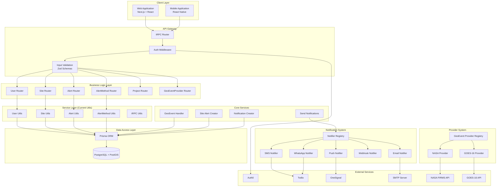
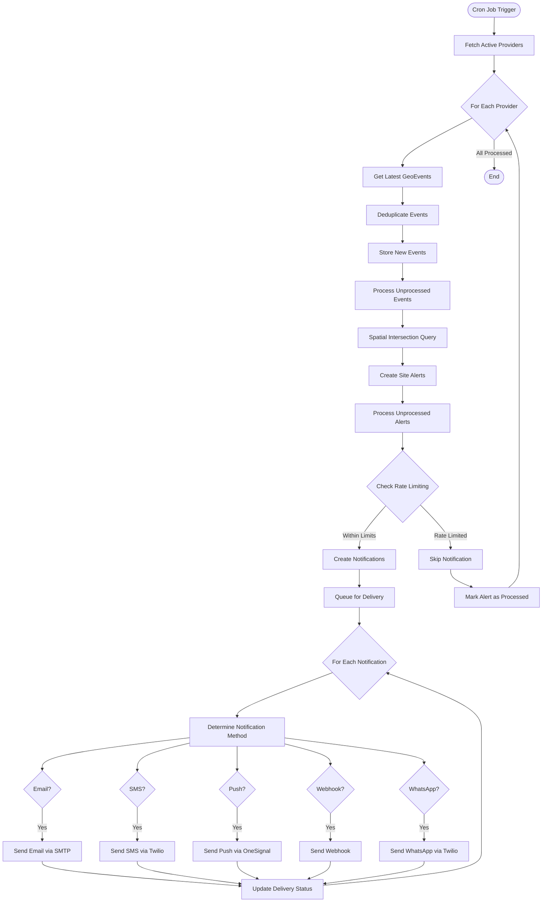
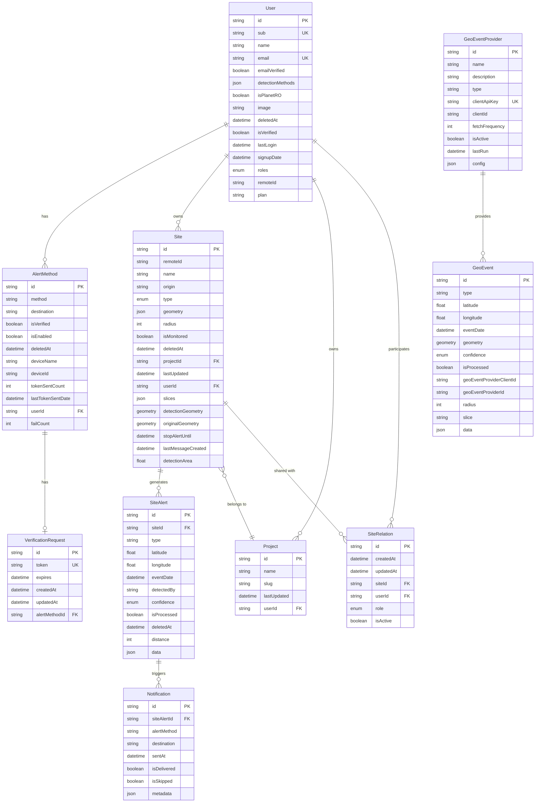
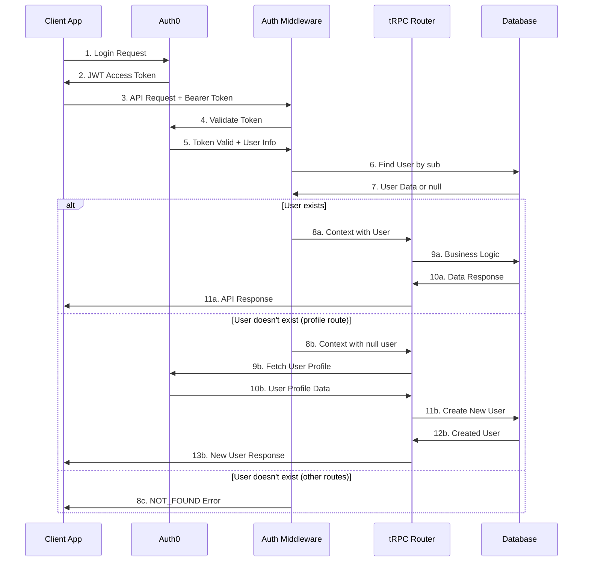
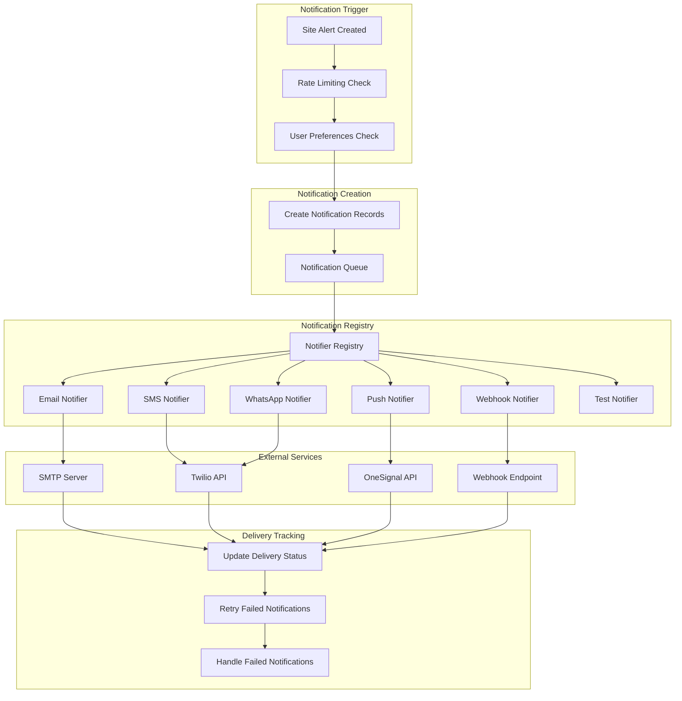
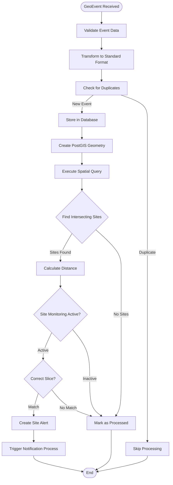
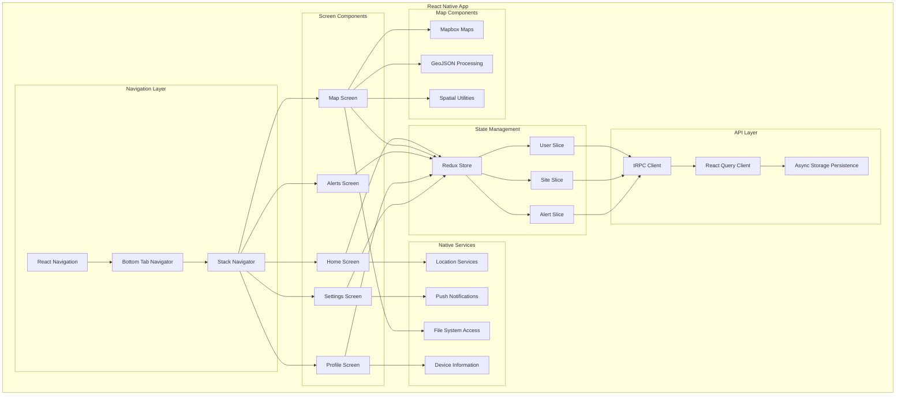

# FireAlert System Diagrams

## Component Relationship Diagram

## Data Flow Diagram

## Database Entity Relationship Diagram

## Authentication Flow Diagram

## Notification System Architecture

## Geospatial Processing Flow

## Mobile App Architecture

These diagrams provide a comprehensive visual representation of the FireAlert system architecture, showing the relationships between components, data flow patterns, and system interactions.